# Computer & Video Games

? | Computer & Video Games
--- | ---
Alternate titles | 
Publisher | EMAP, Dennis Publishing, Future Publishing
Country | United Kingdom
Years | 1981 to 2004
Issues | 279
ISSN | 0261-3697 (1-), 0261-3597 ()

Issue | Cover | Full | Cover date | Actual date | Price | Barcode | Extras
----- | ----- | ---- | ---------- | ----------- | ----- | ------- | ------
1||[A](https://archive.org/details/cvg-magazine-001)|November 1981|1981-xx-xx|0.75GBP||
2|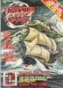||December 1981|[1981-11-18](https://archive.org/details/cvg-magazine-001/page/n2/mode/2up)|0.75GBP||
3|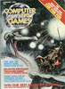||January 1982|1981-12-16|0.75GBP||
4|||February 1982|1982-01-16|0.75GBP||
5|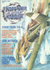||March 1982|1982-02-16|0.75GBP||
6|||April 1982|1982-03-16|0.75GBP||
7|||May 1982|1982-04-16|0.75GBP||
8|||June 1982|1982-05-xx|0.75GBP||Owl supplement
9|||July 1982|1982-06-xx|0.75GBP||Z-Xtra supplement
10|||August 1982|1982-07-xx|0.75GBP||
11|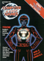||September 1982|1982-08-xx|0.75GBP||Owl Issue 2 supplement
12|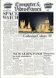||October 1982|1982-09-16|0.75GBP||
13|||November 1982|1982-10-16|0.75GBP||
14|||December 1982|1982-11-16|0.75GBP||
15|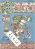||January 1983|1982-12-16|0.75GBP||
16|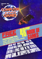||February 1983|1983-01-16|0.75GBP||The Book of Games supplement
17|||March 1983|1983-02-16|0.75GBP||Book of Reviews supplement
18|||April 1983|1983-03-16|0.75GBP||
19|||May 1983|1983-04-16|0.75GBP||
20|||June 1983|1983-05-16|0.75GBP||The Book of Video Games supplement
21|||July 1983|1983-06-16|0.75GBP||
22|||August 1983|1983-07-16|0.75GBP||
23|||September 1983|1983-08-16|0.75GBP||
24|||October 1983|1983-09-16|0.85GBP||
25|||November 1983|1983-10-16|0.85GBP||Poster calendar
26|||December 1983|1983-11-16|0.85GBP||
27|||January 1984|1983-12-16|0.85GBP||Book of Adventure supplement
28|||February 1984|1984-01-16|0.85GBP||Book of Games supplement
29|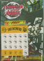||March 1984|1984-02-16|0.85GBP||Treachery board game tokens
30|||April 1984|1984-03-16|0.85GBP||
31|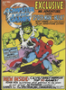||May 1984|1984-04-16|0.85GBP||
32|||June 1984|1984-05-16|0.85GBP||
33|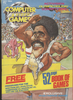||July 1984|1984-06-16|0.85GBP||Book of Games supplement
34|||August 1984|1984-07-16|0.85GBP||
35|||September 1984|1984-08-16|0.85GBP||
36|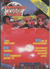||October 1984|1984-09-16|0.95GBP||
37|||November 1984|1984-10-16|0.95GBP||
38|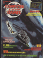||December 1984|1984-11-16|0.95GBP||
39|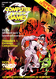||January 1985|1984-12-16|0.95GBP||
40|||February 1985|1985-01-16|0.95GBP||Book of Games supplement
41|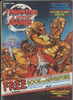||March 1985|1985-02-16|0.95GBP||Book of Adventure supplement
42|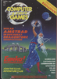||April 1985|1985-03-16|0.95GBP||
43|||May 1985|1985-04-16|0.95GBP||
44|||June 1985|1985-05-16|0.95GBP||
45|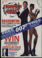||July 1985|1985-06-16|0.95GBP||Book of Games supplement; Poster
46|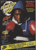||August 1985|1985-07-16|0.95GBP||
47|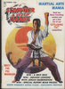||September 1985|1985-08-16|0.95GBP||
48|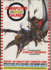||October 1985|1985-09-16|0.95GBP||Poster
49|||November 1985|1985-10-16|0.95GBP||Poster
50|||December 1985|1985-11-16|0.95GBP||Book of Adventure supplement
51|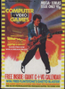||January 1986|1985-12-16|0.95GBP||Calendar
52|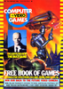||February 1986|1986-01-16|0.95GBP||Book of Games supplement
53|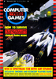||March 1986|1986-02-16|0.98GBP||
54|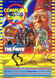||April 1986|1986-03-16|0.98GBP||
55|||May 1986|1986-04-16|0.98GBP||Software World catalogue
56|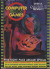||June 1986|1986-05-16|0.98GBP||
57|||July 1986|1986-06-16|0.98GBP||
58|||August 1986|1986-07-16|0.98GBP||
59|||September 1986|1986-08-16|0.98GBP||
60|||October 1986|1986-09-16|0.98GBP||
61|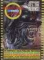||November 1986|1986-10-15|0.98GBP||
62|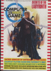||December 1986|1986-11-xx|0.98GBP||
63|||January 1987|1986-12-16|0.98GBP||Poster
64|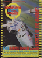||February 1987|1987-01-xx|1.00GBP||Book of Games supplement
65|||March 1987|1987-02-xx|1.00GBP||
66|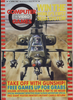||April 1987|1987-03-xx|1.00GBP||
67|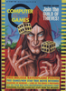||May 1987|1987-04-xx|1.00GBP||Poster
68|||June 1987|1987-05-15|1.00GBP||Atari ST supplement
69|||July 1987|1987-06-15|1.00GBP||Poster
70|||August 1987|1987-07-15|1.00GBP||
71|||September 1987|1987-08-15|1.00GBP||Poster
72|||October 1987|1987-09-15|1.00GBP||Poster
73|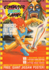||November 1987|1987-10-15|1.00GBP||Poster
74|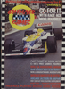||December 1987|1987-11-15|1.00GBP||
75|||January 1988|1987-12-15|1.00GBP||Poster
76|||February 1988|1988-01-15|1.00GBP||
77|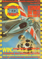||March 1988|1988-02-15|1.10GBP||Poster
78|||April 1988|1988-03-15|1.10GBP||
79|||May 1988|1988-04-15|1.10GBP||Badge; Poster
80|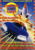||June 1988|1988-05-15|1.10GBP||Poster
81|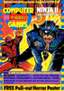||July 1988|1988-06-15|1.10GBP||Poster
82|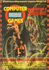||August 1988|1988-07-15|1.10GBP||
83|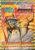||September 1988|1988-08-16|1.10GBP||
84|||October 1988|1988-09-16|1.10GBP||
85|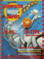||November 1988|1988-10-15|1.20GBP||
86|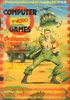||December 1988|1988-11-xx|1.20GBP||
87|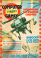||January 1989|1988-12-16|1.20GBP||Posters
88|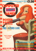||February 1989|1989-01-xx|1.20GBP||Firebird game cassette
89|||March 1989|1989-02-xx|1.20GBP||
90|||April 1989|1989-03-16|1.20GBP||
91|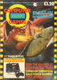||May 1989|1989-04-11|1.20GBP||Poster
92|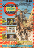||June 1989|1989-05-16|1.20GBP||Poster
93|||July 1989|1989-06-xx|1.20GBP||Poster
93A|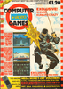||August 1989|1989-07-15|1.20GBP||
94|||September 1989|1989-08-16|1.20GBP||Poster
95|||October 1989|1989-09-16|1.20GBP||Hologram booklet; Poster magazine
96|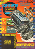||November 1989|1989-10-16|1.20GBP||Hologram booklet
97|||December 1989|1989-11-16|1.20GBP|9770261369000-12|Hologram booklet; Arcade supplement; Badge
98|||January 1990|1989-12-16|1.30GBP|9770261369017-01|Hologram booklet; Poster magazine
99|||February 1990|1990-01-16|1.30GBP|9770261369017-02|
100|||March 1990|1990-02-16|1.30GBP|9770261369017-03|
101|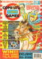||April 1990|1990-03-16|1.30GBP|9770261369017-04|
102|||May 1990|1990-04-16|1.30GBP|9770261369017-05|
103|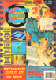||June 1990|1990-05-16|1.30GBP|9770261369017-06|
104|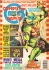||July 1990|1990-06-16|1.30GBP|9770261369017-07|Poster
105|||August 1990|1990-07-16|1.30GBP|9770261369017-08|
106|||September 1990|1990-08-16|1.30GBP|9770261369017-09|
107|||October 1990|1990-09-16|1.30GBP|9770261369017-10|Sticker book
108|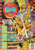||November 1990|1990-10-16|1.30GBP|9770261369017-11|Stickers
109|||December 1990|1990-11-16|1.30GBP|9770261369017-12|Cards
110|||January 1991|1990-12-15|1.30GBP|9770261369017-01|
111|||February 1991|1991-01-16|1.30GBP|9770261369017-02|
112|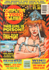||March 1991|1991-02-16|1.30GBP|9770261369017-03|
113|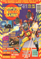||April 1991|1991-03-16|1.30GBP|9770261369017-04|
114|||May 1991|1991-04-14|1.30GBP|9770261369017-05|
115|||June 1991|1991-05-11|1.35GBP|9770261369024-06|Stickers
116|||July 1991|1991-06-15|1.35GBP|9770261369024-07|Stickers
117|||August 1991|1991-07-15|1.35GBP|9770261369024-08|
118|||September 1991|1991-08-15|1.35GBP|9770261369024-09|
119|||October 1991|1991-09-15|1.35GBP|9770261369024-10|Hologram card
120|||November 1991|1991-10-15|1.40GBP|9770261369031-11|Hologram card; Go! magazine
121|||December 1991|1991-11-15|1.40GBP|9770261369031-12|Hologram card; Go! magazine
122|||January 1992|1991-12-15|1.40GBP|9770261369031-01|Hologram card; Go! magazine
123|||February 1992|1992-01-15|1.40GBP|9770261369031-02|Go! magazine
124|||March 1992|1992-02-15|1.40GBP|9770261369031-03|Go! magazine
125|||April 1992|1992-03-15|1.40GBP|9770261369031-04|Go! magazine
126|||May 1992|1992-04-15|1.75GBP|9770261369048-05|Go! magazine; Super Nintendo Handbook
127|||June 1992|1992-05-15|1.75GBP|9770261369048-06|Go! magazine; Poster
128|||July 1992|1992-06-15|1.75GBP|9770261369048-07|Go! magazine; Mario Guide book
129|||August 1992|1992-07-15|1.75GBP|9770261369048-08|Go! magazine
130|||September 1992|1992-08-15|1.75GBP|9770261369048-09|Go! magazine
131|||October 1992|1992-09-15|1.75GBP|9770261369048-10|Go! magazine; Badge
132|||November 1992|1992-10-15|1.75GBP|9770261369048-11|Go! magazine; Handbook
133|||December 1992|1992-11-15|1.75GBP|9770261369048-12|Go! magazine; Gamebook
134|||January 1993|1992-12-15|1.75GBP|9770261369048-01|Go! magazine; Stickers
135|||February 1993|1993-01-15|1.95GBP|9770261369055-02|Go! magazine; Badge; Poster
136|||March 1993|1993-02-15|1.95GBP|9770261369055-03|Go! magazine
137|||April 1993|1993-03-15|1.95GBP|9770261369055-04|Go! magazine
138|||May 1993|1993-04-15|1.95GBP|9770261369055-05|Go! magazine
139|||June 1993|1993-05-15|1.95GBP|9770261369055-06|Go! magazine; Tips booklet
140|||July 1993|1993-06-15|1.95GBP|9770261369055-07|Go! magazine; Mega-CD guide
141|||August 1993|1993-07-15|1.95GBP|9770261369055-08|Go! magazine
142|||September 1993|1993-08-15|1.95GBP|9770261369055-09|Go! magazine
143|||October 1993|1993-09-15|1.95GBP|9770261369055-10|Go! magazine
144|||November 1993|1993-10-15|1.95GBP|9770261369055-11|Scratchcard
145|||December 1993|1993-11-15|2.25GBP|9770261369062-12|Poster; Christmas cards; Badge
146|||January 1994|1993-12-15|2.25GBP|9770261369062-01|Badge
147|||February 1994|1994-01-15|2.25GBP|9770261369062-02|
148|||March 1994|1994-02-15|2.25GBP|9770261369062-03|
149|||April 1994|1994-03-15|2.25GBP|9770261369062-04|
150|||May 1994|1994-04-15|2.25GBP|9770261369062-05|
151|||June 1994|1994-05-15|2.25GBP|9770261369062-06|
152|||July 1994|1994-06-15|2.25GBP|9770261369062-07|World Cup Guide book
153|||August 1994|1994-07-15|2.25GBP|9770261369062-08|
154|||September 1994|1994-08-15|2.25GBP|9770261369062-09|
155|||October 1994|1994-09-15|2.25GBP|9770261369062-10|Tekno supplement
156|||November 1994|1994-10-15|2.25GBP|9770261369062-11|Tekno supplement
157|||December 1994|1994-11-15|2.25GBP|9770261369062-12|
158|||January 1995|1994-12-15|2.25GBP|9770261369062-01|Ultimate Tips book
159|||February 1995|1995-01-15|2.25GBP|9770261369062-02|
160|||March 1995|1995-02-15|2.25GBP|9770261369062-03|
161|||April 1995|1995-03-15|2.25GBP|9770261369062-04|
162|||May 1995|1995-04-15|2.25GBP|9770261369062-05|
163|||June 1995|1995-05-xx|2.25GBP|9770261369062-06|
164|||July 1995|1995-06-09|2.25GBP|9770261369062-07|
165|||August 1995|1995-07-12|2.25GBP|9770261369062-08|
166|||September 1995|1995-08-11|2.25GBP|9770261369062-09|
167|||October 1995|1995-09-14|2.45GBP|9770261369079-10|
168|||November 1995|1995-10-13|2.45GBP|9770261369079-11|
169|||December 1995|1995-11-10|2.45GBP|9770261369079-12|
170|||January 1996|1995-12-10|2.45GBP|9770261369079-01|
171|||February 1996|1996-01-12|2.45GBP|9770261369079-02|
172|||March 1996|1996-02-09|2.45GBP|9770261369079-03|
173|||April 1996|1996-03-14|2.45GBP|9770261369079-04|
174|||May 1996|1996-04-12|2.50GBP|9770261369086-05|Freeplay supplement
175|||June 1996|1996-05-09|2.50GBP|9770261369086-06|Freeplay supplement
176|||July 1996|1996-06-12|2.50GBP|9770261369086-07|Freeplay supplement
177|||August 1996|1996-07-11|2.50GBP|9770261369086-08|Freeplay supplement
178|||September 1996|1996-08-11|2.50GBP|9770261369086-09|Freeplay supplement
179|||October 1996|1996-09-09|2.50GBP|9770261369086-10|Freeplay supplement
180|||November 1996|1996-10-09|2.50GBP|9770261369086-11|Freeplay supplement; Poster
181|||December 1996|1996-11-xx|2.50GBP|9770261369086-12|Freeplay supplement
182|||January 1997|1996-12-11|2.50GBP|9770261369086-01|Freeplay supplement; The Complete History of Computer and Video Games book
183|||February 1997|1997-01-10|2.50GBP|9770261369086-02|Freeplay supplement
184|||March 1997|1997-02-12|2.50GBP|9770261369086-03|Freeplay supplement
185|||April 1997|1997-03-12|2.50GBP|9770261369086-04|Freeplay supplement; Blown Away VHS cassette
186|||May 1997|1997-04-11|2.50GBP|9770261369086-05|Freeplay supplement
187|||June 1997|1997-05-11|2.50GBP|9770261369086-06|Freeplay supplement
188|||July 1997|1997-06-11|2.50GBP|9770261369086-07|Freeplay supplement
189|||August 1997|1997-07-11|2.50GBP|9770261369086-08|Freeplay supplement
190|||September 1997|1997-08-13|2.50GBP|9770261369086-09|Freeplay supplement
191|||October 1997|1997-09-12|2.50GBP|9770261369086-10|Freeplay supplement
192|||November 1997|1997-10-15|2.50GBP|9770261369086-11|Freeplay supplement
193|||December 1997|1997-11-12|2.50GBP|9770261369086-12|Freeplay supplement
194|||January 1998|1997-12-12|1.50GBP|9770261369987-01|Freeplay supplement; Stickers
195|||February 1998|1998-01-14|2.50GBP|9770261369086-02|Freeplay supplement
195A|||February 1998|1998-01-14|1.50GBP|9770261369987-02|Freeplay supplement
196|||March 1998|1998-02-11|2.50GBP|9770261369086-03|Freeplay supplement
196A|||March 1998|1998-02-11|1.50GBP|9770261369093-03|Freeplay supplement
197|||April 1998|1998-03-11|2.50GBP|9770261369086-04|Freeplay supplement
197A|||April 1998|1998-03-11|1.50GBP|9770261369093-04|Freeplay supplement
198|||May 1998|1998-04-15|GBP|9770261369086-05|Freeplay supplement
198A|||May 1998|1998-04-15|1.50GBP|9770261369093-05|Freeplay supplement
199|||June 1998|1998-05-13|1.50GBP|9770261369093-06|Freeplay supplement
200|||July 1998|1998-06-10|1.50GBP|9770261369093-07|Freeplay supplement
201|||August 1998|1998-07-15|GBP|9770261369086-08|Freeplay supplement
201A|||August 1998|1998-07-15|1.50GBP|9770261369093-08|Freeplay supplement
202|||September 1998|1998-08-12|GBP|9770261369086-09|Freeplay supplement
202A|||September 1998|1998-08-12|1.50GBP|9770261369093-09|Freeplay supplement
203|||October 1998|1998-09-16|GBP|9770261369086-10|Freeplay supplement
203A|||October 1998|1998-09-16|1.50GBP|9770261369093-10|Freeplay supplement
204|||November 1998|1998-10-14|GBP|9770261369086-11|Freeplay supplement
204A|||November 1998|1998-10-14|1.50GBP|9770261369093-11|Freeplay supplement
205|||December 1998|1998-11-11|GBP|9770261369086-12|Freeplay supplement
205A|||December 1998|1998-11-11|1.50GBP|9770261369093-12|Freeplay supplement
206|||January 1999|1998-12-09|GBP|9770261369086-01|Freeplay supplement
206A|||January 1999|1998-12-09|1.50GBP|9770261369093-01|Freeplay supplement
207|||February 1999|1999-01-13|GBP|9770261369086-02|Freeplay supplement
207A|||February 1999|1999-01-13|1.50GBP|9770261369093-02|Freeplay supplement
208|||March 1999|1999-02-17|GBP|9770261369086-03|Freeplay supplement
208A|||March 1999|1999-02-17|1.50GBP|9770261369093-03|Freeplay supplement
209|||April 1999|1999-03-17|GBP|9770261369086-04|Freeplay supplement
209A|||April 1999|1999-03-17|1.50GBP|9770261369093-04|Freeplay supplement
210|||May 1999|1999-04-14|GBP|9770261369086-05|Freeplay supplement
210A|||May 1999|1999-04-14|1.50GBP|9770261369093-05|Freeplay supplement
211|||June 1999|1999-05-12|GBP|9770261369086-06|Freeplay supplement
211A|||June 1999|1999-05-12|1.50GBP|9770261369093-06|Freeplay supplement
212|||July 1999|1999-06-16|GBP|9770261369086-07|
212A|||July 1999|1999-06-16|1.50GBP|9770261369093-07||
213|||August 1999|1999-07-14|GBP|9770261369086-08|
213A|||August 1999|1999-07-14|1.50GBP|9770261369093-08||
214|||September 1999|1999-08-11|GBP|9770261369086-09|
214A|||September 1999|1999-08-11|1.50GBP|9770261369093-09|
215|||October 1999|1999-09-15|GBP|9770261369086-10|
215A|||October 1999|1999-09-15|1.50GBP|9770261369093-10||
216|||November 1999|1999-10-13|GBP|9770261369086-11|
216A|||November 1999|1999-10-13|1.99GBP|9770261369109-11||
217|||December 1999|1999-11-xx|GBP|9770261369086-12|Temporary tattoos
217A|||December 1999|1999-11-xx|1.99GBP|9770261369109-12|Temporary tattoos
218|||January 2000|1999-12-15|GBP|9770261369086-01|Calendar
218A|||January 2000|1999-12-15|1.99GBP|9770261369109-01|Calendar
219|||February 2000|2000-01-19|GBP|9770261369086-02|PlayStation 2 cardboard model kit
219A|||February 2000|2000-01-19|1.99GBP|9770261369109-02|PlayStation 2 cardboard model kit
220|||March 2000|2000-02-16|GBP|9770261369086-03|Chocolate
220A|||March 2000|2000-02-16|1.99GBP|9770261369109-03|Chocolate
221|||April 2000|2000-03-15|1.99GBP|9770261369109-04|Trading cards
222|||May 2000|2000-04-xx|GBP|9770261369086-05|Poster
222A|||May 2000|2000-04-xx|1.99GBP|9770261369109-05|Poster
223|||June 2000|2000-05-17|GBP|9770261369086-06|Mini board game
223A|||June 2000|2000-05-17|1.99GBP|9770261369109-06|Mini board game
224|||July 2000|2000-06-14|GBP|9770261369086-07|Stickers
224A|||July 2000|2000-06-14|1.99GBP|9770261369109-07|Stickers
225|||August 2000|2000-07-12|GBP|9770261369086-08|
225A|||August 2000|2000-07-12|2.50GBP|9770261369116-08||
226|||September 2000|2000-08-16|GBP|9770261369086-09|Beachball
226A|||September 2000|2000-08-16|2.50GBP|9770261369116-09|Beachball
227|||October 2000|2000-09-13|GBP|9770261369086-10|Trading cards
228|||November 2000|2000-10-11|GBP|9770261369086-11|Calendar
228A|||November 2000|2000-10-11|2.50GBP|9770261369116-11|Calendar
229|||December 2000|2000-11-15|2.50GBP|9770261369116-12|Cards
230|||January 2001|2000-12-13|2.50GBP|9770261369116-01|Tips book
231|||February 2001|2001-01-17|2.80GBP|9770261369123-02|Tips book
232|||March 2001|2001-02-15|2.80GBP|9770261369123-03|Tips book
233|||April 2001|2001-03-15|2.80GBP|9770261369123-04|Tips book
234|||May 2001|2001-xx-xx|2.80GBP|9770261369123-05|Tips book
235|||June 2001|2001-xx-xx|2.80GBP|9770261369123-06|Tips book
236|||July 2001|2001-xx-xx|2.80GBP|9770261369123-07|
237|||August 2001|2001-xx-xx|2.80GBP|9770261369123-08|
238|||September 2001|2001-08-xx|2.80GBP|9770261369123-09|
239|||October 2001|2001-09-xx|2.80GBP|9770261369123-10|
240|||November 2001|2001-10-25|2.80GBP|9770261369123-11|
241|||xxxx xxxx|2001-11-22|2.80GBP|9770261369123-12|
242|||Jan|200x-xx-xx|2.80GBP|9770261369123-01|
243|||Feb|200x-xx-xx|2.80GBP|9770261369123-02|
244|||Mar|200x-xx-xx|2.80GBP|9770261369123-03|
245|||April|200x-xx-xx|2.80GBP|9770261369123-04|
246|||May 2002|2002-04-xx|2.80GBP|
247|||June 2002|2002-05-09|2.80GBP|9770261369123-06|
248|||xxxx xxxx|200x-xx-xx|GBP||
249|||xxxx xxxx|200x-xx-xx|GBP||
250|||xxxx xxxx|200x-xx-xx|GBP||
251|||xxxx xxxx|200x-xx-xx|GBP||
252|||xxxx xxxx|200x-xx-xx|GBP||
253|||xxxx xxxx|200x-xx-xx|GBP||
254|||xxxx xxxx|200x-xx-xx|GBP||
255|||January 2003|200x-xx-xx|2.85GBP|9770261369130-01|
256|||February 2003|200x-xx-xx|GBP||
257|||March 2003|2003-xx-xx|GBP||
258|||April 2003|2003-xx-xx|GBP||
259|||May 2003|2003-xx-xx|2.85GBP||
260|||June 2003|2003-05-08|GBP||
261|||xxxx xxxx|200x-xx-xx|GBP||
262|||xxxx xxxx|200x-xx-xx|GBP||
263|||xxxx xxxx|200x-xx-xx|GBP||
264|||xxxx xxxx|200x-xx-xx|GBP||
265|||xxxx xxxx|200x-xx-xx|GBP||
266|||xxxx xxxx|200x-xx-xx|GBP||
267|||xxxx xxxx|200x-xx-xx|GBP||
268|||xxxx xxxx|200x-xx-xx|GBP||
269|||xxxx xxxx|200x-xx-xx|GBP||
270|||xxxx xxxx|200x-xx-xx|GBP||
271|||April 2004|2004-xx-xx|GBP||
272|||May 2004|2004-04-08|GBP||
273|||June 2004|2004-05-06|GBP||
274|||July 2004|2004-06-03|GBP||
275|||August 2004|2004-xx-xx|GBP||
276|||September 2004|2004-xx-xx|GBP||
277|||October 2004|2004-08-26|3.25GBP|9770261369147-01|
278|||September 2004|2004-09-23|GBP||