# Mean Machines Sega

. | _Mean Machines Sega_
--- | ---
Alternate titles | 
Publisher | EMAP (1-13) &vert; EMAP Images (14-24)
Country | United Kingdom
Language | English
Topic | Video games
Years | 1992 &mdash; 1997
Issues | 53
Frequency | Monthly
ISSN | 0967-9014
Related | _[Mean Machines][Mean Machines.md]_

Issue | Cover | Full | Cover date | Actual date | Price | Barcode | Extras
----- | ----- | ---- | ---------- | ----------- | ----- | ------- | ------
1|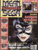|[🔗][1]|October 1992|1992-09-xx|3.95GBP|9770960495987-10| _Sonic the Hedgehog 2_ VHS cassette
2|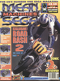|[🔗][2]|November 1992|1992-10-xx|2.50GBP|9770967901993-11|
3|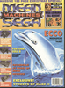|[🔗][3]|December 1992|1992-11-xx|3.95GBP|9770967901986-12|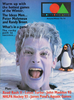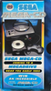 EA Autumn/Winter '92-'93 catalogue [🔗][3e] &vert; Mean Machines Sega Preview Video [🔗][3v]
4|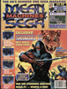|[🔗][4]|January 1993|1992-12-28|2.50GBP|9770967901979-01|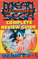 Complete Review Guide Volume 1 book
5|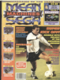|[🔗][5]|February 1993|1993-01-28|2.50GBP|9770967901979-02|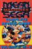 Complete Review Guide Volume 2 book
6|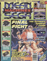|[🔗][6]|March 1993|1993-02-28|1.95GBP|9770967901009-03|Poster
7|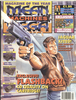|[🔗][7]|April 1993|1993-03-26|1.95GBP|9770967901009-04|
8|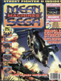|[🔗][8]|May 1993|1993-04-24|1.95GBP|9770967901009-05|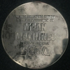 Mega-CD metal box and cards
9|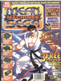|[🔗][9]|July 1993|1993-05-25|1.95GBP|9770967901009-07|Sega Super Play cards
10|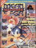|[🔗][10]|August 1993|1993-06-30|1.95GBP|9770967901009-08|_Street Fighter II_ stickers
11|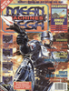|[🔗][11]|September 1993|1993-07-30|1.95GBP|9770967901009-09|_Jurassic Park_ review booklet
12|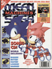|[🔗][12]|October 1993|1993-08-28|2.25GBP|9770967901016-10|_Mortal Kombat_ promotional pamphlet
13|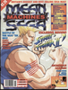|[🔗][13]|November 1993|1993-09-28|2.25GBP|9770967901016-11|
14|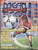|[🔗][14]|December 1993|1993-10-xx|2.25GBP|9770967901016-12|
15|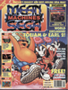|[🔗][15]|January 1994|1993-11-30|2.25GBP|9770967901016-01|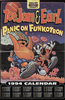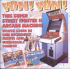 Calendar &vert; Super Street Fighter II competition card
16|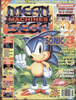|[🔗][16]|February 1994|1993-12-28|2.25GBP|9770967901016-02|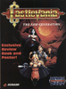 _Castlevania: The New Generation_ review supplement [🔗][16e]
17|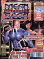|[🔗][17]|March 1994|1994-01-28|2.25GBP|9770967901016-03|_Streets of Rage 3_ poster
18|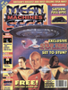|[🔗][18]|April 1994|1994-02-28|2.25GBP|9770967901016-04|Stickers
19|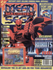|[🔗][19]|May 1994|1994-03-xx|2.25GBP|9770967901016-05|_Eternal Champions_ Panini stickers
20|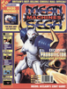|[🔗][20]|June 1994|1994-04-30|2.25GBP|9770967901016-06|
21|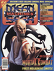|[🔗][21]|July 1994|1994-05-28|2.25GBP|9770967901016-07|Acclaim-ed supplement
22|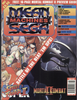|[🔗][22]|August 1994|1994-06-30|2.25GBP|9770967901016-08|Mortal Kombat II preview supplement
23|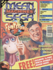|[🔗][23]|September 1994|1994-07-30|2.25GBP|9770967901016-09|Mortal Kombat II review supplement
24|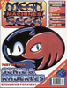|[🔗][24]|October 1994|1994-08-xx|2.25GBP|9770967901016-00|Monster Munch competition card
25|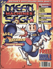|[🔗][25]|November 1994|1994-09-30|2.25GBP|9770967901016-11|Stickers
26|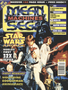|[🔗][26]|December 1994|1994-10-28|2.25GBP|9770967901016-12|Book
27|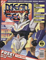|[🔗][27]|January 1995|1994-11-30|2.25GBP|9770967901016-01|Posters
28|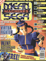|[🔗][28]|February 1995|1994-12-30|2.25GBP|9770967901016-02|Poster
29|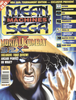|[🔗][29]|March 1995|1995-01-30|2.25GBP|9770967901016-03|
30|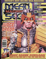|[🔗][30]|April 1995|1995-02-28||9770967901016-04|Mortal Kombat II Panini sticker album
31|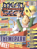|[🔗][31]|May 1995|1995-03-28|2.25GBP|9770967901016-05|Poster
32|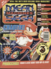|[🔗][32]|June 1995|1995-04-28|2.25GBP|9770967901016-06|
33|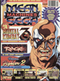|[🔗][33]|July 1995|1995-05-27|2.25GBP|9770967901016-07|
34|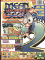|[🔗][34]|August 1995|1995-06-26|2.25GBP|9770967901016-08|
35|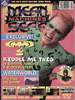|[🔗][35]|September 1995|1995-07-27|2.25GBP|9770967901016-09|
36|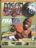|[🔗][36]|October 1995|1995-08-25|2.25GBP|9770967901016-10|
37|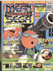|[🔗][37]|November 1995|1995-09-29|2.50GBP|9770967901023-11|Poster
38|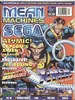|[🔗][38]|December 1995|1995-10-30|2.50GBP|9770967901023-12|Earthworm Jim 2 review booklet, Sega's official 16-page Comix Zone comic
39|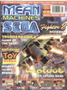|[🔗][39]|January 1996|1995-11-xx|£2.992.99|9770967901993-01|Saturn Sampler Audio CD
40|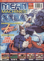|[🔗][40]|February 1996|1995-12-xx|2.50GBP|9770967901023-02|Scratch card
41|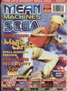|[🔗][41]|March 1996|1996-01-28|2.75GBP|9770967901030-03|
42|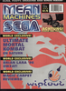|[🔗][42]|April 1996|1996-0x-xx|2.75GBP|9770967901030-04|
43||[🔗][43]|May 1996|1996-04-04|2.75GBP|9770967901030-05|
44||[🔗][44]|June 1996|1996-05-03|2.75GBP|9770967901030-06|
45||[🔗][45]|July 1996|1996-06-03|2.75GBP|9770967901030-07|
46||[🔗][46]|August 1996|1996-07-05|2.75GBP|9770967901030-08|
47||[🔗][47]|September 1996|1996-08-05|2.75GBP|9770967901030-09|
48||[🔗][48]|October 1996|1996-09-03|2.75GBP|9770967901030-10|
49||[🔗][49]|November 1996|1996-10-04|2.75GBP|9770967901030-11|
50||[🔗][50]|December 1996|1996-11-01|2.75GBP|9770967901030-12|Preview Sega Saturn Vol. 1 demo disc
51||[🔗][51]|January 1997|1996-12-06|2.25GBP|9770967901986-01|
52||[🔗][52]|February 1997|1997-01-xx|2.25GBP|9770967901986-02|
53||[🔗][53]|March 1997|1997-01-29|2.50GBP|9770967901047-03|

[1]: https://archive.org/details/mean-machines-sega-magazine-01
[2]: https://archive.org/details/mean-machines-sega-magazine-02
[3]: https://archive.org/details/mean-machines-sega-magazine-03
[4]: https://archive.org/details/mean-machines-sega-magazine-04
[5]: https://archive.org/details/mean-machines-sega-magazine-05
[6]: https://archive.org/details/mean-machines-sega-magazine-06
[7]: https://archive.org/details/mean-machines-sega-magazine-07
[8]: https://archive.org/details/mean-machines-sega-magazine-08
[9]: https://archive.org/details/mean-machines-sega-magazine-09
[10]: https://archive.org/details/mean-machines-sega-magazine-10
[11]: https://archive.org/details/mean-machines-sega-magazine-11
[12]: https://archive.org/details/mean-machines-sega-magazine-12
[13]: https://archive.org/details/mean-machines-sega-magazine-13
[14]: https://archive.org/details/mean-machines-sega-magazine-14
[15]: https://archive.org/details/mean-machines-sega-magazine-15
[16]: https://archive.org/details/mean-machines-sega-magazine-16
[17]: https://archive.org/details/mean-machines-sega-magazine-17
[18]: https://archive.org/details/mean-machines-sega-magazine-18
[19]: https://archive.org/details/mean-machines-sega-magazine-19
[20]: https://archive.org/details/mean-machines-sega-magazine-20
[21]: https://archive.org/details/mean-machines-sega-magazine-21
[22]: https://archive.org/details/mean-machines-sega-magazine-22
[23]: https://archive.org/details/mean-machines-sega-magazine-23
[24]: https://archive.org/details/mean-machines-sega-magazine-24
[25]: https://archive.org/details/mean-machines-sega-magazine-25
[26]: https://archive.org/details/mean-machines-sega-magazine-26
[27]: https://archive.org/details/mean-machines-sega-magazine-27
[28]: https://archive.org/details/mean-machines-sega-magazine-28
[29]: https://archive.org/details/mean-machines-sega-magazine-29
[30]: https://archive.org/details/mean-machines-sega-magazine-30
[31]: https://archive.org/details/mean-machines-sega-magazine-31
[32]: https://archive.org/details/mean-machines-sega-magazine-32
[33]: https://archive.org/details/mean-machines-sega-magazine-33
[34]: https://archive.org/details/mean-machines-sega-magazine-34
[35]: https://archive.org/details/mean-machines-sega-magazine-35
[36]: https://archive.org/details/mean-machines-sega-magazine-36
[37]: https://archive.org/details/mean-machines-sega-magazine-37
[38]: https://archive.org/details/mean-machines-sega-magazine-38
[39]: https://archive.org/details/mean-machines-sega-magazine-39
[40]: https://archive.org/details/mean-machines-sega-magazine-40
[41]: https://archive.org/details/mean-machines-sega-magazine-41
[42]: https://archive.org/details/mean-machines-sega-magazine-42
[43]: https://archive.org/details/mean-machines-sega-magazine-43
[44]: https://archive.org/details/mean-machines-sega-magazine-44
[45]: https://archive.org/details/mean-machines-sega-magazine-45
[46]: https://archive.org/details/mean-machines-sega-magazine-46
[47]: https://archive.org/details/mean-machines-sega-magazine-47
[48]: https://archive.org/details/mean-machines-sega-magazine-48
[49]: https://archive.org/details/mean-machines-sega-magazine-49
[50]: https://archive.org/details/mean-machines-sega-magazine-50
[51]: https://archive.org/details/mean-machines-sega-magazine-51
[52]: https://archive.org/details/mean-machines-sega-magazine-52
[53]: https://archive.org/details/mean-machines-sega-magazine-53

[3e]: https://archive.org/details/mean-machines-sega-03-supplement-electronic-arts-catalogue
[3v]: https://archive.org/details/mean-machines-sega-issue-1-vhs-uk
[16e]: https://archive.org/details/mean-machines-sega-16-castlevania-supplement
