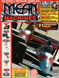

# Mean Machines

. | _Mean Machines_
--- | ---
Alternate titles | 
Publisher | EMAP (1-13) &vert; EMAP Images (14-24)
Country | United Kingdom
Language | English
Topic | Video games
Years | 1990 &mdash; 1992
Issues | 24 (25)
Frequency | Monthly
ISSN | 0960-4952
Website | 
Related | _[Mean Machines Sega](Mean_Machines_Sega.md)_

Issue | Cover | Full | Cover date | Actual date | Price | Barcode | Extras
----- | ----- | ---- | ---------- | ----------- | ----- | ------- | ------
0|||July 1990|1990-xx-xx||9770261369017-06|
1||[🔗][1]|Oct|1990-09-xx|1.75GBP|9770960495000-10|
2||[🔗][2]|Nov|1990-10-29|1.75GBP|9770960495000-11| Do Me a Favour... Master Mix '90 audio cassette
3||[🔗][3]|Dec|1990-12-xx|1.75GBP|9770960495000-12|
4||[🔗][4]|Jan|1991-01-03|1.75GBP|9770960495000-01|
5||[🔗][5]|Feb|1991-02-01|1.75GBP|9770960495000-02|Stickers
6||[🔗][6]|Mar|1991-03-01|1.75GBP|9770960495000-03|
7||[🔗][7]|Apr|1991-04-01|1.75GBP|9770960495000-04|Poster
8||[🔗][8]|May|1991-05-01|1.75GBP|9770960495000-05|
9||[🔗][9]|June|1991-05-29|1.75GBP|9770960495000-06| Stickers
10||[🔗][10]|July|1991-06-29|1.75GBP|9770960495000-07| Stickers
11||[🔗][11]|Aug|1991-07-27|1.75GBP|9770960495000-08|
12||[🔗][12]|Sept|1991-08-29|1.75GBP|9770960495000-09|
13||[🔗][13]|Oct|1991-09-27|1.75GBP|9770960495000-10|
14||[🔗][14]|Nov|1991-10-29|1.75GBP|9770960495000-11|Julian "Jazza" Rignall figure
15||[🔗][15]|Dec|1991-11-28|2.50GBP|9770960495994-12|_Super Mario Bros. 3_ hologram card
16||[🔗][16]|Jan|1991-12-27|1.75GBP|9770960495000-01| Sonic the Hedgehog comic
17||[🔗][17]|Feb|1992-01-27|1.75GBP|9770960495000-02|
18||[🔗][18]|Mar|1992-02-27|1.75GBP|9770960495000-03|
19||[🔗][19]|Apr|1992-03-28|1.75GBP|9770960495000-04|
20||[🔗][20]|May|1992-04-28|1.75GBP|9770960495000-05| Mean Machines Complete Games Guide supplement [🔗][20e] &vert; Badge
21||[🔗][21]|June|1992-05-28|1.75GBP|9770960495000-06|
22||[🔗][22]|July|1992-06-27|2.20GBP|9770960495994-07|
23||[🔗][23]|Aug|1992-07-22|2.20GBP|9770960495994-08|
24||[🔗][24]|Sept|1992-08-27|1.95GBP|9770960495017-09| The Mean Machines Megamart Bumper Edition supplement [🔗][24e] &vert; Poster

[1]: https://archive.org/details/Mean_Machines_Issue_01_1990-10_EMAP_Images_GB
[2]: https://archive.org/details/Mean_Machines_Issue_02_1990-11_EMAP_Images_GB
[3]: https://archive.org/details/Mean_Machines_Issue_03_1990-12_EMAP_Images_GB
[4]: https://archive.org/details/Mean_Machines_Issue_04_1991-01_EMAP_Images_GB
[5]: https://archive.org/details/Mean_Machines_Issue_05_1991-02_EMAP_Images_GB
[6]: https://archive.org/details/Mean_Machines_Issue_06_1991-03_EMAP_Images_GB
[7]: https://archive.org/details/Mean_Machines_Issue_07_1991-04_EMAP_Images_GB
[8]: https://archive.org/details/Mean_Machines_Issue_08_1991-05_EMAP_Images_GB
[9]: https://archive.org/details/Mean_Machines_Issue_09_1991-06_EMAP_Images_GB
[10]: https://archive.org/details/Mean_Machines_Issue_10_1991-07_EMAP_Images_GB
[11]: https://archive.org/details/Mean_Machines_Issue_11_1991-08_EMAP_Images_GB
[12]: https://archive.org/details/Mean_Machines_Issue_12_1991-09_EMAP_Images_GB
[13]: https://archive.org/details/Mean_Machines_Issue_13_1991-10_EMAP_Images_GB
[14]: https://archive.org/details/Mean_Machines_Issue_14_1991-11_EMAP_Images_GB
[15]: https://archive.org/details/Mean_Machines_Issue_15_1991-12_EMAP_Images_GB
[16]: https://archive.org/details/Mean_Machines_Issue_16_1992-01_EMAP_Images_GB
[17]: https://archive.org/details/Mean_Machines_Issue_17_1992-02_EMAP_Images_GB
[18]: https://archive.org/details/Mean_Machines_Issue_18_1992-03_EMAP_Images_GB
[19]: https://archive.org/details/Mean_Machines_Issue_19_1992-04_EMAP_Images_GB
[20]: https://archive.org/details/Mean_Machines_Issue_20_1992-05_EMAP_Images_GB
[21]: https://archive.org/details/Mean_Machines_Issue_21_1992-06_EMAP_Images_GB
[22]: https://archive.org/details/Mean_Machines_Issue_22_1992-07_EMAP_Images_GB
[23]: https://archive.org/details/Mean_Machines_Issue_23_1992-08_EMAP_Images_GB
[24]: https://archive.org/details/Mean_Machines_Issue_24_1992-09_EMAP_Images_GB

[20e]: https://archive.org/details/Mean_Machines_Complete_Games_Guide_1992-05_EMAP_Images_GB_suppliment_issue_20
[24e]: https://archive.org/details/mean-machines-magazine-Megamart
