# ACE

. | _ACE_
--- | ---
Alternate titles | _Advanced Computer Entertainment_
Publisher | Future Publishing (1-21) &vert; EMAP B&CP (22-32) &vert; EMAP Images (33-55)
Country | United Kingdom
Language | English
Topic | Video games
Years | 1987 &mdash; 1992
Issues | 55
Frequency | Monthly
ISSN | 0954-8076
Website | 
Related | 

Issue | Cover | Full | Cover date | Actual date | Price | Barcode | Extras
----- | ----- | ---- | ---------- | ----------- | ----- | ------- | ------
1|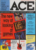|[🔗][1]|October 1987|1987-09-xx|1.50GBP||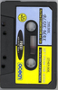 Blue Max/Gift from the Gods game cassette
2|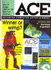|[🔗][2]|November 1987|1987-10-01|1.50GBP||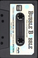 Bubble Bobble game cassette &vert; Discount card
3|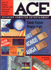|[🔗][3]|December 1987|1987-11-05|1.50GBP||
4|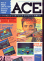|[🔗][4]|Christmas/January 1988|1987-12-xx|1.50GBP||Diary
5|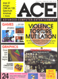|[🔗][5]|February 1988|1988-01-xx|1.50GBP||
6|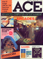|[🔗][6]|March 1988|1988-02-04|1.50GBP||
7|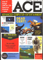|[🔗][7]|April 1988|1988-xx-xx|1.50GBP||Prize card
8|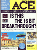|[🔗][8]|May 1988|1988-xx-xx|1.50GBP||
9|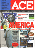|[🔗][9]|June 1988|1988-xx-xx|1.50GBP||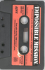 Impossible Mission game cassette
10||[🔗][10]|July 1988|1988-xx-xx|1.50GBP||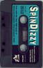 Spindizzy game cassette
11|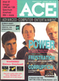|[🔗][11]|August 1988|1988-xx-xx|1.50GBP||
12|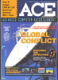|[🔗][12]|September 1988|1988-xx-xx|1.50GBP||Puzzle
13|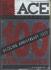|[🔗][13]|October 1988|1988-xx-xx|1.50GBP||
14|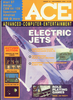|[🔗][14]|November 1988|1988-xx-xx|1.50GBP||
15|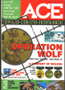|[🔗][15]|December 1988|1988-xx-xx|1.50GBP||
16|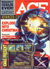|[🔗][16]|Christmas 88/January 89|1989-xx-xx|2.50GBP||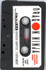 Dragon Ninja game cassette
17|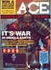|[🔗][17]|February 1989|1989-xx-xx|1.50GBP||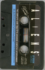 Aliens game cassette
18|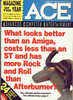|[🔗][18]|March 1989|1989-02-02|1.50GBP||
19|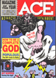|[🔗][19]|April 1989|1989-03-02|1.50GBP||
20|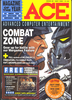|[🔗][20]|May 1989|1989-04-06|1.50GBP||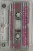 The ACE Computer Music Demo audio cassette
21|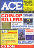|[🔗][21]|June 1989|1989-05-04|1.50GBP||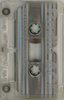 Radio ACE audio cassette
22|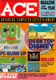|[🔗][22]|July 1989|1989-06-01|1.50GBP||
23|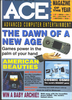|[🔗][23]|August 1989|1989-07-06|1.50GBP||
24|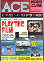|[🔗][24]|September 1989|1989-08-03|1.50GBP||
25|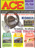|[🔗][25]|October 1989|1989-09-07|1.50GBP||
26|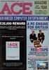|[🔗][26]|November 1989|1989-10-xx|1.50GBP||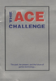 The ACE Challenge book [🔗][26e]
27|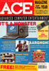|[🔗][27]|December 1989|1989-11-xx|1.50GBP||Wallchart
28|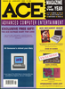|[🔗][28]|January 1990|1989-12-xx|1.60GBP||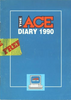 The ACE Diary 1990 book [🔗][28e]
29|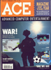|[🔗][29]|February 1990|1990-01-04|1.60GBP||
30|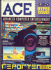|[🔗][30]|March 1990|1990-02-01|1.60GBP||
31||[🔗][31]|April 1990|1990-03-xx|1.60GBP||Prize card
32|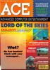|[🔗][32]|May 1990|1990-04-xx|1.60GBP|9770954807017-05|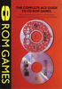 CD ROM Games book [🔗][32e]
33|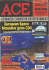|[🔗][33]|June 1990|1990-05-xx|1.60GBP|9770954807017-06|
34|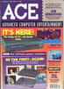|[🔗][34]|July 1990|1990-06-xx|1.60GBP|9770954807017-07|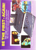 Neo Geo prize card
35|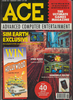|[🔗][35]|August 1990|1990-07-xx|1.60GBP|9770954807017-08|Trip to Hollywood prize ticket
36|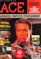|[🔗][36]|September 1990|1990-08-03|1.60GBP|9770954807017-09|
37|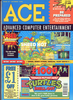|[🔗][37]|October 1990|1990-09-xx|1.60GBP|9770954807017-10|Wallchart
38|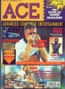|[🔗][38]|November 1990|1990-10-xx|1.60GBP|9770954807017-11|Scratchcard
39|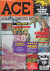|[🔗][39]|December 1990|1990-11-xx|1.60GBP|9770954807017-12|Game Boy book
40|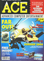|[🔗][40]|Christmas|1990-12-xx|1.60GBP|9770954807017-01|Wallchart
41||[🔗][41]|February 1991|1991-01-08|1.60GBP|9770954807017-02|Book
42||[🔗][42]|March 1991|1991-02-08|1.80GBP|9770954807024-03|
43||[🔗][43]|April 1991|1991-03-08|1.80GBP|9770954807024-04|
44||[🔗][44]|May 1991|1991-04-08|1.80GBP|9770954807024-05|
45||[🔗][45]|June 1991|1991-05-08|1.80GBP|9770954807024-06|
46||[🔗][46]|July 1991|1991-06-08|1.80GBP|9770954807024-07|
47||[🔗][47]|August 1991|1991-07-08|1.80GBP|9770954807024-08|
48||[🔗][48]|September 1991|1991-08-08|1.80GBP|9770954807024-09|
49||[🔗][49]|October 1991|1991-09-08|1.80GBP|9770954807024-10|
50||[🔗][50]|November 1991|1991-10-08|1.80GBP|9770954807024-11| The Classic Tricks 'n' Tactics Supplement 1 [🔗][50e]
51||[🔗][51]|December 1991|1991-11-08|1.80GBP|9770954807024-12| The Classic Tricks 'n' Tactics Supplement 2 [🔗][51e]
52||[🔗][52]|January 1992|1991-12-08|1.80GBP|9770954807024-01| The Classic Tricks 'n' Tactics Supplement 3 [🔗][52e]
53||[🔗][53]|February 1992|1992-01-08|1.80GBP|9770954807024-02|
54||[🔗][54]|March 1992|1992-02-08|2.75GBP|9770954807031-03| Shadowlands/Arcade 4-Pack game disk [🔗][54e]
55||[🔗][55]|April 1992|1992-03-08|2.75GBP|9770954807031-04| Space Crusade/Ozone/Heimdall game disk [🔗][54e]

[1]: https://archive.org/details/ace-magazine-01
[2]: https://archive.org/details/ace-magazine-02
[3]: https://archive.org/details/ace-magazine-03
[4]: https://archive.org/details/ace-magazine-04
[5]: https://archive.org/details/ace-magazine-05
[6]: https://archive.org/details/ace-magazine-06
[7]: https://archive.org/details/ace-magazine-07
[8]: https://archive.org/details/ace-magazine-08
[9]: https://archive.org/details/ace-magazine-09
[10]: https://archive.org/details/ace-magazine-10
[11]: https://archive.org/details/ace-magazine-11
[12]: https://archive.org/details/ace-magazine-12
[13]: https://archive.org/details/ace-magazine-13
[14]: https://archive.org/details/ace-magazine-14
[15]: https://archive.org/details/ace-magazine-15
[16]: https://archive.org/details/ace-magazine-16
[17]: https://archive.org/details/ace-magazine-17
[18]: https://archive.org/details/ace-magazine-18
[19]: https://archive.org/details/ace-magazine-19
[20]: https://archive.org/details/ace-magazine-20
[21]: https://archive.org/details/ace-magazine-21
[22]: https://archive.org/details/ace-magazine-22
[23]: https://archive.org/details/ace-magazine-23
[24]: https://archive.org/details/ace-magazine-24
[25]: https://archive.org/details/ace-magazine-25
[26]: https://archive.org/details/ace-magazine-26
[27]: https://archive.org/details/ace-magazine-27
[28]: https://archive.org/details/ace-magazine-28
[29]: https://archive.org/details/ace-magazine-29
[30]: https://archive.org/details/ace-magazine-30
[31]: https://archive.org/details/ace-magazine-31
[32]: https://archive.org/details/ace-magazine-32
[33]: https://archive.org/details/ace-magazine-33
[34]: https://archive.org/details/ace-magazine-34
[35]: https://archive.org/details/ace-magazine-35
[36]: https://archive.org/details/ace-magazine-36
[37]: https://archive.org/details/ace-magazine-37
[38]: https://archive.org/details/ace-magazine-38
[39]: https://archive.org/details/ace-magazine-39
[40]: https://archive.org/details/ace-magazine-40
[41]: https://archive.org/details/ace-magazine-41
[42]: https://archive.org/details/ace-magazine-42
[43]: https://archive.org/details/ace-magazine-43
[44]: https://archive.org/details/ace-magazine-44
[45]: https://archive.org/details/ace-magazine-45
[46]: https://archive.org/details/ace-magazine-46
[47]: https://archive.org/details/ace-magazine-47
[48]: https://archive.org/details/ace-magazine-48
[49]: https://archive.org/details/ace-magazine-49
[50]: https://archive.org/details/ace-magazine-50
[51]: https://archive.org/details/ace-magazine-51
[52]: https://archive.org/details/ace-magazine-52
[53]: https://archive.org/details/ace-magazine-53
[54]: https://archive.org/details/ace-magazine-54
[55]: https://archive.org/details/ace-magazine-55

[26e]: https://archive.org/details/Ace_Magazine_Issue_Challenge
[28e]: https://archive.org/details/ACEDiary1990/ACE_Diary_1990/
[32e]: https://archive.org/details/Ace_Magazine_Issue_0completeguidecdrom
[50e]: https://archive.org/details/ace-magazine-50-supplement
[51e]: https://archive.org/details/ace-magazine-51-supplement
[52e]: https://archive.org/details/ace-magazine-52-supplement
[54e]: https://archive.org/details/acemagazineissue5455coverdisks

[unk]: https://archive.org/details/Ace_Magazine_Issue_MindStretchers
[unk2]: https://archive.org/details/Ace_Magazine_Flames_of_Freedom_Mini-Issue
