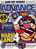
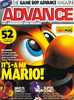
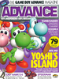
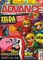
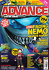
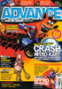
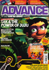
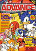

# Advance

. | _Advance_
--- | ---
Alternate titles | 
Publisher | Future Publishing
Country | United Kingdom
Language | English
Topic | Video games
Years | 2001 &mdash; 2004
Issues | 9 (uncomfirmed)
Frequency | 
ISSN | 
Website | 
Related | 

Issue | Cover | Full | Cover date | Actual date | Price | Barcode | Extras
----- | ----- | ---- | ---------- | ----------- | ----- | ------- | ------
1|||Xmas 2001|2001-xx-xx|3.50GBP||
2||[🔗][2]|Spring 2002|2002-xx-xx|3.50GBP||
3||[🔗][3]|Winter 2002|2002-xx-xx|||
4||[🔗][4]|Summer 2003|2003-xx-xx|3.99GBP|9771477099019-06|Cheats book
5||[🔗][5]|October 2003|2003-xx-xx|3.99GBP|9771477099019-10|
6||[🔗][6]|December 2003|2003-11-21|3.99GBP|9771477099019-12|A-Z Cheats Bible
7||[🔗][7]|May 2004|2004-xx-xx|3.99GBP|9771477099019-04|
8||[🔗][8]|July 2004|2004-06-17|3.99GBP|9771477099019-06|A-Z Cheats Bible
9|||October 2004|2004-09-16|||Tips book

[2]: https://archive.org/details/advance-02
[3]: https://archive.org/details/advance-03
[4]: https://archive.org/details/advance-04
[5]: https://archive.org/details/advance-05
[6]: https://archive.org/details/advance-06
[7]: https://archive.org/details/advance-07
[8]: https://archive.org/details/advance-08
