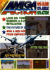
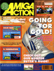
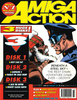
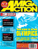
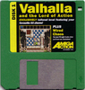
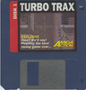
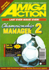

# Amiga Action

. | _Amiga Action_
--- | ---
Alternate titles | 
Publisher | Gollner Publishing (1-6) &vert; Interactive Publishing (7-20) &vert; Europress Interactive (21-64) &vert; IDG Media (65-89)
Country | United Kingdom
Language | English
Topic | Video games
Years | 1989 &mdash; 1996
Issues | 89
Frequency | Monthly
ISSN | 0957-4050
Website | 
Related | 

Issue | Cover | Full | Cover date | Actual date | Price | Barcode | Extras
----- | ----- | ---- | ---------- | ----------- | ----- | ------- | ------
0||[🔗][0]||1989-xx-xx|||
1||[🔗][1]|October 1989|1989-xx-xx|1.95GBP||
2||[🔗][2]|November 1989|1989-10-xx|1.95GBP||
3||[🔗][3]|Dec 1989|1989-xx-xx|1.95GBP||
4||[🔗][4]|Jan 1990|19xx-xx-xx|1.95GBP||
5||[🔗][5]|Feb 1990|1990-xx-xx|1.95GBP||
6||[🔗][6]|Mar 1990|1990-xx-xx|1.95GBP||
7||[🔗][7]|Apr 1990|1990-xx-xx|1.95GBP||
8||[🔗][8]|May 1990|1990-xx-xx|1.95GBP||
9||[🔗][9]|June 1990|1990-xx-xx|1.95GBP|9770957405005-06|
10||[🔗][10]|July 1990|1990-xx-xx|1.95GBP|9770957405005-07|
11||[🔗][11]|Aug 1990|1990-xx-xx|1.95GBP|9770957405005-08|
12||[🔗][12]|Sept 1990|1990-xx-xx|1.95GBP|9770957405005-09|Booklet
13||[🔗][13]|October 1990|1990-xx-xx|2.95GBP|9770957405999-10|Bar Games/The Killing Gameshow game disk [🔗][13e]
14||[🔗][14]|November 1990|1990-xx-xx|1.95GBP|9770957405982-11|Poster
15||[🔗][15]|December 1990|1990-xx-xx|1.95GBP|9770957405005-12|Poster
16||[🔗][16]|January 1991|199x-xx-xx|2.95GBP|9770957405982-01|James Pond/Horror Zombies from the Crypt game disk
17||[🔗][17]|February 1991|1991-xx-xx|2.95GBP|9770957405005-02|Mean 18 game disk
18||[🔗][18]|March 1991|1991-xx-xx|2.95GBP|9770957405005-03|Switchblade II/Team Suzuki/Asteroid Rox game disk [🔗][18e]
19||[🔗][19]|April 1991|1991-xx-xx|2.95GBP|9770957405005-04|Supercars 2/Chuck Rock/Back to the Future 3 game disk [🔗][19e]
20||[🔗][20]|May 1991|1991-04-26|2.95GBP|9770957405005-05|Ilyad game disk &vert; Armour-Geddon game disk
21||[🔗][21]|June 1991|1991-05-16|3.50GBP|9770957405975-06|Purple Saturn Day game disk &vert; Hero Quest game disk
22||[🔗][22]|July 1991|1991-06-20|3.50GBP|9770957405005-07|R-Type II game disk &vert; Amnios/Logical game disk
23||[🔗][23]|August 1991|1991-07-18|2.95GBP|9770957405012-08| Hawk/Little Beau game disk [🔗][23e]
24||[🔗][24]|September 1991|1991-08-15|3.50GBP|9770957405029-09|Pegasus/Zone Warrior game disk &vert; Challenge Golf/Tanx game disk
25||[🔗][25]|October 1991|1991-09-19|3.50GBP|9770957405029-10|Maddog Williams game disk &vert; Battle Isle/Supaplex game disk
26||[🔗][26]|November 1991|1991-10-17|3.50GBP|9770957405029-11|Under Pressure/Rubicon game disk &vert; Robocod/Boston Bomb Club game disk
27||[🔗][27]|December 1991|1991-11-21|3.50GBP|9770957405029-12|Baby Jo/Another World game disk &vert; Siegemaster/Heimdall game disk
28||[🔗][28]|January 1992|199x-xx-xx|3.50GBP|9770957405029-01|Agony/Thunderburner game disk &vert; International Sports Challenge/Daylight Robbery game disk
29||[🔗][29]|February 1992|1992-01-16|3.75GBP|9770957405036-02|Wolfchild/Team Yankee II game disk &vert; Double Dragon III game disk
30||[🔗][30]|March 1992|1992-02-19|3.75GBP|9770957405036-03|Abandoned Places game disk &vert; Ork/Knightmare game disk
31||[🔗][31]|April 1992|1992-03-19|3.75GBP|9770957405036-04|Psyborg game disk &vert; Space Crusade/Son of Zeus game disk
32||[🔗][32]|May 1992|1992-04-16|3.75GBP|9770957405036-05|Apidya/Jim Power game disk &vert; Myth/Winter Sports game disk
33||[🔗][33]|June 1992|1992-xx-xx|3.75GBP|9770957405036-06|Dynablaster game disk &vert; Humans/Jaguar XJ220 game disk
34||[🔗][34]|July 1992|1992-0x-xx|3.75GBP|9770957405036-07|Liverpool game disk &vert; Bug Bomber game disk
35||[🔗][35]|August 1992|1992-07-16|3.75GBP|9770957405036-08|Dojo Dan game disk &vert; D/Generation game disk
36||[🔗][36]|September 1992|1992-08-20|3.75GBP|9770957405036-09|Gobliiins/Tornado game disk &vert; Ugh! game disk
37||[🔗][37]|October 1992|1992-09-17|3.75GBP|9770957405036-10|Fireforce game disk &vert; Tearaway Thomas/Hoi/Dithell's Wonderland game disk
38||[🔗][38]|November 1992|1992-10-15|3.50GBP|9770957405036-11|Pinball Fantasies game disk &vert; The Chaos Engine/Zool game disk
39||[🔗][39]|December 1992|1992-11-19|3.50GBP|9770957405043-12|Alien Breed '92 game disk &vert; Nick Faldo's Golf/Cytron game disk
40||[🔗][40]|January 1993|1992-12-17|3.75GBP|9770957405050-01|Road Rash game disk &vert; Goblins 2 game disk
41||[🔗][41]|February 1993|1993-01-21|3.75GBP|9770957405005-02|Zool/Nigel Mansell game disk &vert; Robin Hood/Elevation game disk
42||[🔗][42]|March 1993|1993-02-18|3.75GBP|9770957405005-03| Body Blows/Furmyre game disk &vert; Creatures/Unsensible Soccer game disk [🔗][42e2]
43||[🔗][43]|April 1993|1993-03-11|3.75GBP|9770957405005-04|64 page book &vert; Lemmings 2/Walker game disk &vert; Abandoned Place 2 game disk
44||[🔗][44]|May 1993|1993-04-08|3.95GBP|9770957405012-05|Superfrog/Chuck Rock II game disk &vert; Fast Food/Sink or Swim game disk &vert; Super Cauldron/Deluxe Pacman game disk
45||[🔗][45]|June 1993|1993-05-06|3.95GBP|9770957405012-06|Hired Guns/Death Bringer game disk &vert; Donk/Assault/Crazy Sue/AmigaQ/Isolation game disk
46||[🔗][46]|July 1993|1993-06-03|3.95GBP|9770957405012-07|Gunship 2000/Mutants from Mars/Battles Cars 3D/Trek-Trivia game disk &vert; Bully's Darts/Match of the Day/Amiga Worm/Pharoah's Curse game disk
47||[🔗][47]|August 1993|1993-07-01|3.95GBP|9770957405012-08|Blastar/F1 Challenge/Battles Cars 2 game disk &vert; Syndicate game disk
48||[🔗][48]|September 1993|1993-07-29|3.95GBP|9770957405012-09|Stardust/Universal Warrior game disk &vert; Tensai/Grav Attack/Jump 'n' Roll game disk
49||[🔗][49]|October 1993|1993-08-26|3.95GBP|9770957405012-10|F117A/Deep Core/Defender game disk &vert; Suburban Commando/Smurf Hunt game disk &vert; Nicky 2/Winning Post game disk
50||[🔗][50]|November 1993|1993-09-23|3.95GBP|9770957405012-11|Theatre of Death game disk &vert; Graham Gooch's 2nd Innings game disk
51||[🔗][51]|December 1993|1993-10-21|3.95GBP|9770957405012-12|Cannon Fodder game disk &vert; Brutal Sports Football game disk
52||[🔗][52]|Christmas 1993|1993-11-18|3.95GBP|9770957405012-32|Bob's Bad Day game disk &vert; Campaign 2/Charlie the Xmas Chimp game disk &vert; Jack the Ripper/Goochy Classic Match game disk
53||[🔗][53]|January 1994|1993-12-16|3.95GBP|9770957405012-01|Alien Breed 2 game disk &vert; Disposable Hero/Dinosaur Detective Agency game disk
54||[🔗][54]|February 1994|1994-01-13|3.95GBP|9770957405012-02|Body Blows Galactic game disk &vert; Fury of the Furries/Baldy game disk
55||[🔗][55]|March 1994|1994-02-10|3.95GBP|9770957405012-03|Super Methane Bros game disk &vert; Jet Strike Fantasy Missions/Dithell in Space game disk
56||[🔗][56]|April 1994|1994-03-10|3.95GBP|9770957405012-04|Liberation game disk &vert; Benefactor/Center Court Tennis game disk &vert; Assassin Special Edition game disk
57||[🔗][57]|May 1994|1994-04-07|3.95GBP|9770957405012-05|Book &vert; Sierra Soccer World Challenge game disk &vert; Brian the Lion game disk
58||[🔗][58]|June 1994|1994-05-05|3.95GBP|9770957405012-06|Puggsy game disk &vert; Rugby League Coach game disk
59||[🔗][59]|July 1994|1994-06-09|3.95GBP|9770957405012-07|Apidya '94/Gulp! game disk &vert; Naughty Ones game disk
60||[🔗][60]|August 1994|1994-07-07|3.95GBP|9770957405012-08|  Tic Tac Toe/Wembley International Soccer/Sensible Massacre game disk &vert; D-Day/Missile Command/Simon/Gooch Cricket/Shoot Pontoon game disk [🔗][60e]
61||[🔗][61]|September 1994|1994-08-04|3.95GBP|9770957405012-09|  Impossible Mission 2025 game disk &vert; Game disk [🔗][61e]
62||[🔗][62]|October 1994|1994-09-01|3.95GBP|9770957405012-10|   Putty Squad game disk &vert; Vital Light/World Tour game disk &vert; Game disk [🔗][62e]
63||[🔗][63]|November 1994|1994-09-29|3.95GBP|9770957405012-11|   Valhalla game disk &vert; Kid Chaos game disk &vert; Battleships/The Big Game/Hydrozone game disk [🔗][63e]
64||[🔗][64]|December 1994|1994-10-27|3.95GBP|9770957405012-12|Tactical Manager game disk &vert; Dreamweb/Charlie J Cool/Ace the Space Case game disk
65||[🔗][65]|Christmas 1994|1994-11-24|3.99GBP|9770957405029-13|    Skeleton Krew game disk &vert; Sensible Moon/Sound the Space Cadet game disk Bubble Gun/Fruit Mania game disk &vert; &vert; Cheat disk [🔗][65e]
66||[🔗][66]|January 1995|1994-12-22|3.99GBP|9770957405029-01|  Shadow Fighter game disk &vert; Premier Manager 3 game disk &vert; £10 off Mortal Kombat II voucher disk [🔗][66e]
67||[🔗][67]|Februrary 1995 (misprint)|1995-01-19|3.99GBP|9770957405029-02|  ATR/Base Jumper game disk &vert; Gorf/Scramble/Air Attack game disk [🔗][67e]
68||[🔗][68]|March 1995|1995-02-16|3.99GBP|9770957405029-03|  Alien Breed 3D/Kingpin game disk &vert; Valhalla Before the War game disk [🔗][68e]
69||[🔗][69]|April 1995|1995-03-16|3.99GBP|9770957405029-04|    Turbo Trax game disk &vert; Harry the Haddock/Space Invasion II/Dodge 'em/Galaxy Wars game disk &vert; Speris Legacy game disk &vert; Blues Brothers game disk [🔗][69e]
70||[🔗][70]|May 1995|1995-04-13|3.99GBP|9770957405029-05|   Kwok's Game/PM3 Multi-Edit game disk &vert; Speris Legacy game disk &vert; Sensible Massacre 2/Demon game disk [🔗][70e]
71||[🔗][71]|June 1995|1995-xx-xx|3.99GBP|9770957405029-06|  Brutal Paws of Fury/Thinkamania game disk &vert; Sensible World of Soccer update disk [🔗][71e]
72||[🔗][72]|July 1995|1995-xx-xx|4.25GBP|9770957405036-07|  Ultimate Soccer Manager game disk &vert; Mortal Kumquat/Ruffian game disk [🔗][72e]
73||[🔗][73]|August 1995|1995-xx-xx|4.25GBP|9770957405036-08|  Quik the Thunder Rabbit game disks [🔗][73e]
74||[🔗][74]|September 1995|1995-xx-xx|4.25GBP|9770957405036-09|  Timekeepers game disk &vert; Quik the Thunder Rabbit game disk [🔗][74e]
75||[🔗][75]|October 1995|1995-xx-xx|4.25GBP|9770957405036-10|  Player Manager 2 game disk &vert; Conquest game disk [🔗][75e]
76||[🔗][76]|November 1995|1995-xx-xx|4.25GBP|9770957405036-11|Virocop game disk &vert; Hollywood Hustler game disk
77||[🔗][77]|December 1995|1995-xx-xx|4.25GBP|9770957405036-12|Its Cricket demo disk &vert; Scramble/Galaxians game disk
78||[🔗][78]|January 1996|1995-xx-xx|4.25GBP|9770957405036-01|Worms game disk &vert; Winning Post game disk
79||[🔗][79]|February 1996|1995-12-21|4.25GBP|9770957405036-02|Super Tennis Champs game disk &vert; Charlie Xmas Chimp '96 game disk
80||[🔗][80]|March 1996|1996-01-18|4.25GBP|9770957405036-03|Wrath of Gwendor game disk &vert; Hillsea Lido game disk &vert; Technology 2 game disk
81||[🔗][81]|April 1996|1996-02-26|4.25GBP|9770957405036-04|Joker Poker game disk &vert; Fruit Salad game disk &vert; Coala game disk
82||[🔗][82]|May 1996|1996-03-25|4.25GBP|9770957405036-05|Charlie Chimp Remix game disk &vert; Saturday Night Snooker game disk &vert; Munch game disk
83||[🔗][83]|June 1996|1996-xx-xx|4.25GBP|9770957405036-06|   Fantasy Football League game disk x2 &vert; Slamtilt game disk [🔗][83e]
84||[🔗][84]|July 1996|1996-xx-xx|4.25GBP|9770957405036-07|Seemore Doolittle's Underwater Capers game disk &vert; Friday Night Pool II game disk &vert; Mr. Blobby and the Pests game disk
85||[🔗][85]|August 1996|1996-xx-xx|4.25GBP|9770957405036-08|Hollywood Hustler game disk &vert; The Great Escape game disk &vert; Outfall game disk
86||[🔗][86]|September 1996|1996-xx-xx|4.50GBP|9770957405036-09|Gorf/Scramble/Galaxians/Space Invasion game disk &vert; Valhalla & the Fortress of Eve game disk
87||[🔗][87]|October 1996|1996|4.50GBP|9770957405043-10|Return of Gwendor game disk &vert; Seemore Doolittle's Toyland Capers game disk
88||[🔗][88]|November 1996|1996-xx-xx|4.50GBP|9770957405043-11|The Treasure of Tutankahmun game disk
89||[🔗][89]|December 1996|1996-xx-xx|4.50GBP|9770957405043-12|Egor in Toyland game disk

[0]: https://archive.org/details/AmigaActionHi00
[1]: https://archive.org/details/amiga-action-1-october-1989
[2]: https://archive.org/details/amiga-action-02
[3]: https://archive.org/details/amiga-action-03
[4]: https://archive.org/details/amiga-action-04
[5]: https://archive.org/details/Amiga_Action_Issue_05_1990-02_Gollner_Publishing_GB
[6]: https://archive.org/details/Amiga_Action_Issue_06_1990-03_Gollner_Publishing_GB
[7]: https://archive.org/details/amiga-action-07
[8]: https://archive.org/details/amiga-action-08
[9]: https://archive.org/details/amiga-action-09
[10]: https://archive.org/details/amiga-action-10
[11]: https://archive.org/details/amiga-action-11
[12]: https://archive.org/details/Amiga_Action_Issue_12_1990-09_Interactive_Publishing_GB
[13]: https://archive.org/details/amiga-action-13
[14]: https://archive.org/details/amiga-action-14
[15]: https://archive.org/details/amigaaction15
[16]: https://archive.org/details/amiga-action-16
[17]: https://archive.org/details/amigaaction17
[18]: https://archive.org/details/amigaaction18
[19]: https://archive.org/details/amigaaction19
[20]: https://archive.org/details/amigaaction20
[21]: https://archive.org/details/Amiga_Action_Issue_21_1991-06_Europress_Interactive_GB
[22]: https://archive.org/details/Amiga_Action_Issue_22_1991-07_Europress_Interactive_GB
[23]: https://archive.org/details/amigaaction23
[24]: 
[25]: https://archive.org/details/amiga-action-25
[26]: https://archive.org/details/amiga-action-1991-11
[27]: https://archive.org/details/amiga-action-27
[28]: https://archive.org/details/amiga-action-28-january-1992
[29]: https://archive.org/details/amiga-action-1992-02
[30]: https://archive.org/details/amiga-action-30
[31]: https://archive.org/details/amigaaction31
[32]: https://archive.org/details/amiga-action-1992-05
[33]: https://archive.org/details/amiga-action-33
[34]: https://archive.org/details/amiga-action-1992-07
[35]: https://archive.org/details/amiga-action-1992-08
[36]: https://archive.org/details/Amiga_Action_Issue_36_1992-09_Europress_Interactive_GB
[37]: https://archive.org/details/amiga-action-37-1992-10
[38]: https://archive.org/details/amiga-action-1992-11_202012
[39]: https://archive.org/details/amiga-action-39
[40]: https://archive.org/details/amiga-action-1993-01
[41]: https://archive.org/details/amiga-action-1993-02
[42]: https://archive.org/details/amigaaction42
[43]: https://archive.org/details/amigaaction43
[44]: https://archive.org/details/amigaaction44
[45]: https://archive.org/details/amigaaction45
[46]: https://archive.org/details/amigaaction46
[47]: https://archive.org/details/amigaaction47
[48]: https://archive.org/details/amigaaction48
[49]: https://archive.org/details/amigaaction49
[50]: https://archive.org/details/amiga-action-50
[51]: https://archive.org/details/amigaaction51
[52]: https://archive.org/details/amiga-action-52
[53]: https://archive.org/details/amigaaction53
[54]: https://archive.org/details/amigaaction54
[55]: https://archive.org/details/amigaaction55
[56]: https://archive.org/details/amigaaction56
[57]: https://archive.org/details/amigaaction57
[58]: 
[59]: https://archive.org/details/amiga-action-59
[60]: https://archive.org/details/amigaaction60
[61]: https://archive.org/details/amigaaction61
[62]: https://archive.org/details/amigaaction62
[63]: https://archive.org/details/amigaaction63
[64]: https://archive.org/details/amiga-action-64
[65]: https://archive.org/details/amigaaction65
[66]: https://archive.org/details/amiga-action-66
[67]: https://archive.org/details/amiga-action-67
[68]: https://archive.org/details/Amiga_Action_Issue_68_1995-03_IDG_Media_GB
[69]: https://archive.org/details/amiga-action-69
[70]: https://archive.org/details/amigaaction70
[71]: https://archive.org/details/Amiga_Action_Issue_71_1995-06_IDG_Media_GB
[72]: 
[73]: https://archive.org/details/amiga-action-73
[74]: 
[75]: 
[76]: https://archive.org/details/amigaaction76
[77]: https://archive.org/details/amigaaction77
[78]: https://archive.org/details/amiga-action-78
[79]: https://archive.org/details/amiga-action-issue-79-february-1996-optimized
[80]: https://archive.org/details/amiga-action-issue-80-march-1996-optimized
[81]: https://archive.org/details/amiga-action-issue-81-april-1996-optimized
[82]: https://archive.org/details/amiga-action-issue-82-may-1996-optimized
[83]: https://archive.org/details/amiga-action-issue-83-june-1996-optimized
[84]: https://archive.org/details/amiga-action-issue-84-july-1996-optimized
[85]: https://archive.org/details/amiga-action-issue-85-august-1996-optimized
[86]: https://archive.org/details/amiga-action-issue-86-september-1996-optimized
[87]: https://archive.org/details/AmigaActionIssue87October1996Opt
[88]: https://archive.org/details/AmigaActionIssue88November1996Opt
[89]: https://archive.org/details/AmigaActionIssue89December1996LastIssue

[13e]: https://archive.org/details/Amiga_Action_13_1990-09_Europress_Interactive_GB_Oct_1990_Disk_1
[18e]: https://archive.org/details/Amiga_Action_18_1991-02_Europress_Interactive_GB_Mar_1991_Disk_4
[19e]: https://archive.org/details/Amiga_Action_19_1991-03_Europress_Interactive_GB_Apr_1991_Disk_5
[23e]: https://archive.org/details/aa-23
[42e2]: https://archive.org/details/aa-42
[60e]: https://archive.org/details/aa-60
[61e]: https://archive.org/details/aa-61
[62e]: https://archive.org/details/aa-62
[63e]: https://archive.org/details/aa-63
[65e]: https://archive.org/details/aa-65
[66e]: https://archive.org/details/aa-66
[67e]: https://archive.org/details/aa-67
[68e]: https://archive.org/details/aa-68
[69e]: https://archive.org/details/aa-69
[70e]: https://archive.org/details/aa-70
[71e]: https://archive.org/details/aa-71
[72e]: https://archive.org/details/aa-72
[73e]: https://archive.org/details/aa-73
[74e]: https://archive.org/details/aa-74
[75e]: https://archive.org/details/aa-75
[83e]: https://archive.org/details/aa-83
