# Amiga Computing

. | _Amiga Computing_
--- | ---
Alternate titles | 
Publisher | Database Publications (1-22) &vert; Interactive Publishing (23-36) &vert; Europress Publications (37-51; 76-80) &vert; Europress Enterprise (52-75) &vert; IDG Publications (81) &vert; IDG Media (82-117)
Country | United Kingdom
Language | English
Topic | Computers
Years | 1988 &mdash; 1997
Issues | 117
Frequency | Monthly
ISSN | 0952-3014 (1-3) &vert; 0952-5948 (4-) &vert; 0959-9630 (103-117)
Website | 
Related | 

Issue | Front&nbsp;cover | Full | Cover date | Actual date | Price | Barcode | Extras
----- | ---------------- | ---- | ---------- | ----------- | ----- | ------- | ------
1|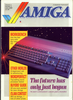|[🔗][1]|June 1988|1988-xx-xx|1.95GBP||
2|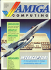|[🔗][2]|July 1988|1988-xx-xx|1.95GBP||
3||[🔗][3]|August 1988|1988-xx-xx|1.95GBP||
4|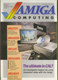|[🔗][4]|September 1988|1988-xx-xx|1.95GBP||
5||[🔗][5]|October 1988|1988-xx-xx|1.95GBP||
6|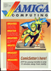|[🔗][6]|November 1988|1988-xx-xx|1.95GBP||
7|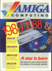|[🔗][7]|December 1988|1988-xx-xx|1.95GBP||
8|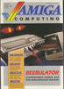|[🔗][8]|January 1989|198x-xx-xx|1.95GBP||
9|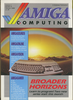|[🔗][9]|February 1989|1989-xx-xx|1.95GBP||
10|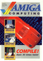|[🔗][10]|March 1989|1989-xx-xx|1.95GBP||
11|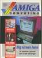|[🔗][11]|April 1989|1989-xx-xx|1.95GBP||
12||[🔗][12]|May 1989|1989-xx-xx|1.95GBP||
13|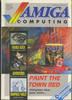|[🔗][13]|June 1989|1989-xx-xx|1.95GBP||
14|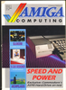|[🔗][14]|July 1989|1989-xx-xx|1.95GBP||
15|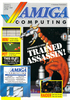|[🔗][15]|August 1989|1989-xx-xx|2.95GBP||Game and utility disk
16|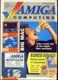|[🔗][16]|September 1989|1989-xx-xx|2.95GBP||Utility disk
17|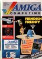|[🔗][17]|October 1989|1989-xx-xx|2.95GBP||Game and utility disk
18||[🔗][18]|November 1989|1989-xx-xx|2.95GBP||Game and utility disk
19|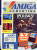|[🔗][19]|December 1989|1989-xx-xx|2.95GBP||Game and utility disk
20||[🔗][20]|January 1990|19xx-xx-xx|2.95GBP||Game and utility disk
21|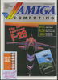|[🔗][21]|February 1990|1990-xx-xx|1.95GBP||Explore Your Amiga book
22||[🔗][22]|March 1990|1990-xx-xx|1.95GBP|9770954594009-03|
23|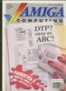|[🔗][23]|April 1990|1990-xx-xx|1.95GBP|9770954594009-04|
24|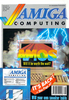|[🔗][24]|May 1990|1990-xx-xx|2.95GBP|9770954594993-05|Game and utility disk
25|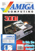|[🔗][25]|June 1990|1990-xx-xx|2.95GBP|9770954594009-06|Utility disk
26||[🔗][26]|July 1990|1990-xx-xx|2.95GBP|9770959963008-07|Game and utility disk
27|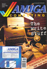|[🔗][27]|August 1990|1990-xx-xx|2.95GBP|9770959963008-08|Utility disk
28||[🔗][28]|September 1990|1990-xx-xx|2.95GBP|9770959963008-09|Utility disk
29|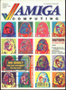|[🔗][29]|October 1990|1990-xx-xx|2.95GBP|9770959963008-10|Game and utility disk
30|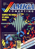|[🔗][30]|November 1990|1990-xx-xx|2.95GBP|9770959963008-11|Game and utility disk
31||[🔗][31]|December 90|1990-xx-xx|2.95GBP|9770959963008-12|Game and utility disk
32|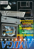|[🔗][32]|January 91|1990-xx-xx|2.95GBP|9770959963008-01|Game and utility disk
33|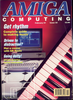|[🔗][33]|February 91|1991-xx-xx|2.95GBP|9770959963008-02|Game and utility disk
34||[🔗][34]|March 1991|1991-xx-xx|2.95GBP|9770959963008-03|Game and utility disk
35|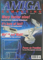|[🔗][35]|April 1991|1991-xx-xx|2.95GBP|9770959963008-04|Game and utility disk
36|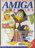|[🔗][36]|May 1991|1991-xx-xx|2.95GBP|9770959963008-05|Game and utility disk
37||[🔗][37]|June 1991|1991-xx-xx|2.99GBP|9770959963015-06|Game and utility disk
38||[🔗][38]|July 1991|1991-xx-xx|2.99GBP|9770959963015-07|Game and utility disk
39|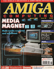|[🔗][39]|August 1991|1991-xx-xx|2.99GBP|9770959963008-08|Game and utility disk
40||[🔗][40]|September 1991|1991-xx-xx|3.75GBP|9770959963022-09|Game and utility disk x2
41||[🔗][41]|October 1991|1991-09-05|3.75GBP|9770959963022-10|CanDo utility disk &vert; Game and utility disk &vert; Gamer supplement
42||[🔗][42]|November 1991|1991-xx-xx|2.99GBP|9770959963039-11|Game and utility disk &vert; Gamer supplement
43|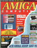|[🔗][43]|December 1991|1991-11-07|2.99GBP|9770959963039-12|Game and utility disk &vert; Gamer supplement
44||[🔗][44]|January 1992|1991-12-05|2.99GBP|9770959963039-01|Game and utility disk &vert; Gamer supplement
45||[🔗][45]|February 1992|1991-12-26|2.99GBP|9770959963039-02|Game and utility disk &vert; Gamer supplement
46||[🔗][46]|March 1992|1992-02-06|2.99GBP|9770959963039-03|Utility disk &vert; Gamer supplement
47||[🔗][47]|April 1992|1992-03-05|2.99GBP|9770959963039-04|Game and utility disk &vert; Gamer supplement
48||[🔗][48]|May 1992|1992-xx-xx|2.99GBP|9770959963039-05|Game and utility disk x2 &vert; Gamer supplement
49||[🔗][49]|June 1992|1992-05-07|2.99GBP|9770959963039-06|SID utility disk &vert; Gamer supplement &vert; Superbase Personal book
50|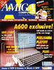|[🔗][50]|July 1992|1992-xx-xx|2.99GBP|9770959963039-07|Saxon Publisher utility disk &vert; Gamer supplement
51||[🔗][51]|August 1992|1992-xx-xx|2.99GBP|9770959963039-08|Game and utility disk &vert; Gamer supplement
52||[🔗][52]|September 1992|1992-xx-xx|2.99GBP|9770959963039-09|Game and utility disk &vert; Gamer supplement &vert; Pocket Companion book
53|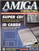|[🔗][53]|October 1992|1992-xx-xx|2.99GBP|9770959963039-10|Game and utility disk &vert; Gamer supplement
54||[🔗][54]|November 1992|1992-xx-xx|2.99GBP|9770959963039-11|Game and utility disk &vert; Gamer supplement
55|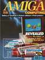|[🔗][55]|December 1992|1992-xx-xx|2.99GBP|9770959963039-12|Game and utility disk &vert; Gamer supplement
56||[🔗][56]|January 1993|1992-xx-xx|3.95GBP|9770959963046-01|Game and utility disk x2 &vert; Gamer supplement
57|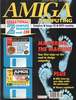|[🔗][57]|February 1993|1993-xx-xx|3.95GBP|9770959963046-02|HiSoft BASIC utility disk &vert; Game and utility disk &vert; Gamer supplement
58|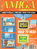|[🔗][58]|March 1993|1993-xx-xx|3.95GBP|9770959963046-03|MaxiPlan 4 utility disk &vert; Utility disk &vert; Gamer supplement
59|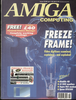|[🔗][59]|April 1993|1993-xx-xx|2.99GBP|9770959963053-04|Game and utility disk &vert; Gamer supplement
60||[🔗][60]|May 1993|1993-xx-xx|2.99GBP|9770959963053-05|Game and utility disk
61||[🔗][61]|June 1993|1993-xx-xx|2.99GBP|9770959963053-06|Utility disk
62||[🔗][62]|July 1993|1993-xx-xx|3.25GBP|9770959963060-07|Utility disk
63||[🔗][63]|August 1993|1993-06-03|3.25GBP|9770959963060-08|Cinemorph Junior utility disk
64||[🔗][64]|September 1993|1993-07-29|3.25GBP|9770959963060-09|Game and utility disk
65|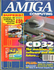|[🔗][65]|October 1993|1993-08-26|3.99GBP|9770959963077-10|Game and utility disk x2
66|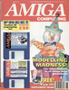|[🔗][66]|November 1993|1993-09-23|3.99GBP|9770959963077-11|Amos 3D utility disk &vert; Game and utility disk
67||[🔗][67]|December 1993|1993-10-21|3.99GBP|9770959963077-12|Game and utility disk x2
68||[🔗][68]|Christmas 1993|1993-11-18|3.99GBP|9770959963077-13|Take 2 utility disk &vert; Game and utility disk
69||[🔗][69]|January 1994|1993-12-16|3.99GBP|9770959963077-01|Design Works utility disk &vert; Game and utility disk
70||[🔗][70]|February 1994|1994-01-13|3.99GBP|9770959963077-02|The Publisher Page Layout utility disk &vert; Utility disk
71||[🔗][71]|March 1994|1994-xx-xx|3.25GBP|9770959963985-03|Utility disk
72|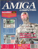|[🔗][72]|April 1994|1994-03-10|3.99GBP|9770959963077-04|KindWords 3 utility disk &vert; CliVa utility disk
73|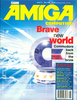|[🔗][73]|May 1994|1994-04-07|3.99GBP|9770959963077-05|Utility disk &vert; Legacy of Sorasil game disk
74|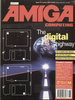|[🔗][74]|June 1994|1994-05-05|3.99GBP|9770959963077-06|KSpread 2 utility disk &vert; Game and utility disk
75|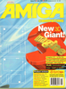|[🔗][75]|July 1994|1994-05-23|3.99GBP|9770959963077-07|Helm Lite utility disk &vert; Game and utility disk
76|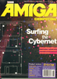|[🔗][76]|August 1994|1994-06-13|3.99GBP|9770959963077-08|Devpac v2 utility disk &vert; Utility disk
77||[🔗][77]|September 1994|1994-07-28|3.99GBP|9770959963077-09|Scroller 2 utility disk &vert; Utility disk
78||[🔗][78]|October 1994|1994-08-25|3.99GBP|9770959963077-10|3D Textures utility disk &vert; Game and utility disk
79|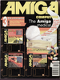|[🔗][79]|November 1994|1994-09-22|3.99GBP|9770959963077-11|Utility disk x2 &vert; Top Gear 2 game disk
80|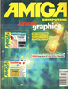|[🔗][80]|December 1994|1994-10-20|3.99GBP|9770959963077-12|Techno Sound Turbo utility disk &vert; Sensible World of Soccer game disk
81||[🔗][81]|Christmas 1994|1994-11-17|3.99GBP|9770959963077-13|Easy AMOS utility disk x2
82|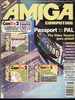|[🔗][82]|January 1995|1994-12-15|3.99GBP|9770959963077-01|Premier Manager 3 game disk &vert; CanDo 2 utility disk x2
83||[🔗][83]|February 1995|1995-01-12|3.99GBP|9770959963077-02|Anim Workshop utility disk &vert; Utility disk
84|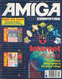|[🔗][84]|March 1995|1995-02-09|3.99GBP|9770959963077-03|Utility disk &vert; Game and utility disk
85||[🔗][85]|April 1995|1995-03-09|3.99GBP|9770959963077-04|Demon Internet utility disk &vert; Mini Office utility disk
86|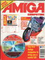|[🔗][86]|May 1995|1995-04-06|3.99GBP|9770959963077-05|Smarty Paints utility disk &vert; Multimedia Toolkit CD-ROM
87||[🔗][87]|June 1995|1995-05-04|3.99GBP|9770959963077-06|Speris Legacy game disk &vert; Lightwave 3D utility disk
88|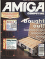|[🔗][88]|July 1995|1995-06-01|3.99GBP|9770959963077-07|MUI 2.3 utility disk &vert; Utility disk
89||[🔗][89]|August 1995|1995-06-29|3.99GBP|9770959963077-08|Personal Paint 4 utility disk &vert; Utility disk
90||[🔗][90]|September 1995|1995-07-27|3.99GBP|9770959963077-09|Utility disk &vert; Game and utility disk
91|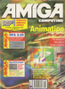|[🔗][91]|October 1995|1995-08-24|3.99GBP|9770959963077-10|DFA 2.25 utility disk &vert; Utility disk
92|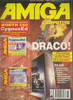|[🔗][92]|November 1995|1995-09-21|3.99GBP|9770959963077-11|Utility disk x2
93||[🔗][93]|December 1995|1995-10-19|4.50GBP|9770959963084-12|Utility disk x2
94||[🔗][94]|Christmas 1995|1995-11-16|4.50GBP|9770959963084-13|Image Engineer utility disk &vert; Game and utility disk
95|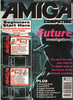|[🔗][95]|January 1996|1995-12-14|4.50GBP|9770959963084-01|Utility disk x2
96||[🔗][96]|February 1996|1996-xx-xx|4.50GBP|9770959963084-02|Image Vision utility disk &vert; Hillsea Lido/Tritus game disk
97||[🔗][97]|March 1996|1996-xx-xx|4.50GBP|9770959963084-03|Nemac IV game disk &vert; Utility disk
98||[🔗][98]|April 1996|1996-xx-xx|4.50GBP|9770959963084-04|Capital Punishment game disk &vert; Utility disk
99||[🔗][99]|May 1996|1996-xx-xx|4.50GBP|9770959963084-05|MUI 3.3 utility disk &vert; Utility disk
100||[🔗][100]|June 1996|1996-xx-xx|4.50GBP|9770959963084-06|Storm C utility disk &vert; Utility disk
101||[🔗][101]|July 1996|1996-xx-xx|4.50GBP|9770959963084-07|Image Engineer v3 utility disk &vert; Utility disk
102||[🔗][102]|August 1996|1996-xx-xx|4.50GBP|9770959963084-08|X-DVE 2 utility disk &vert; Utility disk
103||[🔗][103]|September 1996|1996-xx-xx|4.50GBP|9770959963084-09|iBrowse utility disk &vert; Utility disk
104||[🔗][104]|October 1996|1996-xx-xx|4.50GBP|9770959963084-10|Art Effect utility disk &vert; Utility disk
105||[🔗][105]|November 1996|1996-xx-xx|4.50GBP|9770959963084-11|Doopsi utility disk &vert; Utility disk
106||[🔗][106]|December 1996|1996-xx-xx|4.50GBP|9770959963084-12|Photogenics utility disk &vert; Utility disk
107||[🔗][107]|Christmas 1996|1996-xx-xx|4.50GBP|9770959963084-13|Jet Pilot game disk &vert; DrawStudio utility disk &vert; Game and utility disk
108||[🔗][108]|January 1997|199x-xx-xx|4.50GBP|9770959963084-01|Bubble and Squeak game disk x2
109||[🔗][109]|February 1997|1997-xx-xx|4.50GBP|9770959963084-02|Xtreme Racing game disk x2
110||[🔗][110]|March 1997|1997-xx-xx|4.50GBP|9770959963084-03|Tiny Troops fame disk &vert; Utility disk
111||[🔗][111]|April 1997|1997-xx-xx|4.50GBP|9770959963084-04|Trubo Print 5 utility disk &vert; Utility disk
112||[🔗][112]|May 1997|1997-xx-xx|4.50GBP|9770959963084-05|Utility disk x2
113||[🔗][113]|June 1997|1997-xx-xx|4.50GBP|9770959963084-06|Utility disk &vert; Alien Formula 1 game disk
114||[🔗][114]|July 1997|1997-xx-xx|4.99GBP|9770959963091-07|Utility disk
115||[🔗][115]|August 1997|1997-xx-xx|4.99GBP|9770959963091-08|Utility disk
116||[🔗][116]|September 1997|1997-xx-xx|4.99GBP|9770959963091-09|Utility disk
117||[🔗][117]|October 1997|1997-xx-xx|4.99GBP|9770959963091-10|Utility disk

[1]: https://archive.org/details/amiga-computing-magazine-001
[2]: https://archive.org/details/amiga-computing-magazine-002
[3]: https://archive.org/details/amiga-computing-magazine-003
[4]: https://archive.org/details/amiga-computing-magazine-004
[5]: https://archive.org/details/amiga-computing-magazine-005
[6]: https://archive.org/details/amiga-computing-magazine-006
[7]: https://archive.org/details/amiga-computing-magazine-007
[8]: https://archive.org/details/amiga-computing-magazine-008
[9]: https://archive.org/details/amiga-computing-magazine-009
[10]: https://archive.org/details/amiga-computing-magazine-010
[11]: https://archive.org/details/amiga-computing-magazine-011
[12]: https://archive.org/details/amiga-computing-magazine-012
[13]: https://archive.org/details/amiga-computing-magazine-013
[14]: https://archive.org/details/amiga-computing-magazine-014
[15]: https://archive.org/details/amiga-computing-magazine-015
[16]: https://archive.org/details/amiga-computing-magazine-016
[17]: https://archive.org/details/amiga-computing-magazine-017
[18]: https://archive.org/details/amiga-computing-magazine-018
[19]: https://archive.org/details/amiga-computing-magazine-019
[20]: https://archive.org/details/amiga-computing-magazine-020
[21]: https://archive.org/details/amiga-computing-magazine-021
[22]: https://archive.org/details/amiga-computing-magazine-022
[23]: https://archive.org/details/amiga-computing-magazine-023
[24]: https://archive.org/details/amiga-computing-magazine-024
[25]: https://archive.org/details/amiga-computing-magazine-025
[26]: https://archive.org/details/amiga-computing-magazine-026
[27]: https://archive.org/details/amiga-computing-magazine-027
[28]: https://archive.org/details/amiga-computing-magazine-028
[29]: https://archive.org/details/amiga-computing-magazine-029
[30]: https://archive.org/details/amiga-computing-magazine-030
[31]: https://archive.org/details/amiga-computing-magazine-031
[32]: https://archive.org/details/amiga-computing-magazine-032
[33]: https://archive.org/details/amiga-computing-magazine-033
[34]: https://archive.org/details/amiga-computing-magazine-034
[35]: https://archive.org/details/amiga-computing-magazine-035
[36]: https://archive.org/details/amiga-computing-magazine-036
[37]: https://archive.org/details/amiga-computing-magazine-037
[38]: https://archive.org/details/amiga-computing-magazine-038
[39]: https://archive.org/details/amiga-computing-magazine-039
[40]: https://archive.org/details/amiga-computing-magazine-040
[41]: https://archive.org/details/amiga-computing-magazine-041
[42]: https://archive.org/details/amiga-computing-magazine-042
[43]: https://archive.org/details/amiga-computing-magazine-043
[44]: https://archive.org/details/amiga-computing-magazine-044
[45]: https://archive.org/details/amiga-computing-magazine-045
[46]: https://archive.org/details/amiga-computing-magazine-046
[47]: https://archive.org/details/amiga-computing-magazine-047
[48]: https://archive.org/details/amiga-computing-magazine-048
[49]: https://archive.org/details/amiga-computing-magazine-049
[50]: https://archive.org/details/amiga-computing-magazine-050
[51]: https://archive.org/details/amiga-computing-magazine-051
[52]: https://archive.org/details/amiga-computing-magazine-052
[53]: https://archive.org/details/amiga-computing-magazine-053
[54]: https://archive.org/details/amiga-computing-magazine-054
[55]: https://archive.org/details/amiga-computing-magazine-055
[56]: https://archive.org/details/amiga-computing-magazine-056
[57]: https://archive.org/details/amiga-computing-magazine-057
[58]: https://archive.org/details/amiga-computing-magazine-058
[59]: https://archive.org/details/amiga-computing-magazine-059
[60]: https://archive.org/details/amiga-computing-magazine-060
[61]: https://archive.org/details/amiga-computing-magazine-061
[62]: https://archive.org/details/amiga-computing-magazine-062
[63]: https://archive.org/details/amiga-computing-magazine-063
[64]: https://archive.org/details/amiga-computing-magazine-064
[65]: https://archive.org/details/amiga-computing-magazine-065
[66]: https://archive.org/details/amiga-computing-magazine-066
[67]: https://archive.org/details/amiga-computing-magazine-067
[68]: https://archive.org/details/amiga-computing-magazine-068
[69]: https://archive.org/details/amiga-computing-magazine-069
[70]: https://archive.org/details/amiga-computing-magazine-070
[71]: https://archive.org/details/amiga-computing-magazine-071
[72]: https://archive.org/details/amiga-computing-magazine-072
[73]: https://archive.org/details/amiga-computing-magazine-073
[74]: https://archive.org/details/amiga-computing-magazine-074
[75]: https://archive.org/details/amiga-computing-magazine-075
[76]: https://archive.org/details/amiga-computing-magazine-076
[77]: https://archive.org/details/amiga-computing-magazine-077
[78]: https://archive.org/details/amiga-computing-magazine-078
[79]: https://archive.org/details/amiga-computing-magazine-079
[80]: https://archive.org/details/amiga-computing-magazine-080
[81]: https://archive.org/details/amiga-computing-magazine-081
[82]: https://archive.org/details/amiga-computing-magazine-082
[83]: https://archive.org/details/amiga-computing-magazine-083
[84]: https://archive.org/details/amiga-computing-magazine-084
[85]: https://archive.org/details/amiga-computing-magazine-085
[86]: https://archive.org/details/amiga-computing-magazine-086
[87]: https://archive.org/details/amiga-computing-magazine-087
[88]: https://archive.org/details/amiga-computing-magazine-088
[89]: https://archive.org/details/amiga-computing-magazine-089
[90]: https://archive.org/details/amiga-computing-magazine-090
[91]: https://archive.org/details/amiga-computing-magazine-091
[92]: https://archive.org/details/amiga-computing-magazine-092
[93]: https://archive.org/details/amiga-computing-magazine-093
[94]: https://archive.org/details/amiga-computing-magazine-094
[95]: https://archive.org/details/amiga-computing-magazine-095
[96]: https://archive.org/details/amiga-computing-magazine-096
[97]: https://archive.org/details/amiga-computing-magazine-097
[98]: https://archive.org/details/amiga-computing-magazine-098
[99]: https://archive.org/details/amiga-computing-magazine-099
[100]: https://archive.org/details/amiga-computing-magazine-100
[101]: https://archive.org/details/amiga-computing-magazine-101
[102]: https://archive.org/details/amiga-computing-magazine-102
[103]: https://archive.org/details/amiga-computing-magazine-103
[104]: https://archive.org/details/amiga-computing-magazine-104
[105]: https://archive.org/details/amiga-computing-magazine-105
[106]: https://archive.org/details/amiga-computing-magazine-106
[107]: https://archive.org/details/amiga-computing-magazine-107
[108]: https://archive.org/details/amiga-computing-magazine-108
[109]: https://archive.org/details/amiga-computing-magazine-109
[110]: https://archive.org/details/amiga-computing-magazine-110
[111]: https://archive.org/details/amiga-computing-magazine-111
[112]: https://archive.org/details/amiga-computing-magazine-112
[113]: https://archive.org/details/amiga-computing-magazine-113
[114]: https://archive.org/details/amiga-computing-magazine-114
[115]: https://archive.org/details/amiga-computing-magazine-115
[116]: https://archive.org/details/amiga-computing-magazine-116
[117]: https://archive.org/details/amiga-computing-magazine-117
