# Amiga Fun

. | _Amiga Fun_
--- | ---
Alternate titles | 
Publisher | MC Publications
Country | United Kingdom
Language | English
Topic | Video games
Years | 1990 &mdash; 1992
Issues | 12
Frequency | Monthly
ISSN | 0960-9342
Website | 
Related | _[Amiga Mania](Amiga%20Mania.md)_ (next) &vert; _[C64 Fun](C64%20Fun.md)_ &vert; _[PC Fun](PC%20Fun.md)_ &vert; _[ST Fun](ST%20Fun.md)_

Issue | Front&nbsp;cover | Full | Cover date | Actual date | Price | Barcode | Extras
----- | ---------------- | ---- | ---------- | ----------- | ----- | ------- | ------
1|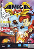||November 1990|1990-xx-xx|2.99GBP|9770960934004-10|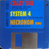 3.5" floppy disk
2|||December 1990|1990-xx-xx|||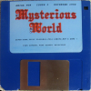 3.5" floppy disk
3|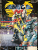||January 1991|1990-xx-xx|4.99GBP||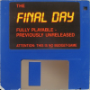 3.5" floppy disk &vert; Poster
4|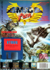||February 1991|1991-xx-xx|4.99GBP|9770960934011-04|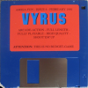 3.5" floppy disk &vert; Poster [🔗][4e]
5|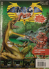||March 1991|1991-xx-xx|4.99GBP|9770960934011-05|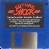 3.5" floppy disk &vert; Poster
6|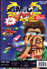||April 1991|1991-xx-xx|4.99GBP|9770960934011-06|3.5" floppy disk [🔗][6e]
7|||May 1991|1991-xx-xx|4.99GBP|9770960934011-07|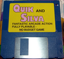 3.5" floppy disk
12|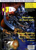|[🔗][12]|January 1992|1991-xx-xx|4.99GBP|9770960934011-12| 3.5" floppy disk &vert; Poster

[12]: https://archive.org/details/amiga-fun-12

[4e]: https://archive.org/details/Amiga_Fun_04_1991-01_MC_Publications_GB_Vyrus_Feb_1991
[6e]: https://archive.org/details/Amiga_Fun_06_1991-03_MC_Publications_GB_Movem_Pick_Out_Apr_1991
