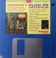
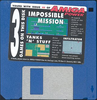
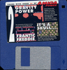

# Amiga Power

. | _Amiga Power_
--- | ---
Alternate titles | 
Publisher | Future Publishing
Country | United Kingdom
Language | English
Topic | Video games
Years | 1991 &mdash; 1996
Issues | 65 (66)
Frequency | Monthly
ISSN | 0961-7310
Website | 
Related | _[Sega Power](Sega%20Power.md)_

Issue | Front&nbsp;cover | Full | Cover date | Actual date | Price | Barcode | Extras
----- | ---------------- | ---- | ---------- | ----------- | ----- | ------- | ------
0|||May 1991|1991-xx-xx|||
1|||May 1991|1991-04-25|2.95GBP|9770961731008-01| 3.5" floppy disk [🔗][1e]
2|||June 1991|1991-05-23|2.95GBP|9770961731008-06| 3.5" floppy disk [🔗][1e]
3|||July 1991|1991-06-27|2.95GBP|9770961731008-07| 3.5" floppy disk [🔗][2e]
4|||August 1991|1991-07-25|2.95GBP|9770961731008-08| 3.5" floppy disk [🔗][3e] &vert; Poster
5|||September 1991|1991-08-22|2.95GBP|9770961731008-09| 3.5" floppy disk [🔗][4e]
6|||October 1991|1991-09-26|2.95GBP|9770961731008-10| 3.5" floppy disk [🔗][5e] &vert; Postcard x5
7|||November 1991|1991-10-24|2.95GBP|9770961731008-11| 3.5" floppy disk [🔗][6e]
8|||December 1991|1991-11-28|2.95GBP|9770961731008-12| 3.5" floppy disk [🔗][7e]
9|||January 1992|1991-12-19|3.65GBP|9770961731992-01|  3.5" floppy disk x2 [🔗][XXe]
10|||February 1992|1992-01-30|2.95GBP|9770961731008-02| 3.5" floppy disk [🔗][10e]
11|||March 1992|1992-02-27|2.95GBP|9770961731008-03| 3.5" floppy disk [🔗][11e]
12|||April 1992|1992-03-26|3.75GBP|9770961731985-04|  3.5" floppy disk x2 [🔗][XXe]
13|||May 1992|1992-xx-xx|3.75GBP|9770961731978-05|  3.5" floppy disk x2
14|||June 1992|1992-05-28|3.75GBP|9770961731015-06|  3.5" floppy disk x2 [🔗][XXe]
15|||July 1992|1992-06-25|3.75GBP|9770961731015-07|  3.5" floppy disk x2 [🔗][XXe]
16|||August 1992|1992-07-25|3.75GBP|9770961731015-08|  3.5" floppy disk x2 [🔗][XXe]
17|||September 1992|1992-08-27|3.75GBP|9770961731015-09|  3.5" floppy disk x2 [🔗][XXe]
18|||October 1992|1992-09-17|3.50GBP|9770961731022-10| 3.5" floppy disk [🔗][18e] &vert; Postcard x4
19|||November 1992|1992-10-22|3.50GBP|9770961731022-11| 3.5" floppy disk [🔗][19e]
20|||December 1992|1992-11-19|3.50GBP|9770961731022-12| 3.5" floppy disk [🔗][20e]
21|||January 1993|1992-12-17|3.50GBP|9770961731022-01| 3.5" floppy disk [🔗][21e]
21A|||January 1993|1992-12-16||9770961731022-01|3.5" floppy disk
22|||February 1993|1993-01-14|3.50GBP|9770961731022-02| 3.5" floppy disk [🔗][22e] &vert; Lemmings 2 wall planner
23|||March 1993|1993-02-11|3.50GBP|9770961731022-03| 3.5" floppy disk [🔗][23e]
24|||April 1993|1993-03-11|3.50GBP|9770961731022-04| 3.5" floppy disk [🔗][24e] &vert; Absolute Power supplement
25|||May 1993|1993-04-08|3.50GBP|9770961731022-05| 3.5" floppy disk [🔗][25e]
26|||June 1993|1993-xx-xx|3.50GBP|9770961731022-06| 3.5" floppy disk [🔗][26e] &vert; HMV vouchers
27|||July 1993|1993-xx-xx|3.50GBP|9770961731022-07| 3.5" floppy disk [🔗][27e]
28|||August 1993|1993-07-08|3.50GBP|9770961731022-08| 3.5" floppy disk [🔗][28e]
29|||September 1993|1993-08-12|3.50GBP|9770961731022-09| 3.5" floppy disk [🔗][29e] &vert; GamesMaster supplement
30|||October 1993|1993-09-09|3.50GBP|9770961731022-10| 3.5" floppy disk [🔗][30e] &vert; Postcards
31|||November 1993|1993-10-14|3.95GBP|9770961731039-11|  3.5" floppy disk x2
32|||December 1993|1993-11-11|3.95GBP|9770961731039-12|  3.5" floppy disk x2
33|||January 1994|1993-12-09|3.95GBP|9770961731039-01|   3.5" floppy disk x3
34|||February 1994|1994-01-13|3.95GBP|9770961731039-02|  3.5" floppy disk x2 [🔗][XXe]
35|||March 1994|1994-02-17|3.50GBP|9770961731046-03| 3.5" floppy disk [🔗][35e] 
36|||April 1994|1994-03-17|3.50GBP|9770961731046-04| 3.5" floppy disk [🔗][36e] 
37|||May 1994|1994-04-21|3.95GBP|9770961731053-05|  3.5" floppy disk x2 [🔗][XXe]
38|||June 1994|1994-xx-xx|3.95GBP|9770961731053-06|  3.5" floppy disk x2 [🔗][XXe]
39|||July 1994|1994-xx-xx|3.95GBP|9770961731053-07|  3.5" floppy disk x2 [🔗][XXe]
40|||August 1994|1994-xx-xx|3.95GBP|9770961731053-08|  3.5" floppy disk x2 [🔗][XXe]
41|||September 1994|1994-xx-xx|3.95GBP|9770961731053-09|  3.5" floppy disk x2 [🔗][XXe]
42|||October 1994|1994-xx-xx|3.95GBP|9770961731053-10|   3.5" floppy disk x3
43|||November 1994|1994-xx-xx|3.95GBP|9770961731053-11|  3.5" floppy disk x2
44|||December 1994|1994-xx-xx|3.95GBP|9770961731053-12|  3.5" floppy disk x2
45|||January 1995|1994-xx-xx|3.95GBP|9770961731053-01|   3.5" floppy disk x3
46|||February 1995|1995-xx-xx|3.95GBP|9770961731053-02|  3.5" floppy disk x2
47|||March 1995|1995-xx-xx|3.95GBP|9770961731053-03|  3.5" floppy disk x2 [🔗][XXe]
48|||April 1995|1995-xx-xx|3.99GBP|9770961731060-04|  3.5" floppy disk x2 [🔗][XXe]
49|||May 1995|1995-xx-xx|3.99GBP|9770961731060-05|  3.5" floppy disk x2
49A|||May 1995|1995-xx-xx|4.99GBP|9771358002008-05| CD32 CD-ROM [🔗][49Ae] 
50|||June 1995|1995-xx-xx|4.25GBP|9770961731077-06|  3.5" floppy disk x2 [🔗][XXe]
51|||July 1995|1995-xx-xx|4.25GBP|9770961731077-07|  3.5" floppy disk x2 [🔗][XXe]
52|||August 1995|1995-xx-xx|4.25GBP|9770961731077-08|  3.5" floppy disk x2 [🔗][XXe]
53|||September 1995|1995-xx-xx|4.25GBP|9770961731077-09|  3.5" floppy disk x2 [🔗][XXe]
54|||October 1995|1995-xx-xx|4.25GBP|9770961731077-10|  3.5" floppy disk x2 [🔗][XXe]
55|||November 1995|1995-xx-xx|4.25GBP|9770961731077-11|  3.5" floppy disk x2 [🔗][XXe]
56|||December 1995|1995-xx-xx|4.25GBP|9770961731077-12|  3.5" floppy disk x2 [🔗][XXe]
57|||January 1996|1995-xx-xx|4.25GBP|9770961731077-01|  3.5" floppy disk x2 [🔗][XXe]
58|||February 1996|1996-xx-xx|4.50GBP|9770961731084-02|  3.5" floppy disk x2
59|||March 1996|1996-xx-xx|4.50GBP|9770961731084-03|  3.5" floppy disk x2 [🔗][XXe]
60|||April 1996|1996-xx-xx|4.50GBP|9770961731084-04|  3.5" floppy disk x2 [🔗][XXe]
61|||May 1996|1996-xx-xx|4.50GBP|9770961731084-05|  3.5" floppy disk x2 [🔗][XXe]
62|||June 1996|1996-xx-xx|4.50GBP|9770961731084-06|3.5" floppy disk [🔗][62e] 
63|||July 1996|1996-xx-xx|4.50GBP|9770961731084-07| 3.5" floppy disk [🔗][63e] 
64|||August 1996|1996-xx-xx|4.50GBP|9770961731084-08| 3.5" floppy disk [🔗][64e] 
65|||September 1996|1996-xx-xx|4.50GBP|9770961731084-09| 3.5" floppy disk  [🔗][65e] 

[1e]: https://archive.org/details/amiga-power-magazine-01-coverdisks
[2e]: https://archive.org/details/amiga-power-magazine-02-coverdisks
[3e]: https://archive.org/details/amiga-power-magazine-03-coverdisks
[4e]: https://archive.org/details/amiga-power-magazine-04-coverdisks
[5e]: https://archive.org/details/amiga-power-magazine-05-coverdisks
[6e]: https://archive.org/details/amiga-power-magazine-06-coverdisks
[7e]: https://archive.org/details/amiga-power-magazine-07-coverdisks
[8e]: https://archive.org/details/amiga-power-magazine-08-coverdisks

[10e]: https://archive.org/details/Amiga_Power_10_1992_Future_Publishing_GB_Feb_1992
[11e]: https://archive.org/details/Amiga_Power_11_1992_Future_Publishing_GB_Mar_1992

[18e]: https://archive.org/details/Amiga_Power_18_1992_Future_Publishing_GB_Oct_1992
[19e]: https://archive.org/details/Amiga_Power_19_1992_Future_Publishing_GB_Nov_1992
[20e]: https://archive.org/details/Amiga_Power_20_1992_Future_Publishing_GB_Dec_1992
[21e]: https://archive.org/details/Amiga_Power_21_1993_Future_Publishing_GB_Jan_1993
[22e]: https://archive.org/details/Amiga_Power_22_1993-01-14_Future_Publishing_GB_Feb_1993
[23e]: https://archive.org/details/Amiga_Power_23_1993-02-11_Future_Publishing_GB_Mar_1993
[24e]: https://archive.org/details/Amiga_Power_24_1993-03-11_Future_Publishing_GB_Apr_1993
[25e]: https://archive.org/details/Amiga_Power_25_1993_Future_Publishing_GB_May_1993
[26e]: https://archive.org/details/Amiga_Power_26_1993_Future_Publishing_GB_Jun_1993
[27e]: https://archive.org/details/Amiga_Power_27_1993_Future_Publishing_GB_Jul_1993
[28e]: https://archive.org/details/Amiga_Power_28_1993_Future_Publishing_GB_Aug_1993
[29e]: https://archive.org/details/Amiga_Power_29_1993_Future_Publishing_GB_Sep_1993
[30e]: https://archive.org/details/Amiga_Power_30_1993-09-09_Future_Publishing_GB_Oct_1993

[35e]: https://archive.org/details/Amiga_Power_35_1994_Future_Publishing_GB_Mar_1994
[36e]: https://archive.org/details/Amiga_Power_36_1994_Future_Publishing_GB_Apr_1994

[40Ae]: https://archive.org/details/amiga-power-cd-1995-05

[62e]: https://archive.org/details/Amiga_Power_62_1996_Future_Publishing_GB_Jun_1996_F1_World_Championship_Edition
[63e]: https://archive.org/details/Amiga_Power_63_1996_Future_Publishing_GB_Jul_1996_Battle_for_the_Ashes
[64e]: https://archive.org/details/Amiga_Power_64_1996_Future_Publishing_GB_Aug_1996_Blob
[65e]: https://archive.org/details/Amiga_Power_65_1996_Future_Publishing_GB_Sep_1996_No_Second_Prize

[XXe]: https://archive.org/download/amiga-power-coverdisks-exotica
