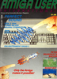
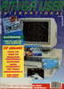
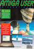
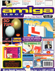
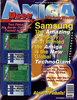

# Amiga User International

. | _Amiga User International_
--- | ---
Alternate titles | _AUI_
Publisher | Croftward Limited (2.1-4.6) &vert; Maxwell Specialist Magazines (4.7-5.9) &vert; Maxwell Consumer Magazines (5.10-6.3) &vert; HHL Publishing (6.4-7.4) &vert; HYA Limited (7.5-) &vert; AUI Limited (-11.5)
Country | United Kingdom
Language | English
Topic | Computers
Years | 1986 &mdash; 1997
Issues | 109
Frequency | Monthly
ISSN | 0955-1077
Website | 
Related | _[Commodore Computing International](Commodore%20Computing%20International.md)_

Issue | Front&nbsp;cover | Full | Cover date | Actual date | Price | Barcode | Extras
----- | ---------------- | ---- | ---------- | ----------- | ----- | ------- | ------
2.1|||November/December 1987|1987-xx-xx|1.95GBP||
2.2||[🔗][2.2]|February 1988|1988-xx-xx|1.95GBP||
2.3||[🔗][2.3]|March 1988|1988-xx-xx|1.95GBP||
2.4||[🔗][2.4]|April 1988|1988-xx-xx|1.95GBP||
2.5||[🔗][2.5]|May 1988|1988-xx-xx|1.95GBP||
2.6||[🔗][2.6]|June 1988|1988-xx-xx|1.95GBP||
2.7||[🔗][2.7]|July 1988|1988-xx-xx|1.95GBP||
2.8||[🔗][2.8]|August 1988|1988-xx-xx|1.95GBP||
2.9||[🔗][2.9]|September 1988|1988-xx-xx|1.95GBP||
2.10||[🔗][2.10]|October 1988|1988-xx-xx|1.95GBP||
2.11||[🔗][2.11]|November 1988|1988-xx-xx|1.95GBP||Printer supplement
2.12||[🔗][2.12]|December 1988|1988-xx-xx|1.95GBP||
3.1||[🔗][3.1]|January 1989|198x-xx-xx|1.95GBP||
3.2||[🔗][3.2]|February 1989|1989-xx-xx|1.95GBP|074470121299-02|
3.3||[🔗][3.3]|March 1989|1989-xx-xx|1.95GBP|074470121299-03|
3.4||[🔗][3.4]|April 1989|1989-xx-xx|1.95GBP|074470121299-04|
3.5||[🔗][3.5]|May 1989|1989-xx-xx|1.95GBP|074470121299-05|
3.6||[🔗][3.6]|June 1989|1989-xx-xx|1.95GBP|074470121299-06|
3.7||[🔗][3.7]|July 1989|1989-xx-xx|1.95GBP|074470121299-07|
3.8||[🔗][3.8]|August 1989|1989-xx-xx|1.95GBP|074470121299-08|
3.9||[🔗][3.9]|September 1989|1989-xx-xx|1.95GBP|074470121299-09|
3.10||[🔗][3.10]|October 1989|1989-xx-xx|1.95GBP|074470121299-10|
3.11||[🔗][3.11]|November 1989|1989-xx-xx|1.95GBP|074470121299-11|
3.12||[🔗][3.12]|December 1989|1989-xx-xx|1.95GBP|074470121299-12|
4.1||[🔗][4.1]|January 1990|1989-xx-xx|1.95GBP|074470121305-01|
4.2||[🔗][4.2]|February 1990|1990-xx-xx|1.95GBP|074470121305-02|
4.3||[🔗][4.3]|March 1990|1990-xx-xx|1.95GBP|074470121305-03|
4.4||[🔗][4.4]|April 1990|1990-xx-xx|1.95GBP|9770955107000-04|
4.5||||1990-xx-xx|||
4.6||[🔗][4.6]||1990-xx-xx|1.95GBP||
4.7||||1990-xx-xx|||
4.8||||1990-xx-xx|||
4.9|||September/October 1990|1990-xx-xx|1.95GBP|074470121305-09|
4.10||[🔗][4.10]|November 1990|1990-xx-xx|1.95GBP|9770955107000-11|
4.11||[🔗][4.11]|December 1990|1990-xx-xx|1.95GBP|9770955107000-12|
5.1||[🔗][5.1]|January 1991|1990-xx-xx|1.95GBP|9770955107000-01|Hit Mix
5.2||[🔗][5.2]|February 1991|1991-xx-xx|1.95GBP|9770955107000-02|Grooves
5.3||[🔗][5.3]|March 1991|1991-xx-xx|1.95GBP|9770955107000-03|
5.4||[🔗][5.4]|April 1991|1991-xx-xx|1.95GBP|9770955107000-04|
5.5||[🔗][5.5]|May 1991|1991-xx-xx|1.95GBP|9770955107000-05|
5.6||[🔗][5.6]|June 1991|1991-xx-xx|2.95GBP|9770955107017-06|3.5" floppy disk
5.7||[🔗][5.7]|July 1991|1991-xx-xx|2.25GBP|9770955107017-07|3.5" floppy disk
5.8||[🔗][5.8]|August 1991|1991-xx-xx|2.25GBP|9770955107017-08|3.5" floppy disk
5.9||[🔗][5.9]|September 1991|1991-xx-xx|2.95GBP|9770955107017-09|3.5" floppy disk
5.10||[🔗][5.10]|October 1991|1991-xx-xx|2.95GBP|9770955107017-10|3.5" floppy disk
5.11||[🔗][5.11]|November 1991|1991-xx-xx|2.95GBP|9770955107017-11|3.5" floppy disk
5.12||[🔗][5.12]|December 1991|1991-xx-xx|2.95GBP|9770955107017-12|3.5" floppy disk
6.1||[🔗][6.1]|January 1992|1991-xx-xx|2.95GBP|9770955107017-01|3.5" floppy disk
6.2||[🔗][6.2]||1992-xx-xx|||
6.3||[🔗][6.3]|March 1992|1992-xx-xx|2.95GBP|9770955107017-03|3.5" floppy disk
6.4||[🔗][6.4]|April 1992|1992-xx-xx|2.95GBP|9770955107017-04|3.5" floppy disk
6.5||[🔗][6.5]|May 1992|1992-xx-xx|2.95GBP|9770955107017-05|3.5" floppy disk
6.6||[🔗][6.6]|June 1992|1992-xx-xx|2.95GBP|9770955107017-06|3.5" floppy disk
6.7||[🔗][6.7]|July 1992|1992-xx-xx|2.95GBP|9770955107017-07|3.5" floppy disk
6.8||[🔗][6.8]|August/September 1992|1992-xx-xx|2.95GBP|9770955107017-08|3.5" floppy disk
6.10||[🔗][6.10]|October 1992|1992-xx-xx|2.95GBP|9770955107017-10|3.5" floppy disk
6.11||[🔗][6.11]|November 1992|1992-10-01|2.95GBP|9770955107017-11|3.5" floppy disk
6.12||[🔗][6.12]|December 1992|1992-xx-xx|2.95GBP|9770955107017-12|3.5" floppy disk
7.1||[🔗][7.1]|January 1993|1992-xx-xx|2.95GBP|9770955107017-01|3.5" floppy disk
7.2||[🔗][7.2]|February 1993|1993-xx-xx|3.25GBP|9770955107024-02|3.5" floppy disk
7.3||[🔗][7.3]|March 1993|1993-xx-xx|3.25GBP|9770955107024-03|3.5" floppy disk
7.4||[🔗][7.4]|April 1993|1993-xx-xx|3.25GBP|9770955107024-04|3.5" floppy disk
7.5||[🔗][7.5]|May/June 1993|1993-xx-xx|3.25GBP|9770955107024-05|3.5" floppy disk
7.6||[🔗][7.6]|July 1993|1993-xx-xx|3.25GBP|9770955107024-07|3.5" floppy disk
7.7||[🔗][7.7]|August 1993|1993-xx-xx|3.25GBP|9770955107024-08|3.5" floppy disk
7.8||[🔗][7.8]|September 1993|1993-xx-xx|3.25GBP|9770955107024-09|3.5" floppy disk
7.9||[🔗][7.9]|October 1993|1993-xx-xx|3.25GBP|9770955107024-10|3.5" floppy disk
7.10||[🔗][7.10]|November 1993|1993-xx-xx|3.25GBP|9770955107024-11|3.5" floppy disk
7.12||[🔗][7.12]|December 1993|1993-xx-xx|3.25GBP|9770955107024-12|3.5" floppy disk &vert; Supplement
8.1||[🔗][8.1]|January 1994|1993-xx-xx|3.25GBP|9770955107024-01|3.5" floppy disk
8.2||[🔗][8.2]|February 1994|1994-xx-xx|3.75GBP|9770955107031-02|3.5" floppy disk x2
8.3||[🔗][8.3]|March/April 1994|1994-xx-xx|3.75GBP|9770955107031-03|3.5" floppy disk x2
8.3A|||March/April 1994|1994-xx-xx|3.75GBP|9770955107031-03|3.5" floppy disk &vert; CD-ROM
8.4||[🔗][8.4]|May 1994|1994-xx-xx|3.99GBP|9770955107048-04|3.5" floppy disk x2
8.4A|||May 1994|1994-xx-xx|3.99GBP|9770955107048-04|3.5" floppy disk &vert; CD-ROM
8.5||[🔗][8.5]|June 1994|1994-xx-xx|3.99GBP|9770955107048-06|3.5" floppy disk x2
8.6||[🔗][8.6]|July 1994|1994-06-02|3.99GBP|9770955107994-07|3.5" floppy disk x2
8.6A|||July 1994|1994-06-02|3.99GBP|9770955107994-07|3.5" floppy disk &vert; CD-ROM
8.7||[🔗][8.7]|August 1994|1994-xx-xx|3.50GBP|9770955107062-08|3.5" floppy disk
8.8||[🔗][8.8]|September 1994|1994-08-04|3.50GBP|9770955107062-09|3.5" floppy disk
8.9||[🔗][8.9]|October 1994|1994-xx-xx|3.99GBP|9770955107079-10|3.5" floppy disk x2
8.10||[🔗][8.10]|November 1994|1994-xx-xx|3.75GBP|9770955107086-11|3.5" floppy disk x2
8.11||[🔗][8.11]|December 1994|1994-11-xx|3.75GBP|9770955107987-12|3.5" floppy disk x2
9.1||[🔗][9.1]|January 1995|1994-xx-xx|3.75GBP|9770955107987-01|3.5" floppy disk x2
9.2||[🔗][9.2]|February 1995|1995-01-xx|3.75GBP|9770955107086-02|3.5" floppy disk x2
9.3||[🔗][9.3]|March 1995|1995-xx-xx|3.75GBP|9770955107086-03|3.5" floppy disk x2
9.4||[🔗][9.4]|April 1995|1995-xx-xx|3.75GBP|9770955107086-04|3.5" floppy disk x2
9.5||[🔗][9.5]|May 1995|1995-04-06|3.75GBP|9770955107086-05|3.5" floppy disk x2
9.6||[🔗][9.6]|June 1995|1995-05-04|3.75GBP|9770955107086-06|3.5" floppy disk x2
9.7||[🔗][9.7]|July 1995|1995-xx-xx|3.75GBP|9770955107086-07|3.5" floppy disk x2
9.8||[🔗][9.8]|August 1995|1995-07-06|3.75GBP|9770955107086-08|3.5" floppy disk x2
9.9||[🔗][9.9]|September 1995|1995-xx-xx|3.99GBP|9770955107093-09|3.5" floppy disk x2
9.10||[🔗][9.10]|October 1995|1995-xx-xx|3.99GBP|9770955107093-10|3.5" floppy disk x2
9.11||[🔗][9.11]|November 1995|1995-xx-xx|3.99GBP|9770955107093-11|3.5" floppy disk x2
9.12||[🔗][9.12]|December 1995|1995-xx-xx|3.99GBP|9770955107093-12|3.5" floppy disk x2
10.1||[🔗][10.1]|January 1996|1995-xx-xx|3.99GBP|9770955107093-01|3.5" floppy disk x2
10.2||[🔗][10.2]|February 1996|1996-xx-xx|3.99GBP|9770955107093-02|3.5" floppy disk x2
10.3||[🔗][10.3]|March 1996|1996-xx-xx|3.99GBP|9770955107093-03|3.5" floppy disk x2
10.4||[🔗][10.4]|April 1996|1996-xx-xx|3.99GBP|9770955107093-04|3.5" floppy disk x2
10.5||[🔗][10.5]|May 1996|1996-xx-xx|3.99GBP|9770955107093-05|3.5" floppy disk x2
10.6||[🔗][10.6]|June 1996|1996-xx-xx|3.99GBP|9770955107093-06|3.5" floppy disk x2
10.7|||July 1996|1996-xx-xx|||3.5" floppy disk x2
10.8||[🔗][10.8]|August 1996|1996-xx-xx|3.99GBP|9770955107093-08|3.5" floppy disk x2
10.9||[🔗][10.9]|September 1996|1996-xx-xx|3.99GBP|9770955107093-09|3.5" floppy disk x2
10.10||[🔗][10.10]|October 1996|1996-xx-xx|3.99GBP|9770955107093-10|3.5" floppy disk x2
10.11||[🔗][10.11]|November 1996|1996-xx-xx|3.99GBP|9770955107093-11|3.5" floppy disk x2
10.12||[🔗][10.12]|December 1996|1996-xx-xx|3.99GBP|9770955107093-12|3.5" floppy disk x2
11.1||[🔗][11.1]|January 1997|1996-xx-xx|3.99GBP|9770955107093-1|3.5" floppy disk x2
11.2||[🔗][11.2]|February 1997|1997-xx-xx|4.25GBP|9770955107109-2|3.5" floppy disk x2
11.3||[🔗][11.3]|March 1997|1997-02-06|4.25GBP|9770955107109-3|3.5" floppy disk x2
11.4||[🔗][11.4]|April 1997|1997-03-06|4.25GBP|9770955107109-4|3.5" floppy disk x2
11.5||[🔗][11.5]|May 1997|1997-04-03|4.25GBP|9770955107109-05|3.5" floppy disk x2 

[2.2]: https://archive.org/download/AUIHi1989005/AUIHi1988002.zip/
[2.3]: https://archive.org/details/AmigaUserInternationalv0203198803CroftwardLtd
[2.4]: https://archive.org/download/AUIHi1989005/AUIHi1988004.zip/
[2.5]: https://archive.org/download/AUIHi1989005/AUIHI1988005.zip/
[2.6]: https://archive.org/details/Amiga_User_International_1988006
[2.7]: https://archive.org/details/AmigaUserInternationalv0207198807CroftwardLtd
[2.8]: https://archive.org/details/Amiga_User_International_1988008
[2.9]: https://archive.org/download/AUIHi1989005/AUIHi1988009.zip/
[2.10]: https://archive.org/details/Amiga_User_International_1988010
[2.11]: https://archive.org/details/Amiga_User_International_1988011
[2.12]: https://archive.org/details/Amiga_User_International_1988012
[3.1]: https://archive.org/details/Amiga_User_International_1989001
[3.2]: https://archive.org/details/Amiga_User_International_1989002
[3.3]: https://archive.org/details/Amiga_User_International_Volume_03_No_03_1989-03_Croftward_Limited_GB
[3.4]: https://archive.org/details/Amiga_User_International_1989004
[3.5]: https://archive.org/details/Amiga_User_International_1989005
[3.6]: https://archive.org/details/Amiga_User_International_1989006
[3.7]: https://archive.org/details/Amiga_User_International_1989007
[3.8]: https://archive.org/details/Amiga_User_International_1989008
[3.9]: https://archive.org/details/amiga-user-international-vol-3-9
[3.10]: https://archive.org/details/Amiga_User_International_1989010
[3.11]: https://archive.org/details/Amiga_User_International_Volume_03_No_11_1989-11_Croftward_Limited_GB
[3.12]: https://archive.org/details/Amiga_User_International_1989012
[4.1]: https://archive.org/details/Amiga_User_International_Volume_04_No_01_1990-01_Croftward_Limited_GB
[4.2]: https://archive.org/download/AUIHi1989005/AUIHI1990002.zip/
[4.3]: https://archive.org/details/Amiga_User_International_1990003
[4.4]: https://archive.org/details/amiga-user-international-vol-4-4
[4.5]: https://archive.org/details/Amiga_User_International_1990005

[4.11]: https://archive.org/details/Amiga_User_International_1990012
[5.1]: https://archive.org/details/Amiga_User_International_1991001
[5.2]: https://archive.org/details/Amiga_User_International_Volume_05_No_02_1991-02_Maxwell_Specialist_Magazines_GB
[5.3]: https://archive.org/details/Amiga_User_International_1991003
[5.4]: https://archive.org/details/amiga-user-international-vol-5-4
[5.5]: https://archive.org/download/AUIHi1989005/AUIHI1991005.zip/
[5.6]: https://archive.org/details/Amiga_User_International_Volume_05_No_06_1991-06_Maxwell_Specialist_Magazines_GB
[5.7]: https://archive.org/download/AUIHi1989005/AUIHI1991007.zip/
[5.8]: https://archive.org/details/Amiga_User_International_Volume_05_No_08_1991-08_Maxwell_Specialist_Magazines_GB
[5.9]: https://archive.org/details/amiga-user-international-vol-5-9

[5.11]: https://archive.org/details/amiga-user-international-vol-5-11
[5.12]: https://archive.org/details/amiga-user-international-vol-5-12

[6.5]: https://archive.org/details/amiga-user-international-vol-6-5
[6.6]: https://archive.org/download/AUIHi1989005/AUIHI1992006.zip/
[6.7]: https://archive.org/details/amiga-user-international-vol-6-7
[6.8]: https://archive.org/details/Amiga_User_International_Volume_06_No_08-09_1992-09_HHL_Publishing_GB
[6.10]: https://archive.org/download/AUIHi1989005/AUIHI1992010.zip/

[6.12]: https://archive.org/download/AUIHi1989005/AUIHI1992012.zip/

[7.1]: https://archive.org/details/amiga-user-international-vol-7-1

[7.3]: https://archive.org/details/Amiga_User_International_Volume_07_No_03_1993-03_HHL_Publishing_GB

[7.6]: https://archive.org/download/AUIHi1989005/AUIHI1993007.zip/

[7.8]: https://archive.org/details/Amiga_User_International_1993-09

[7.10]: https://archive.org/details/Amiga_User_International_1993-11
[7.12]: https://archive.org/details/amiga-user-international-vol-7-12
[8.1]: https://archive.org/download/AUIHi1989005/AUIHI1994001.zip/
[8.2]: https://archive.org/details/Amiga_User_International_1994-04
[8.3]: https://archive.org/download/AUIHi1989005/AUIHI1994003.zip/
[8.4]: https://archive.org/details/Amiga_User_International_1994-05
[8.5]: https://archive.org/download/AUIHi1989005/AUIHI1994006.zip/
[8.6]: https://archive.org/details/Amiga_User_International_1994-07
[8.7]: https://archive.org/details/amiga-user-international-vol-8-7
[8.8]: https://archive.org/details/amiga-user-international-vol-8-8
[8.9]: https://archive.org/details/Amiga_User_International_1994-10_VERY_difficult_source_to_scan
[8.10]: https://archive.org/download/AUIHi1989005/AUIHI1994011.zip/
[8.11]: https://archive.org/download/AUIHi1989005/AUIHI1994012.zip/
[9.1]: https://archive.org/details/Amiga_User_International_Volume_09_No_01_1995-01_AUI_Limited_GB

[9.4]: https://archive.org/details/Amiga_User_International_Volume_09_No_04_1995-04_AUI_Limited_GB
[9.5]: https://archive.org/details/Amiga_User_International_Volume_09_No_05_1995-05_AUI_Limited_GB
[9.6]: https://archive.org/details/Amiga_User_International_Volume_09_No_06_1995-06_AUI_Limited_GB
[9.7]: https://archive.org/details/amiga-user-international-vol-9-7
[9.8]: https://archive.org/details/amiga-user-international-vol-9-8
[9.9]: https://archive.org/download/AUIHi1989005/AUIHI1995009.zip/
[9.10]: https://archive.org/download/AUIHi1989005/AUIHI1995010.zip/
[9.11]: https://archive.org/details/Amiga_User_International_Volume_09_No_11_1995-11_AUI_Limited_GB
[9.12]: https://archive.org/details/amiga-user-international-vol-9-12
[10.1]: https://archive.org/details/Amiga_User_International_Volume_10_No_01_1996-01_AUI_Limited_GB
[10.2]: https://archive.org/details/amiga-user-international-vol-10-2
[10.3]: https://archive.org/details/amiga-user-international-vol-10-3
[10.4]: https://archive.org/details/Amiga_User_International_Volume_10_No_04_1996-04_AUI_Limited_GB
[10.5]: https://archive.org/details/amiga-user-international-vol-10-5

[10.7]: https://archive.org/download/AUIHi1989005/AUIHI1996007.zip/

[10.9]: https://archive.org/download/AUIHi1989005/AUIHI1996009.zip/
[10.10]: https://archive.org/download/AUIHi1989005/AUIHI1996010.zip/
[10.11]: https://archive.org/details/amiga-user-international-vol-10-11
[10.12]: https://archive.org/details/amiga-user-international-vol-10-12

[11.5]: https://archive.org/details/amiga-user-international-vol-11-5
