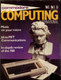
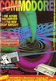

# Commodore Computing International

. | _Commodore Computing International_
--- | ---
Alternate titles | 
Publisher | Nick Hampshire Publications (1.1-3.1) &vert; Croftward Limited (3.2-8.8)
Country | United Kingdom
Language | English
Topic | Computers
Years | 1982 &mdash; 1990
Issues | 93
Frequency | Monthly
ISSN | 0265-475X (1.1-3.9) &vert; 0276-596X (3.10-)
Website | 
Related | _[Amiga User International](Amiga%20User%20International.md)_ (split) &vert; _[Commodore & Amiga Horizons](Commodore%20&%20Amiga%20Horizons)_ (merged)

Issue | Front&nbsp;cover | Full | Cover date | Actual date | Price | Barcode | Extras
----- | ---------------- | ---- | ---------- | ----------- | ----- | ------- | ------
1.1||[🔗][1.1]|April/May 1982|1982-xx-xx|1.25GBP||
1.2||[🔗][1.2]|June 1982|1982-xx-xx|1.00GBP||
1.3||[🔗][1.3]|July 1982|1982-xx-xx|1.00GBP||
1.4||[🔗][1.4]|August 1982|1982-xx-xx|1.00GBP||
1.5||[🔗][1.5]|September 1982|1982-xx-xx|1.00GBP||
1.6||[🔗][1.6]|October 1982|1982-xx-xx|1.00GBP||
1.7||[🔗][1.7]|November 1982|1982-xx-xx|1.00GBP||
1.8||[🔗][1.8]|December 1982|1982-xx-xx|1.00GBP||
1.9||[🔗][1.9]|January 1983|1982-xx-xx|1.00GBP||
1.10||[🔗][1.10]|February 1983|1983-xx-xx|1.00GBP||
1.11||[🔗][1.11]|March 1983|1983-xx-xx|1.00GBP||Home Computing supplement
1.12||[🔗][1.12]|April 1983|1983-xx-xx|1.00GBP||Home Computing supplement
2.1||[🔗][2.1]|May 1983|1983-xx-xx|1.00GBP||Home Computing supplement
2.2||[🔗][2.2]|June 83|1983-xx-xx|1.00GBP||
2.3||[🔗][2.3]|July 83|1983-xx-xx|1.00GBP||
2.4||[🔗][2.4]|August 83|1983-xx-xx|1.00GBP||
2.5||[🔗][2.5]|September 83|1983-xx-xx|1.00GBP||
2.6||[🔗][2.6]|October 1983|1983-xx-xx|1.00GBP||
2.7||[🔗][2.7]||1983-xx-xx|1.00GBP||
2.8||[🔗][2.8]|December 1983|1983-xx-xx|1.25GBP|05669871677-8|
2.9||[🔗][2.9]|February 1984|1984-xx-xx|1.00GBP|05669870151-09|
2.10||[🔗][2.10]|March 1984|1984-xx-xx|1.00GBP|05669870151-10|
2.11||[🔗][2.11]|April 1984|1984-xx-xx|1.00GBP||
2.12||[🔗][2.12]|May 1984|1984-xx-xx|1.00GBP|06139970325-12|Commodore Games supplement
3.1||[🔗][3.1]|June 1984|1984-xx-xx|1.00GBP|6139970325-01|Commodore Games supplement
3.2||[🔗][3.2]|July/August 1984|1984-xx-xx|1.00GBP|06139970325-02|Commodore Games supplement
3.3||[🔗][3.3]|September 1984|1984-xx-xx|1.00GBP|06139970325-03|Commodore Games supplement
3.4||[🔗][3.4]|October 1984|1984-xx-xx|1.00GBP|06139970325-03|Commodore Games supplement
3.5||[🔗][3.5]|November 1984|1984-xx-xx|1.00GBP|06139970325-05|Commodore Games supplement &vert; Commodore Business Magazine supplement
3.6||[🔗][3.6]|December 1984|1984-xx-xx|1.00GBP|06139970325-06|Commodore Games supplement
3.7||[🔗][3.7]|New Year 1985|1984-xx-xx|1.00GBP|06139970325-07|Commodore Games supplement
3.8||[🔗][3.8]|March 1985|1985-xx-xx|1.00GBP|06139970325-08|Commodore Games supplement &vert; Commodore Business Magazine supplement
3.9||[🔗][3.9]|April 1985|1985-xx-xx|1.00GBP|06139970325-09|Commodore Games supplement
3.10||[🔗][3.10]|May 1985|1985-xx-xx|1.00GBP|06139970325-10|Commodore Games supplement
3.11||[🔗][3.11]|June 1985|1985-xx-xx|1.00GBP|06139970325-11|
3.12||[🔗][3.12]|July 1985|1985-xx-xx|1.00GBP|06139970325-12|Commodore Business Magazine supplement
4.1||[🔗][4.1]|August 1985|1985-xx-xx|1.00GBP||
4.2||[🔗][4.2]|September 1985|1985-xx-xx|1.00GBP||
4.3||[🔗][4.3]|October 1985|1985-xx-xx|1.00GBP||Commodore Business Magazine supplement
4.4|||November 1985|1985-xx-xx|1.00GBP||
4.5||[🔗][4.5]|December 1985|1985-xx-xx|1.00GBP||Commodore Business Magazine supplement
4.6||[🔗][4.6]|January 1986|1985-xx-xx|1.00GBP||
4.7||[🔗][4.7]|February 1986|1986-xx-xx|1.00GBP||
4.8||[🔗][4.8]|March 1986|1986-xx-xx|1.00GBP||Commodore Business Magazine/Amiga User supplement
4.9||[🔗][4.9]|April 1986|1986-xx-xx|1.00GBP||
4.10||[🔗][4.10]|May 1986|1986-xx-xx|1.00GBP||
4.11||[🔗][4.11]|June 1986|1986-xx-xx|1.00GBP||
4.12||[🔗][4.12]|July 1986|1986-xx-xx|1.00GBP||
5.1||[🔗][5.1]|August 1986|1986-xx-xx|1.00GBP||
5.2||[🔗][5.2]|September 1986|1986-xx-xx|1.00GBP||Poster
5.3||[🔗][5.3]|October 1986|1986-xx-xx|1.00GBP||
5.4||[🔗][5.4]|November 1986|1986-xx-xx|1.00GBP||Commodore Business and Amiga User supplement
5.5||[🔗][5.5]|December 1986|1986-xx-xx|1.00GBP||
5.6||[🔗][5.6]|January 1987|1986-xx-xx|1.00GBP||
5.7|||February 1987|1987-xx-xx|1.00GBP||
5.8|||March 1987|1987-xx-xx|1.00GBP||
5.9|||April 1987|1987-xx-xx|1.00GBP||Commodore Business and Amiga User supplement
5.10||[🔗][5.10]|May 1987|1987-xx-xx|1.00GBP||
5.11|||June 1987|1987-xx-xx|1.00GBP||Poster
5.12|||July 1987|1987-xx-xx|1.00GBP||
6.1||[🔗][6.1]|August 1987|1987-xx-xx|1.10GBP||
6.2||[🔗][6.2]|September 1987|1987-xx-xx|1.10GBP||
6.3||[🔗][6.3]|October 1987|1987-xx-xx|1.10GBP||
6.4||[🔗][6.4]|November 1987|1987-xx-xx|1.10GBP||
6.5||[🔗][6.5]|December 1987|1987-xx-xx|1.10GBP||
6.6||[🔗][6.6]|January 1988|1987-xx-xx|1.10GBP||
6.7||[🔗][6.7]|February 1988|1988-xx-xx|1.10GBP||
6.8||[🔗][6.8]|March 1988|1988-xx-xx|1.10GBP||
6.9||[🔗][6.9]|April 1988|1988-xx-xx|1.10GBP||
6.10||[🔗][6.10]|May 1988|1988-xx-xx|1.20GBP||
6.11||[🔗][6.11]|June 1988|1988-xx-xx|1.20GBP||
6.12||[🔗][6.12]|July 1988|1988-xx-xx|1.20GBP||
7.1||[🔗][7.1]|August 1988|1988-xx-xx|1.20GBP||
7.2||[🔗][7.2]|September 1988|1988-xx-xx|1.20GBP||
7.2A||[🔗][7.2A]|October 1988|1988-xx-xx|1.20GBP||
7.3||[🔗][7.3]|November 1988|1988-xx-xx|1.20GBP||
7.4||[🔗][7.4]|December 1988|1988-xx-xx|1.20GBP||
7.5||[🔗][7.5]|January 1989|1988-xx-xx|1.20GBP||
7.6||[🔗][7.6]|February 1989|1989-xx-xx|1.20GBP||
7.7||[🔗][7.7]|March 1989|1989-xx-xx|1.20GBP|074470121275-03|
7.8||[🔗][7.8]|April 1989|1989-xx-xx|1.20GBP|074470121275-04|
7.9|||May 1989|1989-xx-xx|1.20GBP|074470121275-05|
7.10||[🔗][7.10]|June 1989|1989-xx-xx|1.20GBP|074470121275-06|
7.11||[🔗][7.11]|July 1989|1989-xx-xx|1.20GBP|074470121275-07|
7.12|||August 1989|1989-xx-xx|1.20GBP||
8.1|||September 1989|1989-xx-xx|1.20GBP|074470121275-09|
8.2||[🔗][8.2]|October 1989|1989-xx-xx|1.20GBP|074470121275-10|
8.3||[🔗][8.3]|November 1989|1989-xx-xx|1.20GBP|074470121275-11|
8.4|||December 1989|1989-xx-xx|1.20GBP|074470121275-12|
8.5||[🔗][8.5]|January 1990|1989-xx-xx|1.20GBP|074470121282-01|
8.6||[🔗][8.6]|February 1990|1990-xx-xx|1.30GBP|074470121282-02|
8.7||[🔗][8.7]|March 1990|1990-xx-xx|1.30GBP|074470121282|
8.8|||April 1990|1990-xx-xx|1.30GBP|074470121282|

[1.1]: https://archive.org/details/commodore-computing-international-vol-01-01-1982-apr-may
[1.2]: https://archive.org/details/commodore-computing-international-vol-01-02-1982-jun
[1.3]: https://archive.org/details/commodore-computing-international-vol-01-03-1982-jul
[1.4]: https://archive.org/details/commodore-computing-international-vol-01-04-1982-aug
[1.5]: https://archive.org/details/commodore-computing-international-vol-01-05-1982-sep
[1.6]: https://archive.org/details/commodore-computing-international-vol-01-06-1982-oct
[1.7]: https://archive.org/details/commodore-computing-international-vol-01-07-1982-nov
[1.8]: https://archive.org/details/commodorecomputinginternational198312
[1.9]: https://archive.org/details/commodore-computing-international-vol-01-09-1983-jan
[1.10]: https://archive.org/details/commodore-computing-international-vol-01-10-1983-feb
[1.11]: https://archive.org/details/commodore-computing-international-vol-01-11-1983-mar
[1.12]: https://archive.org/details/commodore-computing-international-vol-01-12-1983-apr
[2.1]: https://archive.org/details/commodore-computing-international-vol-02-01-1983-may
[2.2]: https://archive.org/details/commodore-computing-international-vol-02-02-1983-jun
[2.3]: https://archive.org/details/Commodore_Computing_International_Vol_02_No_03_1983-07_Nick_Hampshire_Publications_GB
[2.4]: https://archive.org/details/commodorecomputinginternational198308
[2.5]: https://archive.org/details/Commodore_Computing_International_Vol_02_No_05_1983-09_Nick_Hampshire_Publications_GB
[2.6]: https://archive.org/details/Commodore_Computing_International_Vol_02_No_06_1983-10_Nick_Hampshire_Publications_GB
[2.7]: https://archive.org/details/Commodore_Computing_International_198311
[2.8]: https://archive.org/details/commodorecomputinginternational198312
[2.9]: https://archive.org/details/Commodore_Computing_International_Vol_02_No_09_1984-02_Nick_Hampshire_Publications_GB
[2.10]: https://archive.org/details/commodorecomputinginternationalmarch1984vol2no10
[2.11]: https://archive.org/details/commodorecomputinginternational198404
[2.12]: https://archive.org/details/Commodore_Computing_International_Vol_02_No_12_1984-05_Nick_Hampshire_Publications_GB
[3.1]: https://archive.org/details/CommodoreComputingInternationalVol03Nr01198406Nick_HampshirePublications
[3.2]: https://archive.org/details/commodore-computing-international-vol-03-02-1984-jul-aug
[3.3]: https://archive.org/details/Commodore_Computing_International_Vol_03_No_03_1984-09_Croftward_GB
[3.4]: https://archive.org/details/Commodore_Computing_International_Vol_03_No_04_1984-10_Croftward_GB
[3.5]: https://archive.org/details/Commodore_Computing_International_Vol_03_No_05_1984-11_Croftward_GB
[3.6]: https://archive.org/details/Commodore_Computing_International_Vol_03_No_06_1984-12_Croftward_GB
[3.7]: https://archive.org/details/Commodore_Computing_International_Vol_03_No_07_1985-01_Croftward_GB
[3.8]: https://archive.org/details/Commodore_Computing_International_Vol_03_No_08_1985-03_Croftward_GB
[3.9]: https://archive.org/details/commodore-computing-international-vol-03-09-1985-apr
[3.10]: https://archive.org/details/Commodore_Computing_International_Vol_03_No_10_1985-05_Croftward_GB
[3.11]: https://archive.org/details/commodore-computing-international-vol-03-11-1985-jun
[3.12]: https://archive.org/details/commodore-computing-international-vol-03-12-1985-jul
[4.1]: https://archive.org/details/commodorecomputinginternational198508
[4.2]: https://archive.org/details/commodore-computing-international-vol-04-02-1985-sep
[4.3]: https://archive.org/details/commodorecomputinginternational198510

[4.5]: https://archive.org/details/Commodore_Computing_International_198512
[4.6]: https://archive.org/details/commodore-computing-international-vol-04-06-1986-jan-end-of-year
[4.7]: https://archive.org/details/Commodore_Computing_International_Vol_04_No_07_1986-02_Croftward_GB
[4.8]: https://archive.org/details/commodore-computing-international-1986-03
[4.9]: https://archive.org/details/commodore-computing-international-1986-04
[4.10]: https://archive.org/details/Commodore_Computing_International_198605
[4.11]: https://archive.org/details/Commodore_Computing_International_198606
[4.12]: https://archive.org/details/commodore-computing-international-vol-04-12-1986-jul
[5.1]: https://archive.org/details/Commodore_Computing_International_Vol_05_No_01_1986-08_Croftward_GB
[5.2]: https://archive.org/details/Commodore_Computing_International_Vol_05_No_02_1986-09_Croftward_GB
[5.3]: https://archive.org/details/commodore-computing-international-vol-05-03-1986-oct
[5.4]: https://archive.org/details/Commodore_Computing_International_Vol_05_No_04_1986-11_Croftward_GB
[5.5]: https://archive.org/details/Commodore_Computing_International_198612
[5.6]: https://archive.org/details/Commodore_Computing_International_Vol_05_No_06_1987-01_Croftward_GB

[5.10]: https://archive.org/details/Commodore_Computing_International_Vol_05_No_10_1987-06_Croftward_GB

[6.1]: https://archive.org/details/Commodore_Computing_International_Vol_06_No_01_1987-08_Croftward_GB
[6.2]: https://archive.org/details/Commodore_Computing_International_Vol_06_No_02_1987-09_Croftward_GB
[6.3]: https://archive.org/details/commodore-computing-international-1987-10
[6.4]: https://archive.org/details/Commodore_Computing_International_198711
[6.5]: https://archive.org/details/Commodore_Computing_International_198712
[6.6]: https://archive.org/details/Commodore_Computing_International_Vol_06_No_05_1988-01_Croftward_GB
[6.7]: https://archive.org/details/commodorecomputinginternational198802_202003
[6.8]: https://archive.org/details/Commodore_Computing_International_198803
[6.9]: https://archive.org/details/Commodore_Computing_International_198804
[6.10]: https://archive.org/details/Commodore_Computing_International_Vol_06_No_10_1988-05_Croftward_GB
[6.11]: https://archive.org/details/Commodore_Computing_International_198806
[6.12]: https://archive.org/details/Commodore_Computing_International_Vol_06_No_12_1988-07_Croftward_GB
[7.1]: https://archive.org/details/commodore-computing-international-vol-07-01-1988-aug
[7.2]: https://archive.org/details/Commodore_Computing_International_198809
[7.2A]: https://archive.org/details/Commodore_Computing_International_Vol_07_No_02_1988-10_Croftward_GB
[7.3]: https://archive.org/details/Commodore_Computing_International_Vol_07_No_03_1988-11_Croftward_GB
[7.4]: https://archive.org/details/Commodore_Computing_International_198812
[7.5]: https://archive.org/details/commodorecomputinginternational198901main
[7.6]: https://archive.org/details/commodore-computing-international-vol-07-06-1989-feb
[7.7]: https://archive.org/details/Commodore_Computing_International_198903
[7.8]: https://archive.org/details/Commodore_Computing_International_198904

[7.10]: https://archive.org/details/Commodore_Computing_International_198906
[7.11]: https://archive.org/details/commodore-computing-international-1989-07

[8.2]: https://archive.org/details/commodore-computing-international-1989-10
[8.3]: https://archive.org/details/commodorecomputinginternational198911

[8.5]: https://archive.org/details/Commodore_Computing_International_990001
[8.6]: https://archive.org/details/commodorecomputinginternational199002
[8.7]: https://archive.org/details/commodore-computing-international-vol-08-07-1990-mar
