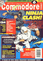
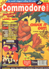

# Commodore Format

. | _Commodore Format_
--- | ---
Alternate titles | 
Publisher | Future Publishing
Country | United Kingdom
Language | English
Topic | Video games
Years | 1990 &mdash; 1994
Issues | 61 (62)
Frequency | Monthly
ISSN | 0960-5169
Website | 
Related | 

Issue | Front&nbsp;cover | Full | Cover date | Actual date | Price | Barcode | Extras
----- | ---------------- | ---- | ---------- | ----------- | ----- | ------- | ------
0||[🔗][XX]||199x-xx-xx|||
1||[🔗][XX]|October 1990|1990-09-20|1.95GBP|9770960516002-01|C64 cassette &vert; Card
2||[🔗][XX]|November 1990|1990-10-13|1.95GBP|9770960516002-02|C64 cassette
3||[🔗][XX]|December 1990|1990-xx-xx|1.95GBP|9770960516002-03|C64 cassette
4||[🔗][XX]|January 1991|1990-xx-xx|1.95GBP||C64 cassette &vert; Badge
5||[🔗][XX]|February 1991|1991-01-17|1.95GBP|9770960516002-05|C64 cassette
6||[🔗][XX]|March 1991|1991-02-21|1.95GBP|9770960516002-03|C64 cassette
7||[🔗][XX]|April 1991|1991-03-21|2.20GBP|9770960516019-04| C64 cassette &vert; Action Replay Pokes Booklet [🔗][7e]
8||[🔗][XX]|May 1991|1991-04-18|2.20GBP|9770960516019-05|C64 cassette
9||[🔗][XX]|June 1991|1991-05-16|2.20GBP|9770960516019-06|C64 cassette
10||[🔗][XX]|July 1991|1991-06-20|2.20GBP|9770960516019-07|C64 cassette
11||[🔗][XX]|August 1991|1991-07-18|2.20GBP|9770960516019-08|C64 cassette
12||[🔗][XX]|September 1991|1991-08-15|2.20GBP|9770960516019-09|C64 cassette
13||[🔗][XX]|October 1991|1991-09-19|2.20GBP|9770960516019-10|C64 cassette
14||[🔗][XX]|November 1991|1991-10-17|2.20GBP|9770960516019-11|C64 cassette
15||[🔗][XX]|December 1991|1991-11-21|2.20GBP|9770960516019-12| C64 cassette &vert; HeroQuest stickers
16||[🔗][XX]|January 1992|1991-12-18|2.95GBP|9770960516019-01|C64 cassette x2
17||[🔗][XX]|February 1992|1992-01-16|2.20GBP|9770960516019-02|C64 cassette
18||[🔗][XX]|March 1992|1992-02-20|2.20GBP|9770960516019-03|C64 cassette
19||[🔗][XX]|April 1992|1992-03-19|2.20GBP|9770960516019-04| C64 cassette &vert; Badge
20||[🔗][XX]|May 1992|1992-04-16|2.20GBP|9770960516019-05| C64 cassette &vert; Door hanger
21||[🔗][XX]|June 1992|1992-05-21|2.50GBP|9770960516026-06| C64 cassette &vert; Card
22||[🔗][XX]|July 1992|1992-06-18|2.50GBP|9770960516026-07|C64 cassette
23||[🔗][XX]|August 1992|1992-07-16|2.50GBP|9770960516026-08|C64 cassette
24||[🔗][XX]|September 1992|1992-08-20|2.50GBP|9770960516026-09|C64 cassette
25||[🔗][XX]|October 1992|1992-09-17|3.25GBP|9770960516996-10|C64 cassette x2
26||[🔗][XX]|November 1992|1992-10-15|2.50GBP|9770960516026-11|C64 cassette
27||[🔗][XX]|December 1992|1992-11-15|3.25GBP|9770960516989-12|C64 cassette x2
28||[🔗][XX]|January 1993|1992-12-17|2.50GBP|9770960516026-01|C64 cassette
29||[🔗][XX]|February 1993|1993-01-26|2.50GBP|9770960516026-02|C64 cassette
30||[🔗][XX]|March 1993|1993-02-23|2.50GBP|9770960516026-03|C64 cassette
31||[🔗][XX]|April 1993|1993-03-23|2.50GBP|9770960516026-04|C64 cassette
32||[🔗][XX]|May 1993|1993-04-27|2.50GBP|9770960516026-05|C64 cassette
33||[🔗][XX]|June 1993|1993-05-25|2.50GBP|9770960516026-06|C64 cassette
34||[🔗][XX]|July 1993|1993-06-22|2.50GBP|9770960516026-07|C64 cassette
35||[🔗][XX]|August 1993|1993-07-27|2.50GBP|9770960516026-08|C64 cassette
36||[🔗][XX]|September 1993|1993-08-24|2.50GBP|9770960516026-09|C64 cassette
37||[🔗][XX]|October 1993|1993-xx-xx|2.95GBP|9770960516965-10|C64 cassette x2
38||[🔗][XX]|November 1993|1993-10-25|2.95GBP|9770960516033-11| C64 cassette &vert; Stickers
39||[🔗][XX]|December 1993|1993-11-22|2.95GBP|9770960516033-12|C64 cassette
40||[🔗][XX]|January 1994|1993-12-23|2.95GBP|9770960516033-01|C64 cassette
41||[🔗][XX]|February 1994|1994-01-25|2.95GBP|9770960516033-02|C64 cassette
42||[🔗][XX]|March 1994|1994-02-15|2.95GBP|9770960516033-03|C64 cassette
43||[🔗][XX]|April 1994|1994-03-15|2.95GBP|9770960516033-04|C64 cassette
44||[🔗][XX]|May 1994|1994-xx-xx|2.95GBP|9770960516033-05|C64 cassette
45||[🔗][XX]|June 1994|1994-05-17|2.95GBP|9770960516033-06|C64 cassette
46||[🔗][XX]|July 1994|1994-06-21|2.95GBP|9770960516033-07|C64 cassette
47||[🔗][XX]|August 1994|1994-xx-xx|2.95GBP|9770960516033-08|C64 cassette
48||[🔗][XX]|September 1994|1994-08-16|2.95GBP|9770960516033-09|C64 cassette
49||[🔗][XX]|October 1994|1994-09-20|2.95GBP|9770960516033-10|C64 cassette
50||[🔗][XX]|November 1994|1994-10-18|2.95GBP|9770960516033-11|C64 cassette
51||[🔗][XX]|December 1994|1994-xx-xx|2.95GBP|9770960516033-12|C64 cassette
52||[🔗][XX]|January 1995|1994-xx-xx|2.95GBP|9770960516033-01|C64 cassette
53||[🔗][XX]|February 1995|1994-01-03|2.95GBP|9770960516033-02|C64 cassette
54||[🔗][XX]|March 1995|1994-xx-xx|2.95GBP|9770960516033-03|C64 cassette
55||[🔗][XX]|April 1995|1994-xx-xx|2.95GBP|9770960516033-04|C64 cassette
56||[🔗][XX]|May 1995|1994-xx-xx|2.99GBP|9770960516040-05|C64 cassette
57||[🔗][XX]|June 1995|1994-xx-xx|3.25GBP|9770960516057-06|C64 cassette
58||[🔗][XX]|July 1995|1994-06-17|3.25GBP|9770960516057-07|C64 cassette
59||[🔗][XX]|August 1995|1994-07-11|3.25GBP|9770960516057-08|C64 cassette
60||[🔗][XX]|September 1995|1994-xx-xx|3.25GBP|9770960516057-09|C64 cassette
61||[🔗][XX]|October 1995|1994-09-05|3.25GBP|9770960516057-10|C64 cassette

[XX]: https://archive.org/details/CommodoreFormatHi000

[7e]: https://archive.org/details/Action_Replay_Pokes_Booklet_1991-04_Future_Publishing_GB_supplement_issue_07
