# Cube Solutions

. | _Cube Solutions_
--- | ---
Alternate titles | _Solutions Nintendo GameCube_ (12-16)
Publisher | Paragon Publishing (1-10) &vert; Highbury Paragon (11-16)
Country | United Kingdom
Language | English
Topic | Video games
Years | 2002 &mdash; 2004
Issues | 16 (unconfirmed)
Frequency | 
ISSN | 1476-7260
Website | 
Related | _[Cube](Cube.md)_

Issue | Front&nbsp;cover | Full | Cover date | Actual date | Price | Barcode | Extras
----- | ---------------- | ---- | ---------- | ----------- | ----- | ------- | ------
1|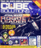|||2002-xx-xx|3.99GBP|9771476726008-01|
2|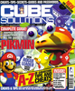|||2002-xx-xx|3.99GBP|9771476726008-02|
3||||2002-xx-xx|3.99GBP|9771476726008-03|
4|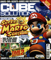|||2002-xx-xx|3.99GBP|9771476726008-04|
5|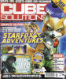|||2002-xx-xx|3.99GBP|9771476726008-05|
6|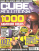|||2003-xx-xx|3.99GBP|9771476726008-06|
7|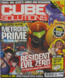|||2003-xx-xx|3.99GBP|9771476726008-07|
8|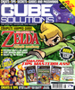|||2003-xx-xx|3.99GBP|9771476726008-08|
9||||2003-xx-xx|3.99GBP|9771476726008-09|
10|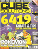|||2003-xx-xx|3.99GBP|9771476726008-10|
11|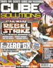|||2003-10-30|3.99GBP|9771476726008-11|
12|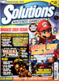|||2003-12-24|3.99GBP|9771742617009-12|Cube Solutions book
14||||2004-02-19|3.99GBP|9771742617009-14|
16|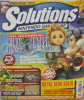|||2004-04-15|3.99GBP|9771742617009-16|