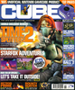
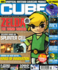
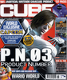
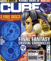
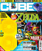
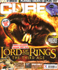
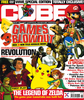

# Cube

. | _Cube_
--- | ---
Alternate titles | 
Publisher | Paragon Publishing (1-24) &vert; Highbury Paragon (25-28) &vert; Highbury (29-52)
Country | United Kingdom
Language | English
Topic | Video games
Years | 2001 &mdash; 2005
Issues | 52
Frequency | Monthly
ISSN | 1475-1399
Website | 
Related | _[Cube Solutions](Cube%20Solutions.md)_

Issue | Front&nbsp;cover | Full | Cover date | Actual date | Price | Barcode | Extras
----- | ---------------- | ---- | ---------- | ----------- | ----- | ------- | ------
1||[🔗][1]||2001-11-22|3.20GBP|9771475139007-01|
2||[🔗][2]||2002-01-10|3.20GBP|9771475139007-02|
3||[🔗][3]||2002-02-14|3.20GBP|9771475139007-03|
4||[🔗][4]||2002-03-14|3.20GBP|9771475139007-04|
5||[🔗][5]||2002-04-11|3.20GBP|9771475139007-05|
6||[🔗][6]||2002-05-02|3.20GBP|9771475139007-06|
7||[🔗][7]||2002-06-06|3.20GBP|9771475139007-07|
8||||2002-07-04|3.20GBP|9771475139007-08|
9||[🔗][9]||2002-08-01|3.20GBP|9771475139007-09|
10||[🔗][10]||2002-08-29|3.50GBP|9771475139014-10|
11||[🔗][11]||2002-09-26|3.50GBP|9771475139014-11|
12||||2002-10-24|3.50GBP|9771475139014-12|
13||||2002-11-21|3.50GBP|9771475139014-13|
14||[🔗][14]||2002-12-19|3.50GBP|9771475139014-14|
15||[🔗][15]||2003-01-16|3.50GBP|9771475139014-15|
16||[🔗][16]||2003-02-13|3.50GBP|9771475139014-16|
17||[🔗][17]||2003-03-13|3.50GBP|9771475139014-17|
18||[🔗][18]||2003-04-10|3.50GBP|9771475139014-18|
19||[🔗][19]||2003-05-08|3.50GBP|9771475139014-19|
20||[🔗][20]||2003-06-05|3.99GBP|9771475139021-20|GameCube disc &vert; DVD video
21||[🔗][21]||2003-07-03|3.99GBP|9771475139021-21|GameCube disc &vert; DVD video
22||[🔗][22]||2003-07-31|3.99GBP|9771475139021-22|GameCube disc &vert; DVD video
23||[🔗][23]||2003-08-28|3.99GBP|9771475139021-23|GameCube disc &vert; DVD video
24||[🔗][24]||2003-09-25|3.99GBP|9771475139021-24|GameCube disc &vert; DVD video
25||[🔗][25]||2003-10-23|3.99GBP|9771475139021-25|GameCube disc &vert; DVD video
26||[🔗][26]||2003-11-20|3.99GBP|9771475139021-26|GameCube disc &vert; DVD video
27||[🔗][27]||2003-12-18|3.99GBP|9771475139021-27|GameCube disc &vert; DVD video
28||[🔗][28]||2004-01-15|3.99GBP|9771475139021-28|GameCube disc &vert; DVD video
29||[🔗][29]||2004-02-12|3.99GBP|9771475139021-29|GameCube disc &vert; DVD video
30||[🔗][30]||2004-03-11|3.99GBP|9771475139021-30|GameCube disc &vert; DVD video
31||[🔗][31]||2004-04-08|3.99GBP|9771475139021-31|GameCube disc &vert; DVD video
32||[🔗][32]||2004-05-06|3.99GBP|9771475139021-32|GameCube disc &vert; DVD video
33||[🔗][33]||2004-06-03|3.99GBP|9771475139021-33|GameCube disc &vert; DVD video
34||[🔗][34]||2004-07-01|3.99GBP|9771475139021-34|GameCube disc &vert; DVD video
35||||2004-07-29|3.99GBP|9771475139021-35|GameCube disc &vert; DVD video
36||[🔗][36]||2004-08-26|3.99GBP|9771475139021-36|GameCube disc &vert; DVD video
37||[🔗][37]||2004-09-23|3.99GBP|9771475139021-37|GameCube disc &vert; DVD video
38||[🔗][38]||2004-10-21|3.99GBP|9771475139021-38|GameCube disc &vert; DVD video
39||[🔗][39]||2004-11-18|3.99GBP|9771475139021-39|GameCube disc &vert; DVD video
40||[🔗][40]||2004-12-16|3.99GBP|9771475139021-40|GameCube disc &vert; DVD video
41||[🔗][41]||2005-01-13|3.99GBP|9771475139021-41|DVD video
42||[🔗][42]||2005-02-10|3.99GBP|9771475139021-40|DVD video
43||[🔗][43]||2005-03-10|3.99GBP|9771475139021-43|DVD video
44||[🔗][44]||2005-04-07|3.99GBP|9771475139021-44|DVD video
45||[🔗][45]||2005-05-05|3.99GBP|9771475139021-45|DVD video
46||[🔗][46]||2005-06-02|3.99GBP|9771475139021-46|DVD video
47||[🔗][47]||2005-06-30|3.99GBP|9771475139021-47|DVD video
48||[🔗][48]||2005-07-28|3.99GBP|9771475139021-48|DVD video
49||[🔗][49]||2005-08-25|3.99GBP|9771475139021-49|DVD video
50||[🔗][50]||2005-09-22|3.99GBP|9771475139021-50|DVD video
51||[🔗][51]||2005-10-20|3.99GBP|9771475139021-51|DVD video
52||[🔗][52]||2005-11-17|3.99GBP|9771475139021-52|DVD video

[1]: https://archive.org/details/cube-01
[2]: https://archive.org/details/cube-02
[3]: https://archive.org/details/cube-03
[4]: https://archive.org/details/cube-uk-4-april-2002
[5]: https://archive.org/details/cube-05
[6]: https://archive.org/details/cube-06
[7]: https://archive.org/details/cube-07

[9]: https://archive.org/details/cube-09
[10]: https://archive.org/details/cube-10
[11]: https://archive.org/details/cube-11

[14]: https://archive.org/details/cube-14
[15]: https://archive.org/details/cube-15
[16]: https://archive.org/details/cube-16
[17]: https://archive.org/details/cube-17
[18]: https://archive.org/details/cube-uk-18-may-2003
[19]: https://archive.org/details/cube-19
[20]: https://archive.org/details/cube-uk-20-july-2003
[21]: https://archive.org/details/cube-uk-21-august-2003
[22]: https://archive.org/details/cube-22
[23]: https://archive.org/details/cube-uk-23-october-2003
[24]: https://archive.org/details/cube-uk-24-november-2003
[25]: https://archive.org/details/cube-25
[26]: https://archive.org/details/cube-26
[27]: https://archive.org/details/cube-27
[28]: https://archive.org/details/cube-28
[29]: https://archive.org/details/cube-29
[30]: https://archive.org/details/cube-30
[31]: https://archive.org/details/cube-31
[32]: https://archive.org/details/cube-32
[33]: https://archive.org/details/cube-33
[34]: https://archive.org/details/cube-34

[36]: https://archive.org/details/cube-uk-36-october-2004
[37]: https://archive.org/details/cube-37
[38]: https://archive.org/details/cube-38
[39]: https://archive.org/details/cube-39
[40]: https://archive.org/details/cube-40
[41]: https://archive.org/details/cube-41
[42]: https://archive.org/details/cube-42
[43]: https://archive.org/details/cube-43
[44]: https://archive.org/details/cube-44
[45]: https://archive.org/details/cube-45
[46]: https://archive.org/details/cube-46
[47]: https://archive.org/details/cube-47
[48]: https://archive.org/details/cube-48
[49]: https://archive.org/details/cube-49
[50]: https://archive.org/details/cube-50
[51]: https://archive.org/details/cube-uk-51-december-2005
[52]: https://archive.org/details/cube-52
