# Dreamcast Magazine

. | _Dreamcast Magazine_
--- | ---
Alternate titles | 
Publisher | Paragon Publishing
Country | United Kingdom
Language | English
Topic | Video games
Years | 1999 &mdash; 2002
Issues | 34
Frequency | Monthly
ISSN | 1466-2388
Website | [dream-cast.net][web]
Related | _[Dreamcast Solutions](Dreamcast%20Solutions.md)_

Issue | Front&nbsp;cover | Full | Cover date | Actual date | Price | Barcode | Extras
----- | ---------------- | ---- | ---------- | ----------- | ----- | ------- | ------
1||[🔗][1]||1999-09-09|2.95GBP|9771466238009-01|Dreamcast Solutions Sonic Adventure booklet
2||[🔗][2]||1999-10-21|2.95GBP|9771466238009-02|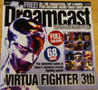 Dreamcast Solutions Virtua Fighter 3tb booklet
3||[🔗][3]||1999-11-25|2.95GBP|9771466238009-03|
4||[🔗][4]||1999-12-23|2.95GBP|9771466238009-04|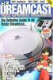 A-Z of Dreamcast book
5|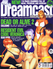|[🔗][5]||2000-01-27|2.99GBP|9771466238016-05|
6||[🔗][6]||2000-02-24|2.99GBP|9771466238016-06|
7|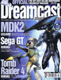|[🔗][7]||2000-03-23|2.99GBP|9771466238016-07|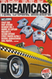 Dreamcast Tips book
8||[🔗][8]||2000-04-20|2.99GBP|9771466238016-08|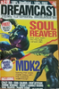 A-Z of Dreamcast book
9||[🔗][9]||2000-05-18|2.99GBP|9771466238016-09| DC-Online book
10||[🔗][10]||2000-06-15|2.99GBP|9771466238016-10|Audio CD
11||[🔗][11]||2000-07-13|2.99GBP|9771466238016-11|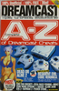 Complete A-Z of Dreamcast Cheats book
12||[🔗][12]||2000-08-10|2.99GBP|9771466238016-12|Poster
13||[🔗][13]||2000-09-07|2.99GBP|9771466238016-13|Book
14||[🔗][14]||2000-10-05|2.99GBP|9771466238016-14|
15||[🔗][15]||2000-11-02|2.99GBP|9771466238016-15|
16||[🔗][16]||2000-11-30|2.99GBP|9771466238016-16|
17||[🔗][17]||2000-12-28|2.99GBP|9771466238016-17|CD-ROM
18||[🔗][18]||2001-01-25|2.99GBP|9771466238016-18|
19||[🔗][19]||2001-02-22|2.99GBP|9771466238016-19|
20||[🔗][20]||2001-03-22|2.99GBP|9771466238016-20|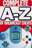 Complete A-Z of Dreamcast Cheats book
21||[🔗][21]||2001-04-19|2.99GBP|9771466238016-21|
22||[🔗][22]||2001-05-17|2.99GBP|9771466238016-22|
23||[🔗][23]||2001-06-14|2.99GBP|9771466238016-23| Complete A-Z of Dreamcast Cheats book
24|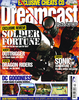|[🔗][24]||2001-07-12|3.50GBP|9771466238023-24|CD-ROM
25||[🔗][25]||2001-08-09|3.50GBP|9771466238023-25|
26||[🔗][26]||2001-09-08|3.50GBP|9771466238023-26|
27||[🔗][27]||2001-10-04|3.50GBP|9771466238023-27|
28||[🔗][28]||2001-11-01|3.50GBP|9771466238023-28|
29|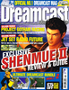|[🔗][29]||2001-11-29|3.50GBP|9771466238023-29|
30||[🔗][30]||2001-12-27|3.50GBP|9771466238023-30|
31|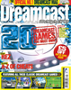|[🔗][31]||2002-01-31|3.50GBP|9771466238023-31|
32|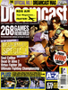|[🔗][32]||2002-02-28|3.50GBP|9771466238023-32|
33|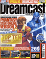|[🔗][33]||2002-03-28|3.50GBP|9771466238023-33|
34||[🔗][34]||2002-04-25|3.50GBP|9771466238023-34|

[1]: https://archive.org/details/Dreamcast_Magazine_No_01_1999-09_Paragon_Publishing_GB
[2]: https://archive.org/details/Dreamcast_Magazine_No_02_1999-10_Paragon_Publishing_GB
[3]: https://archive.org/details/Dreamcast_Magazine_No_03_1999-11_Paragon_Publishing_GB
[4]: https://archive.org/details/Dreamcast_Magazine_No_04_1999-12_Paragon_Publishing_GB
[5]: https://archive.org/details/DreamcastMagazineNo05200001ParagonPublishingGB
[6]: https://archive.org/details/dreamcast-magazine-uk-06
[7]: https://archive.org/details/dreamcast-magazine-uk-07
[8]: https://archive.org/details/dreamcast-magazine-uk-08
[9]: https://archive.org/details/dreamcast-magazine-uk-09
[10]: https://archive.org/details/dreamcastmagazine10
[11]: https://archive.org/details/dreamcast-magazine-uk-11
[12]: https://archive.org/details/dreamcast-magazine-uk-12
[13]: https://archive.org/details/dreamcast-magazine-uk-13
[14]: https://archive.org/details/dreamcast-magazine-14
[15]: https://archive.org/details/dreamcast-magazine-15
[16]: https://archive.org/details/dreamcastmagazine16
[17]: https://archive.org/details/dreamcastmagazine17
[18]: https://archive.org/details/dreamcastmagazine18
[19]: https://archive.org/details/dreamcastmagazine19
[20]: https://archive.org/details/dreamcastmagazine20
[21]: https://archive.org/details/dreamcastmagazine21
[22]: https://archive.org/details/dreamcastmagazine22
[23]: https://archive.org/details/dreamcastmagazine23
[24]: https://archive.org/details/dreamcastmagazine24
[25]: https://archive.org/details/dreamcastmagazine25
[26]: https://archive.org/details/dreamcastmagazine26
[27]: https://archive.org/details/dreamcastmagazine27
[28]: https://archive.org/details/dreamcast-magazine-28
[29]: https://archive.org/details/dreamcast-magazine-29
[30]: https://archive.org/details/dreamcast-magazine-uk-30
[31]: https://archive.org/details/dreamcast-magazine-31
[32]: https://archive.org/details/dreamcast-magazine-uk-32
[33]: https://archive.org/details/dreamcast-magazine-33
[34]: https://archive.org/details/Dreamcast_Magazine_No_34_2002-06_Paragon_Publishing_GB

[web]: https://web.archive.org/web/19991129052719/http://dream-cast.net/
