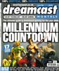
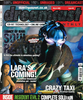
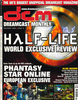
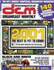

# Dreamcast Monthly

. | _Dreamcast Monthly_
--- | ---
Alternate titles | _DCM_ (13-17)
Publisher | Quay Magazine Publishing
Country | United Kingdom
Language | English
Topic | Video games
Years | 1999 &mdash; 2001
Issues | 17
Frequency | Monthly
ISSN | 
Website | dreamcastmonthly.com
Related | 

Issue | Front&nbsp;cover | Full | Cover date | Actual date | Price | Barcode | Extras
----- | ---------------- | ---- | ---------- | ----------- | ----- | ------- | ------
1||[🔗][1]|September 1999|1999-xx-xx|2.95GBP|9771466790002-09|
2||[🔗][2]|October 1999|1999-09-30|2.95GBP|9771466790002-10|
3||[🔗][3]|November 1999|1999-11-18|2.95GBP|9771466790002-12|
4||[🔗][4]|January 2000|1999-12-16|2.95GBP|9771466790002-01|
5||[🔗][5]|February 2000|2000-01-20|2.95GBP|9771466790002-02|
6||[🔗][6]|March 2000|2000-02-17|2.95GBP|9771466790002-03|
7||[🔗][7]|April 2000|2000-03-16|2.95GBP|9771466790002-04|
8||[🔗][8]|May 2000|2000-04-13|2.99GBP|9771466790019-05|Tomb Raider: The Last Revelation solution book
9||[🔗][9]|June 2000|2000-05-11|2.99GBP|9771466790019-06|
10||[🔗][10]|July 2000|2000-06-08|2.99GBP|9771466790019-07|
11||[🔗][11]|August 2000|2000-07-06|2.99GBP|9771466790019-08|
12||[🔗][12]|September 2000|2000-08-03|2.99GBP|9771466790019-09|
13||[🔗][13]|October 2000|2000-08-31|2.99GBP||
14||[🔗][14]|November 2000|2000-09-28|2.99GBP|9771466790019-11|
15||[🔗][15]|December 2000|2000-10-26|2.99GBP|9771466790019-12|
16||[🔗][16]|Christmas 2000|2000-11-23|2.99GBP|9771466790019-13| Audio CD
17||[🔗][17]|January 2001|2000-12-21|2.99GBP|9771466790019-14|

[1]: https://archive.org/details/Dreamcast_Monthly_Issue_1_1999-09_Quay_Publishing_GB
[2]: https://archive.org/details/Dreamcast_Monthly_Issue_2_1999-10_Quay_Publishing_GB
[3]: https://archive.org/details/Dreamcast_Monthly_Issue_3_1999-11_Quay_Publishing_GB
[4]: https://archive.org/details/dreamcast-monthly-uk-04
[5]: https://archive.org/details/dcm-05
[6]: https://archive.org/details/dcm-06
[7]: https://archive.org/details/dcm-07
[8]: https://archive.org/details/dreamcast-monthly-08
[9]: https://archive.org/details/dcm-09
[10]: https://archive.org/details/dcm-10
[11]: https://archive.org/details/dcm-11
[12]: https://archive.org/details/dcm-12
[13]: https://archive.org/details/dcm-13
[14]: https://archive.org/details/dcm-14
[15]: https://archive.org/details/dcm-15
[16]: https://archive.org/details/dcm-16
[17]: https://archive.org/details/dreamcast-monthly-17
