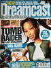
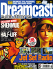
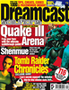

# Dreamcast Solutions

. | _Dreamcast Solutions_
--- | ---
Alternate titles | 
Publisher | Paragon Publishing
Country | United Kingdom
Language | English
Topic | Video games
Years | 1999 &mdash; 2001
Issues | 9
Frequency | 
ISSN | 1466-2396
Website | [dream-cast.net][web]
Related | _[Dreamcast Magazine](Dreamcast%20Magazine.md)_

Issue | Front&nbsp;cover | Full | Cover date | Actual date | Price | Barcode | Extras
----- | ---------------- | ---- | ---------- | ----------- | ----- | ------- | ------
1||[🔗][1]||1999-10-07|3.95GBP|9771466293006-01|
2||[🔗][2]||1999-12-09|3.95GBP|9771466293006-02|
3||[🔗][3]||2000-02-10|3.99GBP|9771466293013-03|
4||||2000-04-13|3.99GBP|9771466293013-04|
5||[🔗][5]||2000-xx-xx|3.99GBP|9771466293013-05|
6||[🔗][6]||2000-08-10|3.99GBP|9771466293013-06|
7||[🔗][7]||2000-10-05|3.99GBP|9771466293013-07|
8||[🔗][8]||2000-11-23|3.99GBP|9771466293013-08|
9||[🔗][9]||2001-01-11|3.99GBP|9771466293013-09|

[1]: https://archive.org/details/dreamcast-solutions-uk-01
[2]: https://archive.org/details/dreamcast-solutions-uk-02
[3]: https://archive.org/details/dreamcast-solutions-03

[5]: https://archive.org/details/dreamcast-solutions-05
[6]: https://archive.org/details/dreamcast-solutions-06
[7]: https://archive.org/details/dreamcast-solutions-07
[8]: https://archive.org/details/dreamcast-solutions-08
[9]: https://archive.org/details/dreamcast-solutions-09

[web]: https://web.archive.org/web/19991129052719/http://dream-cast.net/
