# GBX

. | _GBX_
--- | ---
Alternate titles | _Game Boy Xtreme Magazine_
Publisher | Thin Ice Media
Country | United Kingdom
Language | English
Topic | Video games
Years | 2001 &mdash; 2002
Issues | 11
Frequency | Monthly
ISSN | 
Website | [gbxtreme.co.uk][web]
Related | _[G-Force](G-Force.md)_ (next)

Issue | Front&nbsp;cover | Full | Cover date | Actual date | Price | Barcode | Extras
----- | ---------------- | ---- | ---------- | ----------- | ----- | ------- | ------
1|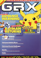|[🔗][1]|July 2001|2001-0x-xx|2.99GBP|9771474355002-07|VHS tape [🔗][vhs]
2|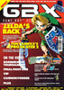|[🔗][2]|August 2001|2001-07-12|2.99GBP|9771474355002-08|VHS tape [🔗][vhs]
3|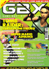|[🔗][3]|September 2001|2001-08-09|2.99GBP|9771474355002-09|VHS tape [🔗][vhs]
4|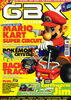|[🔗][4]|October 2001|2001-09-13|2.99GBP|9771474355002-10|VHS tape [🔗][vhs]
5|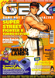|[🔗][5]|November 2001|2001-10-11|2.99GBP|9771474355002-11|VHS tape [🔗][vhs]
6|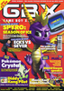|[🔗][6]|December 2001|2001-11-08|2.99GBP|9771474355002-12|VHS tape [🔗][vhs]
7|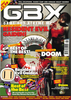|[🔗][7]|January 2001|2001-12-xx|2.99GBP|9771474355002-01|VHS tape [🔗][vhs]
8|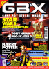|[🔗][8]|February 2002|2002-01-02|2.99GBP|9771474355002-02|VHS tape [🔗][vhs]
9|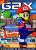|[🔗][9]|March 2002|2002-02-06|2.99GBP|9771474355002-03|VHS tape [🔗][vhs]
10|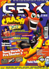|[🔗][10]|April 2002|2002-03-06|2.99GBP|9771474355002-04|VHS tape [🔗][vhs]
11|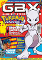|[🔗][11]|May 2002|2002-04-03|2.99GBP|9771474355002-05| Karate Joe Game Boy Color game &vert; Jelly Belly beans &vert; Poster
11A||[🔗][11]|May 2002|2002-04-03|2.99GBP|9771474355002-05| Space Invasion/Karate Joe Game Boy Color game [🔗][11Ae] &vert; Jelly Belly beans &vert; Poster

[1]: https://archive.org/details/gbx-01
[2]: https://archive.org/details/gbx-02
[3]: https://archive.org/details/gbx-03
[4]: https://archive.org/details/gbx-04
[5]: https://archive.org/details/gbx-05
[6]: https://archive.org/details/gbx-2001-12-06
[7]: https://archive.org/details/gbx-07
[8]: https://archive.org/details/gbx-2002-02-08
[9]: https://archive.org/details/GBX_Issue_09_2002-03_Thin_Ice_Media_GB
[10]: https://archive.org/details/gbx-10
[11]: https://archive.org/details/gbx-11

[vhs]: https://archive.org/details/action-gbx-vhs-full-set
[11Ae]: https://archive.org/details/1-karate-joe-space-invasion

[web]: https://web.archive.org/web/20020328040600/http://www.gbxtreme.co.uk/
