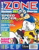

# Game Zone

. | _Game Zone_
--- | ---
Alternate titles | _Nintendo Game Zone_ (2.4-2.14)
Publisher | Dennis Publishing (1.1-) &vert; Future Publishing (2.11-2.18)
Country | United Kingdom
Language | English
Topic | Video games
Years | 1991 &mdash; 1994
Issues | 30
Frequency | Monthly
ISSN | 
Website | 
Related | _[Sega Zone](Sega%20Zone.md)_ &vert; _[PC Zone](PC%20Zone.md)_

Issue | Front&nbsp;cover | Full | Cover date | Actual date | Price | Barcode | Extras
----- | ---------------- | ---- | ---------- | ----------- | ----- | ------- | ------
1.1||[🔗][1.1]|November 1991|1991-10-08|1.75GBP|9770964466006-01|
1.2||[🔗][1.2]|December 1991|1991-11-22|1.75GBP|9770964466006-02|
1.3||[🔗][1.3]|January 1992|1991-12-18|1.75GBP|9770964466006-03|
1.4||[🔗][1.4]|February 1992|1992-01-24|1.75GBP|9770964466006-04|
1.5||[🔗][1.5]|March 1992|1992-02-21|1.75GBP|9770964466006-05|
1.6||[🔗][1.6]|April 1992|1992-03-20|1.75GBP|9770964466006-06|Lynx badge
1.7||[🔗][1.7]|May 1992|1992-04-22|1.75GBP|9770964466006-07|
1.8||[🔗][1.8]|June 1992|1992-05-20|1.75GBP|9770964466006-08|Tattoos
1.9||[🔗][1.9]|July 1992|1992-06-24|1.75GBP|9770964466006-09|
1.10||[🔗][1.10]|August 1992|1992-07-xx|1.75GBP|9770964466006-10|Poster
1.11||[🔗][1.11]|September 1992|1992-08-19|1.75GBP|9770964466006-11|Badges
1.12||[🔗][1.12]|October 1992|1992-09-24|1.75GBP|9770964466006-10|
2.1||[🔗][2.1]|November 1992|1992-10-28|1.95GBP|9770964466013-11|Street Fighter II flinger
2.2||[🔗][2.2]|December 1992|1992-11-08|1.95GBP|9770964466013-12|Tips book
2.3||[🔗][2.3]|January 1993|1992-12-16|1.95GBP|9770964466013-01|
2.4||[🔗][2.4]|Feb '93|1993-01-20|1.95GBP|9770964466013-02|
2.5||[🔗][2.5]|Mar'93|1993-02-17|1.95GBP|9770964466013-03|Stickers
2.6||[🔗][2.6]|April '93|1993-03-11|1.95GBP|9770964466020-04|Tips book
2.7||[🔗][2.7]|May '93|1993-04-08|2.25GBP|9770964466020-05|Zone Groan Stick
2.8||[🔗][2.8]|June '93|1993-05-13|2.25GBP|9770964466020-06|Mario badge
2.9||[🔗][2.9]|July '93|1993-06-10|2.25GBP|9770964466020-07|T-shirt transfer
2.10|||August '93|1993-07-08|2.25GBP|9770964466020-08|
2.11||[🔗][2.11]|Sept '93|1993-08-11|2.25GBP|9770964466020-09|Tips book
2.12||[🔗][2.12]|Oct '93|1993-09-08|2.25GBP|9770964466020-10|
2.13||[🔗][2.13]|November 1993|1993-xx-xx|2.50GBP|9770964466037-11|
2.14||[🔗][2.14]|December 1993|1993-11-11|2.50GBP|9770964466037-12|Poster
2.15||[🔗][2.15]|January 1994|1993-12-09|2.50GBP|9770964466037-01|
2.16||[🔗][2.16]|February 1994|1994-xx-xx|2.50GBP|9770964466037-02|
2.17||[🔗][2.17]|March 1994|1994-xx-xx|2.50GBP|9770964466037-03|
2.18||[🔗][2.18]|April 1994|1994-xx-xx|2.50GBP|9770964466037-04|

[1.1]: https://archive.org/details/game-zone-01
[1.2]: https://archive.org/details/game-zone-02
[1.3]: https://archive.org/details/game-zone-03
[1.4]: https://archive.org/details/game-zone-04
[1.5]: https://archive.org/details/game-zone-05
[1.6]: https://archive.org/details/game-zone-06
[1.7]: https://archive.org/details/game-zone-07
[1.8]: https://archive.org/details/game-zone-08
[1.9]: https://archive.org/details/game-zone-09
[1.10]: https://archive.org/details/game-zone-10
[1.11]: https://archive.org/details/game-zone-11
[1.12]: https://archive.org/details/game-zone-12
[2.1]: https://archive.org/details/nintendo-game-zone-01
[2.2]: https://archive.org/details/nintendo-game-zone-02
[2.3]: https://archive.org/details/nintendo-game-zone-03
[2.4]: https://archive.org/details/nintendo-game-zone-04
[2.5]: https://archive.org/details/nintendo-game-zone-05
[2.6]: https://archive.org/details/nintendo-game-zone-06
[2.7]: https://archive.org/details/nintendo-game-zone-07
[2.8]: https://archive.org/details/nintendo-game-zone-08
[2.9]: https://archive.org/details/nintendo-game-zone-09

[2.11]: https://archive.org/details/nintendo-game-zone-11
[2.12]: https://archive.org/details/nintendo-game-zone-12
[2.13]: https://archive.org/details/nintendo-game-zone-13
[2.14]: https://archive.org/details/nintendo-game-zone-14
[2.15]: https://archive.org/details/nintendo-game-zone-15
[2.16]: https://archive.org/details/nintendo-game-zone-16
[2.17]: https://archive.org/details/nintendo-game-zone-17
[2.18]: https://archive.org/details/nintendo-game-zone-18
