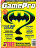
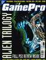

# GamePro

. | _GamePro_
--- | ---
Alternate titles | 
Publisher | IDG Media
Country | United Kingdom
Language | English
Topic | Video games
Years | 1995 &mdash; 1996
Issues | 9 (10)
Frequency | Monthly
ISSN | 1358-7536
Website | 
Related | _[GamePro](../us/GamePro.md)_ (US)

Issue | Front&nbsp;cover | Full | Cover date | Actual date | Price | Barcode | Extras
----- | ---------------- | ---- | ---------- | ----------- | ----- | ------- | ------
0||[🔗][0]||1995-xx-xx|||
1||[🔗][1]|July 1995|1995-0x-xx|2.50GBP|9771358753009-07|Hardware supplement
2||[🔗][2]|October 1995|1995-08-28|2.50GBP|9771358753009-10|PlayStation supplement
3||[🔗][3]|November 1995|1995-09-28|2.50GBP|9771358753009-11|Card x8
4||[🔗][4]|December 1995|1995-10-28|2.50GBP|9771358753009-12|Edible worm sucker
5|||January 1996|1995-11-26|||
6||[🔗][6]|February 1996|1995-12-xx|2.50GBP|9771358753009-02|Music CD &vert; Poster
7||[🔗][7]|March 1996|1996-01-25|2.50GBP|9771358753009-03|
8|||April 1996|1996-02-22|2.50GBP|9771358753009-04|Disney CD-ROM
9||[🔗][9]|May 1996|1996-04-xx|2.50GBP|9771358753009-05|

[0]: https://archive.org/details/game-pro-uk-sampler-01
[1]: https://archive.org/details/game-pro-uk-01_202011
[2]: https://archive.org/details/game-pro-uk-02
[3]: https://archive.org/details/game-pro-uk-03
[4]: https://archive.org/details/game-pro-uk-04

[6]: https://archive.org/details/game-pro-uk-06
[7]: https://archive.org/details/game-pro-uk-07

[9]: https://archive.org/details/game-pro-uk-09
