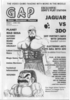
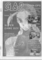
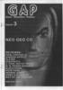
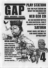
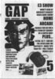

# Games Amusement Pleasure

. | _Games Amusement Pleasure_
--- | ---
Alternate titles | _GAP_
Publisher | 
Country | United Kingdom
Language | English
Topic | Video games
Years | 1994 &mdash; 1995
Issues | 5
Frequency | 
ISSN | 
Website | 
Related | _[Electric Brain](Electric%20Brain.md)_ (previous)

Issue | Front&nbsp;cover | Full | Cover date | Actual date | Price | Barcode | Extras
----- | ---------------- | ---- | ---------- | ----------- | ----- | ------- | ------
1||[🔗][1]|June 1994|1994-xx-xx|1.50GBP||
2||[🔗][2]|August 1994|1994-07-xx|||
3||[🔗][3]||1994-xx-xx|||
4||[🔗][4]||1995-xx-xx|||
5||[🔗][5]||1995-xx-xx|2.00GBP||

[1]: https://archive.org/details/1994-06-games-amusement-pleasure-01
[2]: https://archive.org/details/1994-08-games-amusement-pleasure-02
[3]: https://archive.org/details/1994-09-games-amusement-pleasure-03
[4]: https://archive.org/details/1995-04-games-amusement-pleasure-04
[5]: https://archive.org/details/1995-06-games-amusement-pleasure-05
