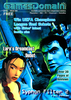
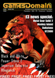
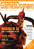
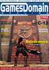
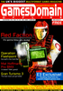
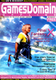

# Games Domain Offline

. | _Games Domain Offline_
--- | ---
Alternate titles | 
Publisher | Kaleidoscope Networks
Country | United Kingdom
Language | English
Topic | Video games
Years | 1999 &mdash; 2001
Issues | 19
Frequency | Monthly
ISSN | 
Website | [gamesdomain.co.uk][web]
Related | 

Issue | Front&nbsp;cover | Full | Cover date | Actual date | Price | Barcode | Extras
----- | ---------------- | ---- | ---------- | ----------- | ----- | ------- | ------
1||||1999-12-01|||
2||||2000-xx-xx|||
3||||2000-xx-xx|||
4||[🔗][4]|April|2000-xx-xx|||
5||[🔗][5]|May|2000-xx-xx|||
6||[🔗][6]|June|2000-xx-xx|||
7||||2000-xx-xx|||
8||[🔗][8]|August|2000-xx-xx|||
9||[🔗][9]|September|2000-xx-xx||| PlayStation 2 supplement [🔗][9e]
10||[🔗][10]|October|2000-xx-xx|||
11||[🔗][11]|November|2000-xx-xx|||
12||[🔗][12]|Dec/Jan|2000-xx-xx|||
13||[🔗][13]|Feb|2001-xx-xx|||
14||[🔗][14]|March|2001-xx-xx|||
15||[🔗][15]|April|2001-xx-xx|||
16||[🔗][16]|May|2001-xx-xx|||
17||[🔗][17]|June|2001-06-01|||
18||[🔗][18]|July|2001-07-01|||
19||[🔗][19]|Aug|2001-08-01|||

[4]: https://archive.org/details/games-domain-offline-04
[5]: https://archive.org/details/games-domain-offline-05
[6]: https://archive.org/details/games-domain-offline-06

[8]: https://archive.org/details/games-domain-offline-08
[9]: https://archive.org/details/games-domain-offline-09
[10]: https://archive.org/details/games-domain-offline-10
[11]: https://archive.org/details/games-domain-offline-11
[12]: https://archive.org/details/games-domain-offline-12
[13]: https://archive.org/details/games-domain-offline-13
[14]: https://archive.org/details/games-domain-offline-14
[15]: https://archive.org/details/games-domain-offline-15
[16]: https://archive.org/details/games-domain-offline-16
[17]: https://archive.org/details/games-domain-offline-17
[18]: https://archive.org/details/games-domain-offline-18
[19]: https://archive.org/details/games-domain-offline-19

[9e]: https://archive.org/details/games-domain-offline-09-supplement-ps-2-special

[web]: https://web.archive.org/web/20000302010808/http://www.gamesdomain.co.uk/
