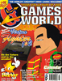

# Games World: The Magazine

. | _Games World: The Magazine_
--- | ---
Alternate titles | 
Publisher | Paragon Publishing
Country | United Kingdom
Language | English
Topic | Video games
Years | 1994 &mdash; 1996
Issues | 
Frequency | Monthly
ISSN | 1354-2907
Website | 
Related | 

Issue | Front&nbsp;cover | Full | Cover date | Actual date | Price | Barcode | Extras
----- | ---------------- | ---- | ---------- | ----------- | ----- | ------- | ------
0||[🔗][0]|June 1994|1994-xx-xx|2.50GBP||
1||[🔗][1]|July 1994|1994-05-26|2.50GBP|9771354290003-07|A Survivor's Guide to Arcade Combat book
2||[🔗][2]|August 1994|1994-06-30|2.50GBP|9771354290003-08|
3||[🔗][3]|September 1994|1994-07-28|2.50GBP|9771354290003-09|
4||[🔗][4]|October 1994|1994-08-25|2.50GBP|9771354290003-10|
5||[🔗][5]|November 1994|1994-09-29|2.50GBP|9771354290003-11|EA Sports Guide supplement
6||[🔗][6]|December 1994|1994-10-28|2.50GBP|9771354290003-12|The Ultimate Cheats Bible book
7||[🔗][7]|January 1995|1994-11-xx|2.95GBP|9771354290997-01|50 Games Without Equal book
8||[🔗][8]|February 1995|1994-12-xx|2.50GBP|9771354290003-02|1995 calendar
9||[🔗][9]|March 1995|1995-01-26|2.50GBP|9771354290003-03|NBA Jam Tournament Edition poster
10||[🔗][10]|April 1995|1995-xx-xx|2.50GBP|9771354290003-04|Beavis and Butt-Head tattoo
11|||May 1995|1995-xx-xx|2.50GBP|9771354290003-05|A Survivor's Guide to Arcade Combat 2 book
12||[🔗][12]|June 1995|1995-xx-xx|2.50GBP|9771354290003-06|Sports World book
13||[🔗][13]|July 1995|1995-xx-xx|2.50GBP|9771354290003-07|
14||[🔗][14]|August 1995|1995-xx-xx|2.50GBP|9771354290003-08|
15||[🔗][15]|Sept 1995|1995-xx-xx|2.50GBP|9771354290003-09|
16|||October 1995|1995-xx-xx|||
17|||November 1995|1995-xx-xx|||
18|||December 1995|1995-xx-xx|2.95GBP|9771354290010-12|Floppy disk
19|||January 1996|199x-xx-xx|||
20||[🔗][20]|Feb 1996|1996-xx-xx|2.95GBP|9771354290010-02|
21|||March 1996|199x-xx-xx|||
22|||April 96|199x-xx-xx|2.95GBP|9771354290010-04|

https://archive.org/details/games-world-00
https://archive.org/details/games-world-01
https://archive.org/details/games-world-02
https://archive.org/details/games-world-03
https://archive.org/details/games-world-04
https://archive.org/details/games-world-05
https://archive.org/details/games-world-06
https://archive.org/details/games-world-07
https://archive.org/details/games-world-08
https://archive.org/details/games-world-09
https://archive.org/details/games-world-10

https://archive.org/details/games-world-12
https://archive.org/details/games-world-13
https://archive.org/details/games-world-14
https://archive.org/details/games-world-15

https://archive.org/details/games-world-20-february-1996
