# Games-X

. | _Games-X_
--- | ---
Alternate titles | 
Publisher | Europress Interactive
Country | United Kingdom
Language | English
Topic | Video games
Years | 1991 &mdash; 1992
Issues | 48 (49)
Frequency | Weekly
ISSN | 
Website | 
Related | 

Issue | Front&nbsp;cover | Full | Cover date | Actual date | Price | Barcode | Extras
----- | ---------------- | ---- | ---------- | ----------- | ----- | ------- | ------
0||[🔗][XX]|March 1991|1991-0x-xx|||
1||[🔗][XX]|3rd May 1991|1991-04-26|0.60GBP|9770962105006-01|
2||[🔗][XX]|10th May 1991|1991-05-03|0.60GBP|9770962105006-02|
3||[🔗][XX]|17th May 1991|1991-05-10|0.60GBP|9770962105006-03|
4||[🔗][XX]|24th May 1991|1991-05-17|0.60GBP|9770962105006-21|
5|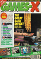|[🔗][XX]|31st May 1991|1991-05-24|0.60GBP|9770962105006-22|
6||[🔗][XX]|31st May-6th June '91|1991-05-31|0.60GBP|9770962105006-23|
7||[🔗][XX]|7th-13th June '91|1991-06-07|0.60GBP|9770962105006-24|
8||[🔗][XX]|14th-20th June '91|1991-06-14|0.60GBP|9770962105006-25|
9||[🔗][XX]|21st-26th June '91|1991-06-21|0.60GBP|9770962105006-26|
10|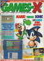|[🔗][XX]|27th June-3rd July '91|1991-06-27|0.99GBP|9770962105013-27|3.5" floppy disk
11|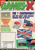|[🔗][XX]|4th-10th July '91|1991-07-04|0.99GBP|9770962105013-28|3.5" floppy disk
12||[🔗][XX]|11th-17th July '91|1991-07-11|0.99GBP|9770962105013-29|3.5" floppy disk
13||[🔗][XX]|18th-24th July '91|1991-07-18|0.70GBP|9770962105020-30|
14||[🔗][XX]|25th-31st July '91|1991-07-25|0.70GBP|9770962105020-31|
15|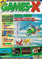|[🔗][XX]|1st-7th August '91|1991-08-01|0.70GBP|9770962105020-32|
16|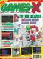|[🔗][XX]|8th-14th August '91|1991-08-08|0.70GBP|9770962105020-33|
17|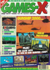|[🔗][XX]|15th-21st August '91|1991-08-15|0.70GBP|9770962105020-34|
18|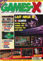|[🔗][18]|22nd-28th August '91|1991-08-22|0.70GBP|9770962105020-35|
19|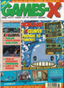|[🔗][XX]|29th August-4th Sept '91|1991-08-29|0.70GBP|9770962105020-36|
20||[🔗][XX]|5th-11th Sept '91|1991-09-05|0.70GBP|9770962105020-37|Poster
21||[🔗][XX]|12th-18th Sept '91|1991-09-12|0.70GBP|9770962105020-38|
22||[🔗][22]|19th-25th Sept '91|1991-09-19|0.70GBP|9770962105020-39|
23|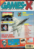|[🔗][XX]|26th Sept-2nd Oct '91|1991-09-26|0.70GBP|9770962105020-40|
24||[🔗][XX]|3rd-9th Oct '91|1991-10-03|0.70GBP|9770962105020-41|
25|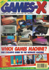|[🔗][XX]|10th-16th Oct '91|1991-10-10|0.70GBP|9770962105020-42|
26|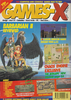|[🔗][XX]|17th-23rd Oct '91|1991-10-17|0.70GBP|9770962105020-43|
27|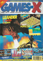|[🔗][XX]|24th-30th Oct '91|1991-10-24|0.70GBP|9770962105020-44|
28||[🔗][XX]|31st Oct-6th Nov '91|1991-10-31|0.70GBP|9770962105020-45|
29|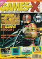|[🔗][XX]|7th-13th Nov '91|1991-11-07|0.75GBP|9770962105037-46|
30||[🔗][XX]|14th-20th Nov '91|1991-11-14|0.75GBP|9770962105037-47|
31||[🔗][XX]|21st-27th Nov '91|1991-11-21|0.75GBP|9770962105037-48|
32|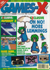|[🔗][XX]|28th Nov-4th Dec '91|1991-11-28|0.75GBP|9770962105037-49|
33||[🔗][XX]|5th-11th Dec '91|1991-12-05|0.75GBP|9770962105037-50|
34|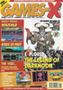|[🔗][XX]|12th-18th Dec '91|1991-12-12|0.75GBP|9770962105037-51|
35||[🔗][XX]|19th Dec '91-1st Jan '92|1991-12-19|0.75GBP|9770962105037-52|
36|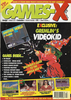|[🔗][XX]|2nd-8th Jan '92|1992-01-02|0.75GBP|9770962105037-53|
37||[🔗][XX]|9th-15th Jan '92|1992-01-09|0.75GBP|9770962105037-54|
38||[🔗][38]|16th-22nd Jan '92|1992-01-16|0.75GBP|9770962105037-55|
39||[🔗][39]|23rd-29th Jan '92|1992-01-23|0.75GBP|9770962105037-56|
40||[🔗][XX]|30th Jan-5th Feb '92|1992-01-30|0.75GBP|9770962105037-57|
41|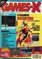|[🔗][41]|6th-12th Feb '92|1992-02-06|0.75GBP|9770962105037-58|
42||[🔗][42]|13th-19th Feb '92|1992-02-13|0.75GBP|9770962105037-07|
43||[🔗][XX]|20th-26th Feb '92|1992-02-20|0.75GBP|9770962105037-08|
44|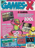|[🔗][XX]|27th Feb-4th March '92|1992-02-27|0.75GBP|9770962105037-09|
45|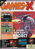|[🔗][XX]|5th-11th March '92|1992-03-05|0.75GBP|9770962105037-10|
46||[🔗][XX]|12th-18th March '92|1992-03-12|0.75GBP|9770962105037-11|
47||[🔗][XX]|19th-25th March '92|1992-03-19|0.75GBP|9770962105037-12|
48||[🔗][XX]|26th March-1st April '92|1992-03-26|0.75GBP|9770962105037-13|

[XX]: https://archive.org/details/GamesXHi05
[18]: https://archive.org/details/games-x-uk-18
[22]: https://archive.org/details/games-x-uk-22
[38]: https://archive.org/details/games-x-uk-38
[39]: https://archive.org/details/games-x-uk-39
[41]: https://archive.org/details/games-x-uk-41
[42]: https://archive.org/details/games-x-uk-42
