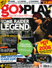
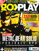

# Go>Play

. | _Go>Play_
--- | ---
Alternate titles | 
Publisher | Highbury Entertainment (1-2) &vert; Imagine Publishing (3-14)
Country | United Kingdom
Language | English
Topic | Video games
Years | 2005 &mdash; 2007
Issues | 14
Frequency | Monthly
ISSN | 
Website | [goplaymagazine.co.uk][web]
Related | 

Issue | Front&nbsp;cover | Full | Cover date | Actual date | Price | Barcode | Extras
----- | ---------------- | ---- | ---------- | ----------- | ----- | ------- | ------
1||[🔗][1]||2005-1x-xx|3.49GBP|9771749433008-01|
2||[🔗][2]||2005-12-28|3.49GBP|9771749433008-02|
3||[🔗][3]||2006-02-02|3.49GBP|9771749433008-03|
4||[🔗][4]||2006-04-06|3.49GBP|9771749433008-04|
5||[🔗][5]||2006-05-04|3.49GBP|9771749433008-05|
6||[🔗][6]||2006-06-01|3.99GBP|9771749433015-06|Cheats book
7||[🔗][7]||2006-06-29|3.99GBP|9771749433015-07|
8||||2006-07-27|||
9||[🔗][9]||2006-xx-xx|3.99GBP|9771749433015-09|
10||[🔗][10]||2006-09-21|3.99GBP|9771749433015-10|
11||[🔗][11]||2006-10-19|3.99GBP|9771749433015-11|
12||||2006-11-16|||
13||||2006-xx-xx|||
14||[🔗][14]||200x-xx-xx|4.99GBP|9771749433022-14 |

[1]: https://archive.org/details/go-play-01
[2]: https://archive.org/details/go-play-02
[3]: https://archive.org/details/go-play-03
[4]: https://archive.org/details/go-play-04
[5]: https://archive.org/details/go-play-05
[6]: https://archive.org/details/go-play-06
[7]: https://archive.org/details/go-play-07

[9]: https://archive.org/details/go-play-09
[10]: https://archive.org/details/go-play-10
[11]: https://archive.org/details/go-play-11

[14]: https://archive.org/details/go-play-14

[web]: http://web.archive.org/web/20060613192903/http://www.goplaymagazine.co.uk/
