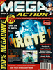
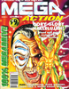
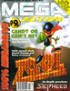
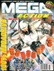
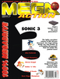
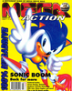

# Mega Action

. | _Mega Action_
--- | ---
Alternate titles | 
Publisher |  Europress Interactive
Country | United Kingdom
Language | English
Topic | Video games
Years | 1993 &mdash; 1994
Issues | 11
Frequency | Monthly
ISSN | 
Website | 
Related | 

Issue | Front&nbsp;cover | Full | Cover date | Actual date | Price | Barcode | Extras
----- | ---------------- | ---- | ---------- | ----------- | ----- | ------- | ------
1||[🔗][1]|June 1993|1993-05-20|0.99GBP|9770969284001-06|Chupa Chups lollipop
2||[🔗][2]|July 1993|1993-06-17|0.99GBP|9770969284001-07|Laser Quest voucher
3||[🔗][3]|August 1993|1993-07-15|0.99GBP|9770969284001-08|
4||[🔗][4]|September 1993|1993-08-12|0.99GBP|9770969284001-09|
5||[🔗][5]|October 1993|1993-09-09|0.99GBP|9770969284001-10|
6||[🔗][6]|November 1993|1993-10-07|1.75GBP|9770969284018-11|Badge
7||[🔗][7]|December 1993|1993-11-04|1.75GBP|9770969284018-12|Laces
8||[🔗][8]|Christmas 1993|1993-12-02|1.75GBP|9770969284018-32|
9||[🔗][9]|January 1994|1993-12-30|1.75GBP|9770969284018-01|
10||[🔗][10]|February 1994|1994-01-28|1.75GBP|9770969284018-02|
11||[🔗][11]|March 1994|1994-02-24|1.75GBP|9770969284018-03|

[1]: https://archive.org/details/mega-action-issue-1-1993-06
[2]: https://archive.org/details/mega-action-issue-02
[3]: https://archive.org/details/mega-action-03-1993-08
[4]: https://archive.org/details/mega-action-04_202212
[5]: https://archive.org/details/mega-action-05
[6]: https://archive.org/details/mega-action-06
[7]: https://archive.org/details/mega-action-07_202212
[8]: https://archive.org/details/mega-action-08_202212
[9]: https://archive.org/details/mega-action-09
[10]: https://archive.org/details/mega-action-10
[11]: https://archive.org/details/mega-action-11
