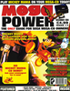

# Mega Power

. | _Mega Power_
--- | ---
Alternate titles | 
Publisher | Paragon Publishing
Country | United Kingdom
Language | English
Topic | Video games
Years | 1993 &mdash; 1995
Issues | 24
Frequency | Monthly
ISSN | 0969-8434
Website | 
Related | 

Issue | Front&nbsp;cover | Full | Cover date | Actual date | Price | Barcode | Extras
----- | ---------------- | ---- | ---------- | ----------- | ----- | ------- | ------
1||[🔗][1]|Aug 1993|1993-07-29|1.95GBP|9770969843017-08|
2||[🔗][2]|Sept 1993|1993-08-19|1.95GBP|9770969843017-09|
3||[🔗][3]|Oct 1993|1993-09-23|1.95GBP|9770969843017-10|
4||[🔗][4]|Nov 1993|1993-10-21|4.50GBP|9770969843994-11|Thunderhawk Mega-CD demo disc
5||[🔗][5]|Dec 1993|1993-11-18|2.25GBP|9770969843024-12|
6||[🔗][6]|Jan 1994|1993-12-16|4.50GBP|9770969843994-01|Psygnosis Mega-CD demo disc
7||[🔗][7]|Feb 1994|1994-01-20|2.50GBP|9770969843031-02|
8||[🔗][8]|Mar 1994|1994-02-17|2.50GBP|9770969843031-03|
9||[🔗][9]|Apr 1994|1994-03-24|2.50GBP|9770969843031-04|
10||[🔗][10]|May 1994|1994-04-21|4.99GBP|9770969843048-05|Soul Star Mega-CD demo disc
11||[🔗][11]|June 1994|1994-05-19|4.99GBP|9770969843048-06|Battlecorps Mega-CD demo disc
12||[🔗][12]|July 1994|1994-06-23|4.99GBP|9770969843048-07|Sensible Soccer Mega-CD demo disc
13||[🔗][13]|Aug 1994|1994-07-21|4.99GBP|9770969843048-08|FIFA International Soccer Mega-CD demo disc
14||[🔗][14]|Sept 1994|1994-08-18|4.99GBP|9770969843048-09|Soul Star & Battlecorps Mega-CD demo disc
15||[🔗][15]|October 1994|1994-09-22|4.99GBP|9770969843048-10|Star Wars: Rebel Assault Mega-CD demo disc
16||[🔗][16]|November 1994|1994-10-20|4.99GBP|9770969843048-11|The Lawnmower Man Mega-CD demo disc
17||[🔗][17]|December 1994|1994-11-17|4.99GBP|9770969843048-12|Mickey Mania Mega-CD demo disc
18||[🔗][18]|February 1994|1994-12-22|5.99GBP|9770969843055-02|BC Racers Mega-CD demo disc
19||[🔗][19]|March 1995|1995-02-16|5.99GBP|9770969843055-03|Lethal Enforcers II Mega-CD demo disc
20||[🔗][20]|April 1995|1995-03-23|5.99GBP|9770969843055-04|Flashback Mega-CD demo disc
21||[🔗][21]|May 1995|1995-0x-xx|5.99GBP|9770969843055-05|Keio Flying Squadron Mega-CD demo disc
22|||June 1995|1995-0x-xx|5.99GBP|9770969843055-06|Time Cop Mega-CD demo disc
23||[🔗][23]|July 1995|1995-0x-xx|5.99GBP|9770969843055-07|Fatal Fury Mega-CD demo disc
24||[🔗][24]|August 1995|1995-0x-xx|5.99GBP|9770969843055-08|Samurai Shodown Mega-CD demo disc

[1]: https://archive.org/details/mega-power-uk-01
[2]: https://archive.org/details/mega-power-uk-02
[3]: https://archive.org/details/mega-power-uk-03
[4]: https://archive.org/details/mega-power-uk-04
[5]: https://archive.org/details/megapower05
[6]: https://archive.org/details/mega-power-uk-06
[7]: https://archive.org/details/mega-power-uk-07
[8]: https://archive.org/details/mega-power-uk-08
[9]: https://archive.org/details/mega-power-uk-09
[10]: https://archive.org/details/mega-power-uk-10
[11]: https://archive.org/details/mega-power-uk-11
[12]: https://archive.org/details/mega-power-uk-12
[13]: https://archive.org/details/mega-power-uk-13
[14]: https://archive.org/details/mega-power-uk-14
[15]: https://archive.org/details/mega-power-uk-15
[16]: https://archive.org/details/mega-power-uk-16
[17]: https://archive.org/details/mega-power-uk-17
[18]: https://archive.org/details/mega-power-uk-18
[19]: https://archive.org/details/mega-power-uk-19
[20]: https://archive.org/details/mega-power-uk-20
[21]: https://archive.org/details/mega-power-uk-21

[23]: https://archive.org/details/mega-power-uk-23
[24]: https://archive.org/details/mega-power-uk-24
