# MegaTech

. | _MegaTech_
--- | ---
Alternate titles | 
Publisher | EMAP Images (1-25) &vert; Maverick Magazines (26-43)
Country | United Kingdom
Language | English
Topic | Video games
Years | 1991 &mdash; 1995
Issues | 43
Frequency | Monthly
ISSN | 0964-5764
Website | 
Related | 

Issue | Front&nbsp;cover | Full | Cover date | Actual date | Price | Barcode | Extras
----- | ---------------- | ---- | ---------- | ----------- | ----- | ------- | ------
1||[🔗][1]|Xmas 1991|1991-12-06|1.95GBP|9770964576002-12|
2||[🔗][2]|Feb 1992|1992-01-20|1.95GBP|9770964576002-02|
3||[🔗][3]|March 1992|1992-02-20|1.95GBP|9770964576002-03|Badge
4||[🔗][4]|April 1992|1992-03-20|1.95GBP|9770964576002-04|
5|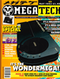|[🔗][5]|May 1992|1992-04-20|1.95GBP|9770964576002-05|
6||[🔗][6]|June 1992|1992-05-20|1.95GBP|9770964576002-06|
7|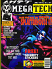|[🔗][7]|July 1992|1992-06-20|1.95GBP|9770964576002-07|Stickers
8||[🔗][8]|Aug. 1992|1992-07-20|1.95GBP|9770964576002-08|
9|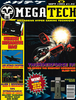|[🔗][9]|Sept 1992|1992-08-20|1.95GBP|9770964576002-09|
10||[🔗][10]|Oct. 1992|1992-09-20|1.95GBP|9770964576002-10|
11||[🔗][11]|Nov. 1992|1992-10-20|1.95GBP|9770964576002-11| Sonic the Hedgehog 2 booklet [🔗][11e]
12|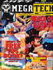|[🔗][12]|Dec. 1992|1992-11-20|1.95GBP|9770964576002-12| Tips book [🔗][12e]
13||[🔗][13]|January 1993|1992-12-20|1.95GBP|9770964576002-01|
14||[🔗][14]|February 1993|1993-01-20|1.95GBP|9770964576002-02|
15||[🔗][15]|March 1993|1993-02-20|1.95GBP|9770964576002-03|
16|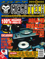|[🔗][16]|April 1993|1993-03-20|1.95GBP|9770964576002-04|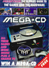 Mega-CD guide [🔗][16e]
17|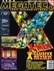|[🔗][17]|May 1993|1993-04-23|1.95GBP|9770964576002-05|
18||[🔗][18]|June 1993|1993-05-20|1.95GBP|9770964576002-06|
19||[🔗][19]|July 1993|1993-06-19|1.95GBP|9770964576002-07|
20||[🔗][20]|August 1993|1993-07-20|1.95GBP|9770964576002-08|
21|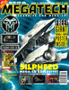|[🔗][21]|September 1993|1993-08-20|1.95GBP|9770964576002-09|Poster
22||[🔗][22]|October 1993|1993-09-20|2.25GBP|9770964576019-10|
23|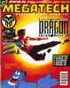|[🔗][23]|November 1993|1993-10-20|2.25GBP|9770964576019-11|Competition card
24||[🔗][24]|December 1993|1993-11-20|2.50GBP|9770964576026-12|Booklet
25||[🔗][25]|January 1994|1993-12-21|2.50GBP|9770964576026-01|
26|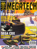|[🔗][26]|February 1994|1994-01-20|2.50GBP|9770964576019-03|
27||[🔗][27]|March 1994|1994-02-20|2.25GBP|9770964576026-99|
28||[🔗][28]|April 1994|1994-03-18|2.25GBP|9770964576026-04|
29||[🔗][29]|May 1994|1994-04-21|2.25GBP|9770964576026-05|
30|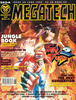|[🔗][30]|June 1994|1994-05-19|2.50GBP|9770964576033-06|
31||[🔗][31]|July 1994|1994-06-16|2.50GBP|9770964576033-07|
32||[🔗][32]|August 1994|1994-07-21|2.50GBP|9770964576033-08|
33||[🔗][33]|September 1994|1994-08-18|2.50GBP|9770964576033-09|
34|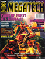|[🔗][34]|October 1994|1994-09-15|2.50GBP|9770964576033-10|
35||[🔗][35]|December 1994|1994-10-27|2.50GBP|9770964576033-11|
36|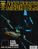|[🔗][36]|Christmas Special 1994|1994-11-30|2.50GBP|9770964576026-12|
37||[🔗][37]|January 1995|1994-12-xx|2.50GBP|9770964576026-01|
38||[🔗][38]|February 1995|1995-01-xx|2.50GBP|9770964576026-02|
39|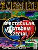|[🔗][39]|March 1995|1995-02-30|2.50GBP|9770964576026-03|
40||[🔗][40]|April 1995|1995-03-31|2.50GBP|9770964576026-04|
41|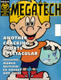|[🔗][41]|May 1995|1995-04-30|2.50GBP|	
42||[🔗][42]|June 1995|1995-05-31|2.50GBP|9770964576026-06|
43|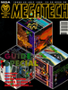|[🔗][43]|July 1995|1995-06-30|2.50GBP|9770964576026-06|

[1]: https://archive.org/details/mega-tech-uk-01
[2]: https://archive.org/details/mega-tech-uk-02
[3]: https://archive.org/details/mega-tech-uk-03
[4]: https://archive.org/details/mega-tech-uk-04
[5]: https://archive.org/details/mt-05
[6]: https://archive.org/details/mega-tech-uk-06
[7]: https://archive.org/details/mt-07
[8]: https://archive.org/details/megatech8
[9]: https://archive.org/details/mt-09
[10]: https://archive.org/details/mega-tech-uk-10
[11]: https://archive.org/details/mega-tech-uk-11
[12]: https://archive.org/details/mt-12
[13]: https://archive.org/details/mt-13
[14]: https://archive.org/details/mt-14
[15]: https://archive.org/details/mt-15
[16]: https://archive.org/details/mt-16
[17]: https://archive.org/details/mt-17
[18]: https://archive.org/details/mt-18
[19]: https://archive.org/details/mt-19
[20]: https://archive.org/details/mt-20
[21]: https://archive.org/details/megatech-21
[22]: https://archive.org/details/mt-22_202005
[23]: https://archive.org/details/megatech23
[24]: https://archive.org/details/megatech24
[25]: https://archive.org/details/megatech25
[26]: https://archive.org/details/mega-tech-26
[27]: https://archive.org/details/mega-tech-27
[28]: https://archive.org/details/megatech28
[29]: https://archive.org/details/megatech-29
[30]: https://archive.org/details/megatech-30
[31]: https://archive.org/details/megatech-31
[32]: https://archive.org/details/megatech-32
[33]: https://archive.org/details/megatech-33
[34]: https://archive.org/details/megatech-34
[35]: https://archive.org/details/megatech-35
[36]: https://archive.org/details/megatech-36
[37]: https://archive.org/details/megatech-37
[38]: https://archive.org/details/megatech-38
[39]: https://archive.org/details/megatech-39
[40]: https://archive.org/details/megatech-40
[41]: https://archive.org/details/megatech-41
[42]: https://archive.org/details/megatech-42
[43]: https://archive.org/details/megatech-43

[11e]: https://archive.org/details/megatech-11-supplement-sonic-2-guide
[12e]: https://archive.org/details/megatech-12-supplement-complete-technique-zone
[16e]: https://archive.org/details/mega-tech-supplement-mega-cd-guide
