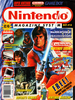
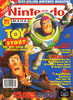
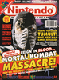
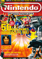
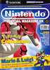
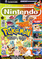
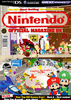

# Nintendo Official Magazine

. | _Nintendo Official Magazine_
--- | ---
Alternate titles | _Nintendo Magazine System_ (1-53) | _Nintendo Magazine_ (54-68) | _Nintendo Official Magazine UK_ (132-151)
Publisher | EMAP Images (1-73) | EMAP Active (74-162)
Country | United Kingdom
Language | English
Topic | Video games
Years | 1992 — 2006
Issues | 162
Frequency | Monthly
ISSN | 0965-4240 (1-) | 1466-1748
Website | 
Related | 

Issue | Front cover | Full | Cover date | Actual date | Price | Barcode | Extras
----- | ---------------- | ---- | ---------- | ----------- | ----- | ------- | ------
1||[🔗][1]|Oct|1992-xx-xx|1.95GBP|9770965424005-10|Poster
2||[🔗][2]|Nov|1992-xx-xx|2.50GBP|9770965424999-11|T-shirt transfer
3||[🔗][3]|Dec|1992-10-19|3.95GBP|9770965424982-12|VHS cassette
4||[🔗][4]|Jan|1992-12-19|2.95GBP|9770965424975-01|Audio CD
5||[🔗][5]|Feb|1993-xx-xx|1.95GBP|9770965424005-02|Wallplanner
6||[🔗][6]|Mar|1993-xx-xx|1.95GBP|9770965424005-03|
7||[🔗][7]|Apr|1993-02-20|1.95GBP|9770965424005-04|Poster
8||[🔗][8]|May|1993-xx-xx|1.95GBP|9770965424005-05|
9||[🔗][9]|June|1993-xx-xx|1.95GBP|9770965424005-06|
10||[🔗][10]|July|1993-xx-xx|1.95GBP|9770965424005-07|
11||[🔗][11]|Aug|1993-xx-xx|1.95GBP|9770965424005-08|
12||[🔗][12]|Sept|1993-xx-xx|1.95GBP|9770965424005-09|Poster
13||[🔗][13]|Oct|1993-xx-xx|2.45GBP|9770965424999-10|Poster
14||[🔗][14]|Nov|1993-09-18|2.25GBP|9770965424012-11|NatWest flyer
15||[🔗][15]|Dec|1993-11-19|2.25GBP|9770965424012-12|
16||[🔗][16]|Jan|1993-12-19|2.25GBP|9770965424012-01|
17||[🔗][17]|Feb|1994-01-19|2.25GBP|9770965424012-02|
18||[🔗][18]|Mar|1994-02-19|2.25GBP|9770965424012-03|Konami supplement
19||[🔗][19]|April|1994-03-19|2.25GBP|9770965424012-04|Manga cards
20||[🔗][20]|May|1994-04-19|2.25GBP|9770965424012-05|
21||[🔗][21]|June|1994-05-19|2.25GBP|9770965424012-06|
22||[🔗][22]|July|1994-06-19|2.25GBP|9770965424012-07|Konami supplement
23||[🔗][23]|Aug|1994-xx-xx|2.25GBP|9770965424012-08|
24||[🔗][24]|Sept|1994-08-19|2.25GBP|9770965424012-09|
25||[🔗][25]|Oct|1994-09-19|2.25GBP|9770965424012-10|Poster
26||[🔗][26]|Nov|1994-10-19|2.45GBP|9770965424029-11|
27||[🔗][27]|Dec|1994-11-19|2.45GBP|9770965424029-12|Book
28||[🔗][28]|Jan|1994-12-19|2.45GBP|9770965424029-01|Guide book | Magnet
29||[🔗][29]|Feb|1995-01-19|2.45GBP|9770965424029-02|Poster
30||[🔗][30]|Mar|1995-02-19|2.45GBP|9770965424029-03|Sports supplement
31||[🔗][31]|Apr|1995-03-19|2.45GBP|9770965424029-04|
32||[🔗][32]|May|1995-04-19|2.45GBP|9770965424029-05|
33||[🔗][33]|June|1995-05-19|2.45GBP|9770965424029-06|
34||[🔗][34]|July|1995-xx-xx|2.45GBP|9770965424029-07|
35||[🔗][35]|Aug|1995-07-21|2.45GBP|9770965424029-08|
36||[🔗][36]|Sept|1995-08-18|2.45GBP|9770965424029-09|Book
37||[🔗][37]|Oct|1995-09-19|2.45GBP|9770965424036-10|
38||[🔗][38]|Nov|1995-10-19|2.65GBP|9770965424043-11|
39||[🔗][39]|Dec|1995-11-17|2.65GBP|9770965424043-12|Killer Instinct cards
40||[🔗][40]|Jan|1995-12-17|2.65GBP|9770965424043-01|
41||[🔗][41]|Feb|1996-01-19|2.75GBP|9770965424050-02|
42||[🔗][42]|Mar|1996-02-16|2.75GBP|9770965424050-03|
43||[🔗][43]|Apr|1996-03-20|2.75GBP|9770965424050-04|
44||[🔗][44]|May|1996-04-24|2.75GBP|9770965424050-05|Shadows of the Empire supplement
45||[🔗][45]|June|1996-05-22|2.75GBP|9770965424050-06|
46||[🔗][46]|July|1996-06-19|2.75GBP|9770965424050-07|
47||[🔗][47]|Aug|1996-07-17|2.75GBP|9770965424050-08|
48||[🔗][48]|Sept|1996-08-17|2.75GBP|9770965424050-09|
49||[🔗][49]|Oct|1996-09-11|2.75GBP|9770965424050-10|
50||[🔗][50]|Nov|1996-10-16|2.75GBP|9770965424050-11|
51||[🔗][51]|Dec|1996-11-13|2.75GBP|9770965424050-12|
52||[🔗][52]|Jan|1996-12-12|2.75GBP|9770965424050-01|
53||[🔗][53]|Feb|1997-01-15|2.75GBP|9770965424050-02|
54||[🔗][54]|March '97|1997-02-19|2.50GBP|9770965424067-03|Tips book | Poster
55||[🔗][55]|April '97|1997-xx-xx|2.50GBP|9770965424067-04|Tips book
56||[🔗][56]|May '97|1997-xx-xx|2.50GBP|9770965424067-05|Tips book
57||[🔗][57]|June '97|1997-xx-xx|2.50GBP|9770965424067-06|Tips book
58||[🔗][58]|July '97|1997-xx-xx|2.50GBP|9770965424067-07|Tips book
59||[🔗][59]|Aug '97|1997-07-19|2.50GBP|9770965424067-08|Tips book
60||[🔗][60]|Sept '97|1997-08-23|2.50GBP|9770965424067-09|Tips book
61||[🔗][61]|Oct '97|1997-09-20|2.50GBP|9770965424067-10|Tips book
62||[🔗][62]|Nov '97|1997-10-18|2.50GBP|9770965424067-11|Book
63||[🔗][63]|December 1997|1997-11-22|2.50GBP|9770965424067-12|Battle card game | Tips book
64||[🔗][64]|January|1997-12-22|2.50GBP|9770965424067-01|Book | Posters
65||[🔗][65]|February|1998-xx-xx|2.50GBP|9770965424067-02|Book
66||[🔗][66]|March|1998-xx-xx|2.50GBP|9770965424067-03|Tips book
67||[🔗][67]|April|1998-03-21|2.50GBP|9770965424067-04|Book | Posters
68||[🔗][68]|May|1998-04-25|2.50GBP|9770965424067-05|Tips book
69||[🔗][69]|June 1998|1998-05-23|2.95GBP|9770965424074-06|Booklet
70||[🔗][70]|July 1998|1998-06-20|2.95GBP|9770965424074-07|Booklet
71||[🔗][71]|August 1998|1998-07-25|2.95GBP|9770965424074-08|Booklet
72||[🔗][72]||1998-08-22|2.95GBP|9770965424074-09|Booklet
73||[🔗][73]|October 1998|1998-09-26|2.95GBP|9770965424074-10|Booklet
74||[🔗][74]|November 1998|1998-10-24|2.95GBP|9770965424074-11|Booklet | Posters
75||[🔗][75]|December 1998|1998-11-21|2.95GBP|9770965424074-12|Booklet
76||[🔗][76]|January 1999|1998-12-19|2.95GBP|9770965424074-01|Booklet | Stickers
77||[🔗][77]|February 1999|1999-01-23|2.95GBP|9770965424074-02|Booklet
78||[🔗][78]|March 1999|1999-02-20|2.95GBP|9770965424074-03|Posters
79||[🔗][79]|April 1999|1999-03-20|2.95GBP|9770965424074-04|
80||[🔗][80]|May 1999|1999-04-17|2.95GBP|9770965424074-05|Posters
81||[🔗][81]|June 1999|1999-05-15|2.95GBP|9770965424074-06|Star Wars supplement
82||[🔗][82]|July 1999|1999-06-21|2.95GBP|9770965424074-07|Posters
83||[🔗][83]|August 1999|1999-07-19|2.95GBP|9770965424074-08|Jar Jar toy
84||[🔗][84]|September 1999|1999-08-20|2.95GBP|9770965424074-09|Poster
85||[🔗][85]|October 1999|1999-09-17|2.95GBP|9770965424074-10|
86||[🔗][86]|November 1999|1999-10-15|2.95GBP|9770965424074-11|
87||[🔗][87]|December 1999|1999-11-12|2.95GBP|9770965424074-12|Pokémon car folder | Pokémon card | Posters
88||[🔗][88]|January 2000|1999-12-10|2.95GBP|9770965424074-01|
89||[🔗][89]|February 2000|2000-01-14|2.95GBP|9770965424074-02|
90||[🔗][90]|March 2000|2000-02-18|2.95GBP|9770965424074-03|Pokémon stickers
91||[🔗][91]|April|2000-03-17|2.95GBP|9770965424074-04|Game Boy Official Magazine
92||[🔗][92]|May|2000-04-14|2.95GBP|9770965424074-05|Game Boy Official Magazine | Pokémon Stadium supplement
93||[🔗][93]|June|2000-05-19|2.95GBP|9770965424074-06|Game Boy Official Magazine
94||[🔗][94]|July|2000-06-16|2.95GBP|9770965424074-07|Game Boy Official Magazine
95||[🔗][95]|August|2000-07-14|2.95GBP|9770965424074-08|
96||[🔗][96]|September|2000-08-11|2.95GBP|9770965424074-09|Game Boy Official Magazine
97||[🔗][97]|October|2000-09-08|2.95GBP|9770965424074-10|Game Boy Official Magazine
98||[🔗][98]|November|2000-10-08|2.95GBP|9770965424074-11|Game Boy Official Magazine
99||[🔗][99]|December|2000-11-10|2.95GBP|9770965424074-12|Game Boy Official Magazine
100||[🔗][100]|January|2000-12-08|2.95GBP|9770965424074-01|Game Boy Official Magazine
101||[🔗][101]|February|2001-01-12|2.95GBP|9770965424074-02|Game Boy Official Magazine
102||[🔗][102]|March|2001-02-09|2.95GBP|9770965424074-03|Game Boy Official Magazine
103||[🔗][103]|April|2001-03-09|2.99GBP|9770965424081-04|Game Boy Official Magazine
104||[🔗][104]|May|2001-04-12|2.99GBP|9770965424081-05|Game Boy Official Magazine
105||[🔗][105]|June|2001-05-11|2.99GBP|9770965424081-06|Game Boy Official Magazine
106||[🔗][106]|July|2001-06-08|2.99GBP|9770965424081-07|Game Boy Official Magazine
107||[🔗][107]|August|2001-07-13|2.99GBP|9770965424081-08|Game Boy Official Magazine
108||[🔗][108]|September|2001-08-10|2.99GBP|9770965424081-09|Game Boy Official Magazine
109||[🔗][109]|October|2001-09-14|2.99GBP|9770965424081-10|Game Boy Official Magazine
110||[🔗][110]|November|2001-10-12|2.99GBP|9770965424081-11|Game Boy Official Magazine
111||[🔗][111]|December|2001-11-09|2.99GBP|9770965424081-12|Game Boy Official Magazine
112||[🔗][112]|January|2001-12-14|2.99GBP|9770965424081-01|Game Boy Official Magazine
113||[🔗][113]|February|2002-01-15|2.99GBP|9770965424081-02|
114||[🔗][114]|March|2002-02-11|2.99GBP|9770965424081-03|
115||[🔗][115]|April|2002-03-15|2.99GBP|9770965424081-04|
116||[🔗][116]|May 2002|2002-04-19|3.15GBP|9770965424098-05|
117||[🔗][117]|June 2002|2002-05-10|3.15GBP|9770965424098-06|
118||[🔗][118]|July 2002|2002-06-14|3.15GBP|9770965424098-07|
119||[🔗][119]|Aug 2002|2002-07-12|3.15GBP|9770965424098-08|
120||[🔗][120]|September 2002|2002-08-16|3.15GBP|9770965424098-09|
121||[🔗][121]|Oct 2002|2002-09-13|3.15GBP|9770965424098-10|
122||[🔗][122]|Nov 2002|2002-10-11|3.15GBP|9770965424098-11|
122A||[🔗][122A]|Nov 2002|2002-10-11|3.15GBP|9770965424098-11|
123||[🔗][123]|Dec 2002|2002-11-15|3.50GBP|9770965424104-12|
124||[🔗][124]|Jan 2003|2002-12-13|3.50GBP|9770965424104-01|
125||[🔗][125]|Feb 2003|2003-01-17|3.50GBP|9770965424104-02|
126||[🔗][126]|Mar 2003|2003-02-14|3.50GBP|9770965424104-03|
127||[🔗][127]|Apr 2003|2003-03-14|3.50GBP|9770965424104-04|
128||[🔗][128]|May 2003|2003-04-11|3.50GBP|9770965424104-05|
129||[🔗][129]|June 2003|2003-05-16|3.50GBP|9770965424104-06|
130||[🔗][130]|July 2003|2003-06-13|3.50GBP|9770965424104-07|
131||[🔗][131]|Aug 2003|2003-07-11|3.50GBP|9770965424104-08|Poké Ball
132||[🔗][132]|Sept 2003|2003-08-15|3.50GBP|9770965424104-09|Book
133||[🔗][133]|Oct 2003|2003-09-12|3.50GBP|9770965424104-10|Game wallet
134||[🔗][134]|Nov 2003|2003-10-17|3.50GBP|9770965424104-11|Nincyclopaedia book
135||[🔗][135]|Dec 2003|2003-11-14|3.50GBP|9770965424104-12|Calendar
136||[🔗][136]|Jan 2004|2003-12-12|3.50GBP|9770965424104-01|Ninflatable punchable
137||[🔗][137]|Feb 2004|2004-01-16|3.50GBP|9770965424104-02|Super Smash Bros. Melee music CD
138||[🔗][138]|March 2004|2004-02-13|3.50GBP|9770965424104-03|Super Mario World fridge magnets
139||[🔗][139]|April 2004|2004-03-12|3.75GBP|9770965424111-04|NES controller keyring
140||[🔗][140]|May 2004|2004-04-16|3.75GBP|9770965424111-05|
141||[🔗][141]|June 2004|2004-05-14|3.75GBP|9770965424111-06|Nintendo playing cards
142||[🔗][142]|July 2004|2004-06-11|3.75GBP|9770965424111-07|
143||[🔗][143]|August 2004|2004-07-16|3.75GBP|9770965424111-08|
144||[🔗][144]|September 2004|2004-08-13|3.75GBP|9770965424111-09|Buildable Pikachu model
145||[🔗][145]|October 2004|2004-09-10|3.75GBP|9770965424111-10|
146||[🔗][146]|November 2004|2004-10-15|3.75GBP|9770965424111-11|
147||[🔗][147]|December 2004|2004-11-12|3.99GBP|9770965424128-12|DVD video
148||[🔗][148]|January 2005|2004-12-10|3.99GBP|9770965424128-01|DVD video
149||[🔗][149]|February 2005|2005-01-14|3.99GBP|9770965424128-02|
150||[🔗][150]|March 2005|2005-02-11|3.99GBP|9770965424128-03|GBA hard covers
151||[🔗][151]||2005-03-04|3.99GBP|9770965424128-04|DVD video
152||[🔗][152]|April 2005|2005-03-31|3.99GBP|9770965424128-05|Cartridge case
153||[🔗][153]|May 2005|2005-04-29|3.99GBP|9770965424128-06|DS slip case
154||[🔗][154]|June 2005|2005-05-27|3.99GBP|9770965424128-07|Neck strap
155||[🔗][155]|July 2005|2005-06-24|3.99GBP|9770965424128-08|Beach ball
156||[🔗][156]|August 2005|2005-07-22|3.99GBP|9770965424128-09|Mouse mat
157||[🔗][157]|September 2005|2005-08-19|3.99GBP|9770965424128-10|Super Smash Bros. Melee Battle Cards
158||[🔗][158]|October 2005|2005-09-16|3.99GBP|9770965424128-11|
159||[🔗][159]|November 2005|2005-10-14|3.99GBP|9770965424128-12|
160||[🔗][160]|December 2005|2005-11-11|3.99GBP|9770965424128-13|Pokémon XD Prima Guide | DS card case
161||[🔗][161]|January 2006|2005-12-16|3.99GBP|9770965424128-01|Calendar
162||[🔗][162]|February 2006|2006-01-13|3.99GBP|9770965424128-02|Game Boy Micro pouch 

[13]: https://archive.org/details/nintendo-magazine-system-uk-13-october-1993
[14]: https://archive.org/details/nms-14
[15]: https://archive.org/details/nintendo-magazine-system-uk-15-december-1993
[16]: https://archive.org/details/nms16
[17]: https://archive.org/details/nintendo-magazine-system-uk-17-february-1994
[18]: https://archive.org/details/nintendo-magazine-system-uk-18-march-1994
[19]: https://archive.org/details/nintendo-magazine-system-uk-19-april-1994
[20]: https://archive.org/details/nintendo-magazine-system-uk-20-may-1994
[21]: https://archive.org/details/nms-21
[22]: https://archive.org/details/nms-22
[23]: https://archive.org/details/nms23

[25]: https://archive.org/details/nintendo-magazine-system-uk-25-october-1994
[26]: https://archive.org/details/nintendo-magazine-system-uk-26-november-1994
[27]: https://archive.org/details/nintendo-magazine-system-uk-27-december-1994
[28]: https://archive.org/details/nintendo-magazine-system-uk-28-january-1995
[29]: https://archive.org/details/nms-29
[30]: https://archive.org/details/nms30
[31]: https://archive.org/details/nms-31
[32]: https://archive.org/details/nms-32
[33]: https://archive.org/details/nms-33
[34]: https://archive.org/details/nms-34
[35]: https://archive.org/details/nms-35
[36]: https://archive.org/details/nintendo-magazine-system-uk-36-september-1995
[37]: https://archive.org/details/nms37
[38]: https://archive.org/details/nms-38
[39]: https://archive.org/details/nms39
[40]: https://archive.org/details/nintendo-magazine-system-uk-40-january-1996
[41]: https://archive.org/details/nintendo-magazine-system-uk-41-february-1996
[42]: https://archive.org/details/nintendo-magazine-system-uk-42-march-1996
[43]: https://archive.org/details/nintendo-magazine-system-uk-43-april-1996
[44]: https://archive.org/details/nintendo-magazine-system-uk-44-may-1996
[45]: https://archive.org/details/nintendo-magazine-system-uk-45-june-1996

[47]: https://archive.org/details/nms47

[50]: https://archive.org/details/nintendo-magazine-system-uk-50-november-1996
[51]: https://archive.org/details/nintendo-magazine-system-uk-51-december-1996

[54]: https://archive.org/details/nintendo-magazine-uk-54
[55]: https://archive.org/details/nintendo-magazine-uk-55-april-1997
[56]: https://archive.org/details/nintendo-magazine-uk-56-may-1997
[57]: https://archive.org/details/nintendo-magazine-uk-57-june-1997
[58]: https://archive.org/details/nintendo-magazine-uk-58-july-1997
[59]: https://archive.org/details/nintendo-magazine-uk-59-august-1997
[60]: https://archive.org/details/nintendo-magazine-uk-60-september-1997
[61]: https://archive.org/details/nintendo-magazine-uk-61-october-1997
[62]: https://archive.org/details/nintendo-magazine-uk-62-november-1997
[63]: https://archive.org/details/nintendo-magazine-uk-63-december-1997
[64]: https://archive.org/details/nintendo-magazine-uk-64-january-1998
[65]: https://archive.org/details/nintendo-magazine-uk-65-february-1998
[66]: https://archive.org/details/nintendo-magazine-uk-66-march-1998
[67]: https://archive.org/details/nintendo-magazine-uk-67-april-1998
[68]: https://archive.org/details/nintendo-magazine-uk-68-may-1998
[69]: https://archive.org/details/nintendo-official-magazine-uk-69-june-1998
[70]: https://archive.org/details/nintendo-official-magazine-uk-70-july-1998
[71]: https://archive.org/details/nintendo-official-magazine-uk-71-august-1998
[72]: https://archive.org/details/nintendo-official-magazine-uk-72-september-1998
[73]: https://archive.org/details/nintendo-official-magazine-uk-73-october-1998
[74]: https://archive.org/details/nintendo-official-magazine-uk-74-november-1998
[75]: https://archive.org/details/nintendo-official-magazine-uk-75-december-1998
[76]: https://archive.org/details/nintendo-official-magazine-uk-76-january-1999
[77]: https://archive.org/details/nintendo-official-magazine-uk-77-february-1999
[78]: https://archive.org/details/nintendo-official-magazine-uk-78-march-1999
[79]: https://archive.org/details/nintendo-official-magazine-uk-79-april-1999
[80]: https://archive.org/details/nintendo-official-magazine-uk-80-may-1999
[81]: https://archive.org/details/nintendo-official-magazine-uk-81-june-1999
[82]: https://archive.org/details/nintendo-official-magazine-uk-82-july-1999
[83]: https://archive.org/details/nintendo-official-magazine-uk-83-august-1999
[84]: https://archive.org/details/nintendo-official-magazine-uk-84-september-1999
[85]: https://archive.org/details/nintendo-official-magazine-uk-85-october-1999
[86]: https://archive.org/details/nintendo-official-magazine-uk-86-november-1999
[87]: https://archive.org/details/nintendo-official-magazine-uk-87-december-1999
[88]: https://archive.org/details/nom88
[89]: https://archive.org/details/nom89
[90]: https://archive.org/details/nintendo-official-magazine-uk-90-march-2000
[91]: https://archive.org/details/nintendo-official-magazine-uk-91-april-2000
[92]: https://archive.org/details/nom92
[93]: https://archive.org/details/nom93
[94]: https://archive.org/details/nintendo-official-magazine-uk-94-july-2000
[95]: https://archive.org/details/nintendo-official-magazine-uk-95-august-2000
[96]: https://archive.org/details/nintendo-official-magazine-uk-96-september-2000
[97]: https://archive.org/details/nintendo-official-magazine-uk-97-october-2000
[98]: https://archive.org/details/nintendo-official-magazine-uk-98-november-2000
[99]: https://archive.org/details/nom99
[100]: https://archive.org/details/nintendo-official-magazine-uk-100-january-2001
[101]: https://archive.org/details/nintendo-official-magazine-uk-101-february-2001
[102]: https://archive.org/details/nintendo-official-magazine-uk-102-march-2001
[103]: https://archive.org/details/nintendo-official-magazine-uk-103-april-2001
[104]: https://archive.org/details/nintendo-official-magazine-uk-104-may-2001
[105]: https://archive.org/details/nintendo-official-magazine-uk-105-june-2001
[106]: https://archive.org/details/nom106
[107]: https://archive.org/details/nintendo-official-magazine-uk-107-august-2001
[108]: https://archive.org/details/nom108
[109]: https://archive.org/details/nintendo-official-magazine-uk-109-october-2001
[110]: https://archive.org/details/nom110
[111]: https://archive.org/details/nintendo-official-magazine-uk-111-december-2001
[112]: https://archive.org/details/nom112
[113]: https://archive.org/details/nintendo-official-magazine-uk-113-february-2002
[114]: https://archive.org/details/nintendo-official-magazine-uk-114-march-2002
[115]: https://archive.org/details/nom115
[116]: https://archive.org/details/nom116
[117]: https://archive.org/details/nom117
[118]: https://archive.org/details/nom118
[119]: https://archive.org/details/nom119
[120]: https://archive.org/details/NOM120MarioSide
[121]: https://archive.org/details/nom121
[122]: https://archive.org/details/nom122
[122A]: https://archive.org/details/nintendo-official-magazine-122-2002-11-james-bond-cover
[123]: https://archive.org/details/nom123
[124]: https://archive.org/details/nom124
[125]: https://archive.org/details/nom125
[126]: https://archive.org/details/nintendo-official-magazine-uk-126-march-2003
[127]: https://archive.org/details/nom127
[128]: https://archive.org/details/nom128
[129]: https://archive.org/details/nom129
[130]: https://archive.org/details/nom130
[131]: https://archive.org/details/nom131
[132]: https://archive.org/details/nom132
[133]: https://archive.org/details/nom133
[134]: https://archive.org/details/nom134
[135]: https://archive.org/details/nom135
[136]: https://archive.org/details/nom136
[137]: https://archive.org/details/nom137
[138]: https://archive.org/details/nom138
[139]: https://archive.org/details/nom139
[140]: https://archive.org/details/nom140
[141]: https://archive.org/details/nom141
[142]: https://archive.org/details/nom142
[143]: https://archive.org/details/nom143
[144]: https://archive.org/details/nom144
[145]: https://archive.org/details/nom145
[146]: https://archive.org/details/nom146
[147]: https://archive.org/details/nom147
[148]: https://archive.org/details/nom148
[149]: https://archive.org/details/nom149
[150]: https://archive.org/details/nom150
[151]: https://archive.org/details/nom151
[152]: https://archive.org/details/nom152
[153]: https://archive.org/details/nom153
[154]: https://archive.org/details/nom154
[155]: https://archive.org/details/nom155
[156]: https://archive.org/details/nintendo-official-magazine-uk-156-august-2005
[157]: https://archive.org/details/nom157
[158]: https://archive.org/details/nom158
[159]: https://archive.org/details/nom159
[160]: https://archive.org/details/nom160
[161]: https://archive.org/details/nom161
[162]: https://archive.org/details/nom162
