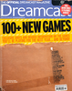
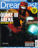
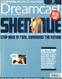
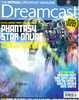
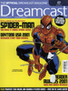

# Official Dreamcast Magazine

. | _Official Dreamcast Magazine_
--- | ---
Alternate titles | 
Publisher | Dennis Publishing
Country | United Kingdom
Language | English
Topic | Video games
Years | 1999 &mdash; 2001
Issues | 21 (23)
Frequency | Monthly
ISSN | 1467-6265
Website | dreamcastmag.co.uk
Related | 

Issue | Front&nbsp;cover | Full | Cover date | Actual date | Price | Barcode | Extras
----- | ---------------- | ---- | ---------- | ----------- | ----- | ------- | ------
-1||[🔗][Preview]||1999-xx-xx|||
0||[🔗][0]|Special Issue 1999|1999-09-02|4.99GBP||Dream On Preview VHS cassette
1|||November 1999|1999-09-30|4.99GBP|9771467626003-11|Dream On Volume 2 Dreamcast demo disc
2|||December 1999|1999-11-11|4.99GBP|9771467626003-12|Dream On Volume 3 Dreamcast demo disc
3|||January 2000|1999-12-09|4.99GBP|9771467626003-01|Dream On Volume 4 Dreamcast demo disc
4|||February 2000|2000-01-13|4.99GBP|9771467626003-02|Dream On Volume 5 Dreamcast demo disc
5|||March 2000|2000-02-10|4.99GBP|9771467626003-03|Dream On Volume 6 Dreamcast demo disc
6|||April 2000|2000-03-09|4.99GBP|9771467626003-04|Dream On Volume 7 Dreamcast demo disc
7|||May 2000|2000-04-06|4.99GBP|9771467626003-05|Dream On Volume 8 Dreamcast demo disc
8|||June 2000|2000-05-11|4.99GBP|9771467626003-06|Dream On Volume 9 Dreamcast demo disc
9|||July 2000|2000-06-08|4.99GBP|9771467626003-07|Dream On Volume 10 Dreamcast demo disc
10|||August 2000|2000-07-06|4.99GBP|9771467626003-08|Dream On Volume 11 Dreamcast demo disc
11|||September 2000|2000-08-03|4.99GBP|9771467626003-09|Dream On Volume 12 Dreamcast demo disc
12|||October 2000|2000-09-07|4.99GBP|9771467626003-10|Dream On Volume 13 Dreamcast demo disc
13|||November 2000|2000-10-05|4.99GBP|9771467626003-11|Dream On Volume 14 Dreamcast demo disc
14|||December 2000|2000-11-02|4.99GBP|9771467626003-12|Dream On Volume 15 Dreamcast demo disc
15|||January 2001|2000-11-30|4.99GBP|9771467626003-01|Dream On Volume 16 Dreamcast demo disc &vert; Planet Ring Dreamcast disc
16|||February 2001|2001-01-04|4.99GBP|9771467626003-02|Dream On Volume 17 Dreamcast demo disc &vert; Poster
17|||March 2001|2001-02-08|4.99GBP|9771467626003-03|Dream On Volume 18 Dreamcast demo disc
18|||April 2001|2001-03-08|4.99GBP|9771467626003-04|Dream On Volume 19 Dreamcast demo disc
19|||May 2001|2001-04-05|4.99GBP|9771467626003-05|Dream On Volume 20 Dreamcast demo disc
20|||June 2001|2001-05-24|4.99GBP|9771467626003-06|Dream On Volume 21 Dreamcast demo disc
21|||July/August 2001|2001-06-21|4.99GBP|9771467626003-07|Dream On Volume 22 Dreamcast demo disc

[Preview]: https://archive.org/details/Official_Dreamcast_Magazine_The_Preview_Issue_1999-08_Dennis_Publishing_GB
[0]: https://archive.org/details/Official_Dreamcast_Magazine_The_Special_Issue_1999-10_Dennis_Publishing_GB
