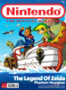
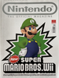
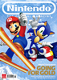
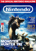
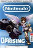
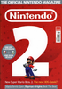

# The Official Nintendo Magazine

. | _The Official Nintendo Magazine_
--- | ---
Alternate titles | _Nintendo The Official Magazine_
Publisher | Future Publishing
Country | United Kingdom
Language | English
Topic | Video games
Years | 2006 &mdash; 2014
Issues | 114
Frequency | Monthly
ISSN | 1750-9998
Website | [officialnintendomagazine.co.uk][web] &vert; [@onm_uk][web2]
Related | 

Issue | Front&nbsp;cover | Full | Cover date | Actual date | Price | Barcode | Extras
----- | ---------------- | ---- | ---------- | ----------- | ----- | ------- | ------
1|||March 2006|2006-xx-xx|3.99GBP|9770965424128-03|
2|||April 2006|2006-03-16|3.99GBP|9770965424128-04|DVD video
3|||May 2006|2006-04-13|3.99GBP|9770965424128-05|
4|||June 2006|2006-05-11|3.99GBP|9770965424128-06|
5|||July 2006|2006-06-08|3.99GBP|9770965424128-07|
6|||August 2006|2006-07-06|3.99GBP|9770965424128-08|
7|||September 2006|2006-08-03|3.99GBP|9770965424128-09|
8|||October 2006|2006-09-01|3.99GBP|9770965424128-10|
9|||November 2006|2006-09-29|3.99GBP|9770965424128-11|
10|||December 2006|2006-10-27|3.99GBP|9770965424128-12|
11|||Christmas 2006|2006-11-24|3.99GBP|9770965424128-13|
12|||January 2007|2006-12-22|3.99GBP|9770965424128-01|
13|||February 2007|2007-01-19|3.99GBP|9770965424128-02|
14|||March 2007|2007-02-16|3.99GBP|9770965424128-03|
15|||April 2007|2007-03-16|3.99GBP|9770965424128-04|
16|||May 2007|2007-04-13|3.99GBP|9770965424128-05|
17|||June 2007|2007-05-11|3.99GBP|9770965424128-06|
18|||July 2007|2007-06-08|3.99GBP|9770965424128-07|
19|||August 2007|2007-07-06|3.99GBP|9770965424128-08|
20|||September 2007|2007-08-03|3.99GBP|9770965424128-09|
21|||October 2007|2007-08-31|3.99GBP|9770965424128-10|
22|||November 2007|2007-09-28|3.99GBP|9770965424128-11|
23|||December 2007|2007-10-26|3.99GBP|9770965424128-12|
24|||Christmas 2007|2007-11-23|3.99GBP|9770965424128-13|
25|||January 2008|2007-12-21|3.99GBP|9770965424128-02|
26|||February 2008|2008-01-18|3.99GBP|9770965424128-22|
27|||March 2008|2008-02-15|3.99GBP|9770965424128-03|
28|||April 2008|2008-03-14|3.99GBP|9770965424128-04|
29|||May 2008|2008-04-11|3.99GBP|9770965424128-05|
30|||June 2008|2008-05-09|3.99GBP|9770965424128-06|
31|||July 2008|2008-06-06|3.99GBP|9770965424128-07|
32|||August 2008|2008-07-04|3.99GBP|9770965424128-08|
33|||September 2008|2008-08-01|3.99GBP|9770965424128-09|
34|||October 2008|2008-08-29|3.99GBP|9770965424128-10|
35|||November 2008|2008-09-26|3.99GBP|9770965424128-11|
36|||December 2008|2008-10-24|3.99GBP|9770965424128-12|
37|||Christmas 2008|2008-11-21|3.99GBP|9770965424128-32|
38|||January 2009|2008-12-19|3.99GBP|9770965424128-01|
39|||February 2009|2009-01-16|3.99GBP|9770965424128-02|
40|||March 2009|2009-02-13|3.99GBP|9770965424128-03|
41|||April 2009|2009-03-13|3.99GBP|9770965424128-04|
42|||May 2009|2009-04-14|3.99GBP|9770965424128-05|
43|||June 2009|2009-xx-xx|3.99GBP|9770965424128-06|
44|||July 2009|2009-06-05|3.99GBP|9770965424128-07|
45|||August 2009|2009-07-03|3.99GBP|9770965424128-08|
46|||September 2009|2009-07-31|3.99GBP|9770965424128-09|
47|||October 2009|2009-08-28|||
47A|||October 2009|2009-08-28|3.99GBP|9770965424128-10|
47B|||October 2009|2009-08-28|3.99GBP|9770965424128-10|
47C|||October 2009|2009-08-28|3.99GBP|9770965424128-10|
47D|||October 2009|2009-08-28|3.99GBP|9770965424128-10|
48|||November 2009|2009-09-25|3.99GBP|9770965424128-11|
49|||December 2009|2009-xx-xx|3.99GBP|9770965424128-12|
50|||Christmas 2009|2009-11-20|3.99GBP|9770965424128-32|
51|||January 2010|2009-12-18|3.99GBP|9770965424128-01|
52|||February 2010|2010-01-15|3.99GBP|9770965424128-02|
53|||March 2010|2010-02-12|||
53A|||March 2010|2010-02-12|3.99GBP|9770965424128-03|Nintendo wallet
53B|||March 2010|2010-02-12|3.99GBP|9770965424128-03|Nintendo wallet
54|||April 2010|2010-03-12|3.99GBP|9770965424128-04|
55|||May 2010|2010-04-09|3.99GBP|9770965424128-05|
56|||June 2010|2010-05-07|||
56A|||June 2010|2010-05-07|3.99GBP|9770965424128-06|Badge set
56B|||June 2010|2010-05-07|3.99GBP|9770965424128-06|Badge set
56C|||June 2010|2010-05-07|3.99GBP|9770965424128-06|Badge set
56D|||June 2010|2010-05-07|3.99GBP|9770965424128-06|Badge set
56E|||June 2010|2010-05-07|3.99GBP|9770965424128-06|Badge set
57|||July 2010|2010-06-16|3.99GBP|9770965424128-07|
58|||August 2010|2010-07-14|3.99GBP|9770965424128-08|
59|||September 2010|2010-08-09|3.99GBP|9770965424128-09|
60|||October 2010|2010-09-06|3.99GBP|9770965424128-10|
61|||November 2010|2010-09-30|3.99GBP|9770965424128-11|Super Mario Sticker Album
62|||December 2010|2010-10-28|3.99GBP|9770965424128-12|
63|||Christmas 2010|2010-11-25|3.99GBP|9770965424128-32|
64|||January 2011|2010-12-23|3.99GBP|9770965424128-01|
65|||February 2011|2011-01-20|3.99GBP|9770965424128-02|Mouse mat
65A|||February 2011|2011-01-20|3.99GBP|9770965424128-02|Mouse mat
66|||March 2011|2011-02-17|3.99GBP|9770965424128-03|
67|||April 2011|2011-03-17|3.99GBP|9770965424128-04|Nintendo 3DS carry case
68|||May 2011|2011-xx-xx|3.99GBP|9770965424128-05|
69|||June 2011|2011-xx-xx|3.99GBP|9770965424128-06|
70|||July 2011|2011-xx-xx|3.99GBP|9770965424128-07|
71|||August 2011|2011-xx-xx|4.50GBP|9770965424999-08|
72|||September 2011|2011-xx-xx|4.50GBP|9770965424999-09|
73|||October 2011|2011-xx-xx|3.99GBP|9770965424128-10|
74|||November 2011|2011-xx-xx|3.99GBP|9770965424128-11|
75|||December 2011|2011-xx-xx|3.99GBP|9770965424128-12|
76|||Christmas 2011|2011-xx-xx|3.99GBP|9770965424128-32|
77|||January 2012|2011-xx-xx|3.99GBP|9770965424128-01|
78|||February 2012|2012-xx-xx|3.99GBP|9770965424128-02|
79|||March 2012|2012-xx-xx|3.99GBP|9770965424128-03|
80|||April 2012|2012-xx-xx|3.99GBP|9770965424128-04|
81|||May 2012|2012-xx-xx|3.99GBP|9770965424128-05|
82|||June 2012|2012-xx-xx|3.99GBP|9770965424128-06|
83|||July 2012|2012-xx-xx|3.99GBP|9770965424128-07|
84|||August 2012|2012-xx-xx|3.99GBP|9770965424128-08|
85|||September 2012|2012-08-01|4.50GBP|9770965424999-09|Nintendo 3DS decals
86|||October 2012|2012-08-25|4.50GBP|9770965424999-10|
87|||November 2012|2012-09-26|3.99GBP|9770965424128-11|
87A|||November 2012|2012-09-26|3.99GBP|9770965424128-11|
88|||December 2012|2012-10-24|3.99GBP|9770965424128-31|
89|||Christmas 2012|2012-11-21|4.50GBP|9770965424135-12|
90|||January 2013|2012-12-19|4.50GBP|9770965424135-01|
91|||February 2013|2013-01-16|4.50GBP|9770965424135-02|
92|||March 2013|2013-02-13|4.50GBP|9770965424135-03|
93|||April 2013|2013-03-13|4.50GBP|9770965424135-04|
94|||May 2013|2013-04-10|4.50GBP|9770965424135-05|
95|||June 2013|2013-05-08|4.50GBP|9770965424135-06|
96|||July 2013|2013-06-05|4.50GBP|9770965424135-07|
97|||August 2013|2013-xx-xx|4.50GBP|9770965424135-08|
98|||September 2013|2013-07-31|4.50GBP|9770965424135-09|
99|||October 2013|2013-08-28|4.50GBP|9770965424135-10|
100|||November 2013|2013-09-25|4.50GBP|9770965424135-11|Posters &vert; Stickers
101|||Xmas 2013|2013-10-23|||
101A|||Xmas 2013|2013-10-23|4.50GBP|9770965424135-31|Posters
102|||December 2013|2013-11-20|||
102A|||December 2013|2013-11-20|4.50GBP|9770965424135-12|Posters
103|||January 2014|2013-xx-xx|||
103A|||January 2014|2013-xx-xx|4.50GBP|9770965424135-01|
103B|||January 2014|2013-xx-xx|4.50GBP|9770965424135-01|
104|||February 2014|2014-01-15|||
104A|||February 2014|2014-01-15|4.50GBP|9770965424135-02|2014 Wall Planner
105|||March 2014|2014-02-12|||
105A|||March 2014|2014-02-12|4.50GBP|9770965424135-03|Posters
106|||April 2014|2014-03-12|||
106A|||April 2014|2014-03-12|4.50GBP|9770965424135-04|
107|||May 2014|2014-04-09|||
107A|||May 2014|2014-04-09|4.50GBP|9770965424135-05|Pokémon trading cards
108|||June 2014|2014-05-02|||
108A|||June 2014|2014-05-02|4.50GBP|9770965424135-06|Posters
109|||July 2014|2014-05-28|||
109A|||July 2014|2014-05-28|4.50GBP|9770965424135-07|Mario Kart 8 booklet &vert; Posters
110|||August 2014|2014-06-24|||
110A|||August 2014|2014-06-24|4.50GBP|9770965424135-08|Pokémon trading cards
111|||September 2014|2014-07-22|4.50GBP|9770965424135-09|
112|||October 2014|2014-08-19|4.50GBP|9770965424135-10|Posters
113|||November 2014|2014-09-16|4.50GBP|9770965424135-11|Posters
114|||Xmas 2014|2014-10-14|4.50GBP|9770965424135-31|

[web]: https://web.archive.org/web/20060228205622/http://www.officialnintendomagazine.co.uk/
[web2]: https://web.archive.org/web/20090216233141/http://twitter.com/onm_uk
