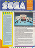
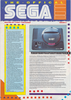
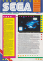
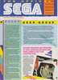

# The Official Sega Club

. | _The Official Sega Club_
--- | ---
Alternate titles | 
Publisher | Mastertronic (1) &vert; Virgin Mastertronic (2-4)
Country | United Kingdom
Language | English
Topic | Video games
Years | 1988 &mdash; 1989
Issues | 4
Frequency | Quarterly
ISSN | 
Website | 
Related | _[S: The Sega Magazine](S%The%20Sega%20Magazine.md)_ (next)

Issue | Front&nbsp;cover | Full | Cover date | Actual date | Price | Barcode | Extras
----- | ---------------- | ---- | ---------- | ----------- | ----- | ------- | ------
1||[🔗][1]||1988-10-xx|||
2||[🔗][2]||1989-01-xx|||
3||[🔗][3]||1989-04-xx|||
4||[🔗][4]||1989-07-xx|||

[1]: https://archive.org/details/official-sega-club-uk-01
[2]: https://archive.org/details/official-sega-club-uk-02
[3]: https://archive.org/details/official-sega-club-uk-03
[4]: https://archive.org/details/official-sega-club-uk-04
